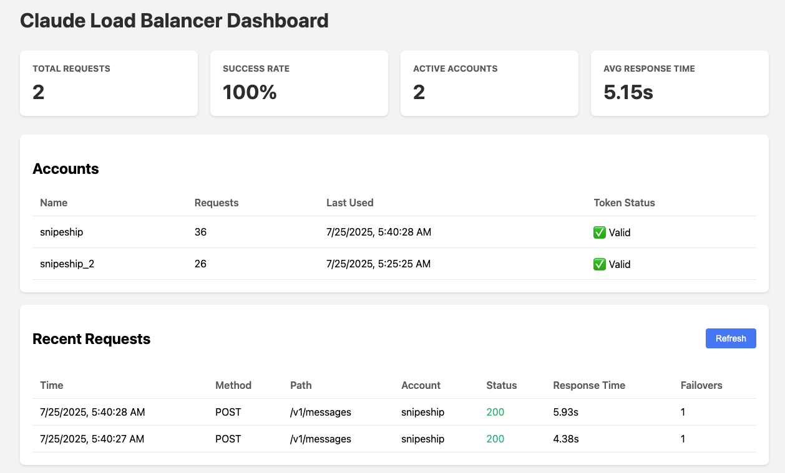
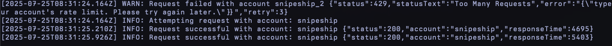

# Claude Load Balancer

A load balancer proxy for multiple Claude OAuth accounts with automatic failover, request tracking, and web dashboard.

## Why?

Ever get tired of Claude's rate limiting?

https://github.com/user-attachments/assets/9b45bc1c-9069-4190-99e0-bba53a0a62ee

## Example





## Features

- **Load Balancing**: Multiple strategies including tier-aware distribution
- **Account Tiers**: Support for Pro (1x), Max 5x, and Max 20x accounts
- **Automatic Failover**: If a request fails with one account, automatically retries with others
- **Rate Limit Detection**: Automatically detects and respects rate limits
- **Session Management**: 5-hour session windows for better distribution
- **Retry Logic**: Configurable retries per account with exponential backoff (3 retries by default)
- **Request Tracking**: Stores all requests in a database for monitoring
- **Web Dashboard**: Real-time monitoring UI with strategy switching and tier management
- **Enhanced Logging**: Detailed logging with configurable levels
- **Token Management**: Automatic token refresh when expired
- **Hot Configuration**: Change strategies without restarting the server

## Installation

```bash
bun install
```

## Usage

### 1. Add Claude Accounts

Use the CLI to add your Claude accounts:

```bash
# Interactive mode - will prompt for account type and tier
bun run cli.ts add myaccount

# Add an API account (console.anthropic.com)
bun run cli.ts add api-account --mode console

# Add a Max account with tier selection
bun run cli.ts add max-account --mode max  # Will prompt for tier

# Add specific tier Max accounts
bun run cli.ts add pro --mode max --tier 1      # Pro Account (1x)
bun run cli.ts add premium --mode max --tier 5   # Max 5x Account
bun run cli.ts add enterprise --mode max --tier 20  # Max 20x Account
```

When prompted:
- **Account Type**: Choose between API (console.anthropic.com) or Claude Max (claude.ai)
- **Tier** (Max accounts only): Select capacity multiplier (1x, 5x, or 20x)

Follow the authorization prompts for each account.

### 2. Start the Server

```bash
bun start
```

The server will start on port 8080 (or the PORT environment variable).

### 3. Access the Dashboard

Open your browser and navigate to:
- Dashboard: http://localhost:8080/dashboard
- Health Check: http://localhost:8080/health

### 4. Use as Proxy

Configure your Claude Code to use the load balancer:

```
export ANTHROPIC_BASE_URL=http://localhost:8080
```

## CLI Commands

```bash
# Add a new account (interactive mode)
bun cli.ts add <name>

# Add with specific options
bun cli.ts add <name> [--mode max|console] [--tier 1|5|20]

# List all accounts with tier information
bun cli.ts list

# Remove an account
bun cli.ts remove <name>

# Reset usage statistics
bun cli.ts reset-stats

# Clear request history
bun cli.ts clear-history

# Show help
bun cli.ts help
```

## API Endpoints

- `GET /` - Web dashboard
- `GET /dashboard` - Web dashboard (alias)
- `GET /health` - Health check endpoint
- `GET /api/stats` - Get aggregated statistics
- `GET /api/accounts` - Get account information with tiers
- `GET /api/requests?limit=50` - Get recent requests
- `GET /api/config` - Get current configuration
- `GET /api/config/strategy` - Get current load balancing strategy
- `POST /api/config/strategy` - Update load balancing strategy
- `POST /api/accounts/:id/tier` - Update account tier
- `/v1/*` - Proxy to Anthropic API

## How It Works

1. **Load Balancing Strategies**:
   - **Least Requests**: Routes to account with fewest total requests (default)
   - **Round Robin**: Distributes requests evenly in circular order
   - **Session Based**: Maintains 5-hour session windows
   - **Weighted**: Considers account tiers (1x, 5x, 20x) for fair distribution
   - **Weighted Round Robin**: Round-robin with tier-based slots

2. **Account Tiers**:
   - **Pro (1x)**: Standard capacity
   - **Max 5x**: 5x the capacity of Pro accounts
   - **Max 20x**: 20x the capacity of Pro accounts

3. **Retry Logic**: Each account gets 3 retry attempts with exponential backoff:
   - 1st retry: 1 second delay
   - 2nd retry: 2 seconds delay
   - 3rd retry: 4 seconds delay

4. **Failover**: If all retries fail, moves to the next available account

5. **Rate Limit Handling**: Automatically detects 429 responses and marks accounts as rate-limited

6. **Token Management**: Access tokens are automatically refreshed when expired

7. **Request Tracking**: All requests are logged to a SQLite database

## Dashboard Features

The web dashboard shows:
- **Total Requests**: Number of requests processed
- **Success Rate**: Percentage of successful requests
- **Active Accounts**: Number of configured accounts
- **Average Response Time**: Mean response time across all requests
- **Strategy Selector**: Switch load balancing strategies in real-time
- **Account Management**:
  - Account tiers with visual badges
  - Tier selector to change account capacity
  - Usage statistics and token validity
  - Rate limit status
  - Session information
- **Request History**: Recent requests with details and status

The dashboard auto-refreshes every 5 seconds.

## Logging

The server logs all activity with timestamps and configurable levels:
- `DEBUG`: Detailed debugging information
- `INFO`: Normal operations, requests, and responses
- `WARN`: Failed requests that trigger failover
- `ERROR`: Critical errors and failures

Set the log level with the `LOG_LEVEL` environment variable.

## Database

The load balancer uses SQLite to store:
- Account information, tokens, and tiers
- Request history and statistics
- Configuration settings
- Rate limit and session data

Database file: `claude-accounts.db`

## Architecture

The codebase follows a modular architecture:
- `server.ts` - Main server entry point
- `config.ts` - Configuration management
- `database.ts` - Database operations
- `api-routes.ts` - API endpoint handlers
- `dashboard.ts` - Web dashboard UI
- `strategies/` - Load balancing strategy implementations
- `migrations.ts` - Database schema migrations

## Configuration

### Environment Variables

```bash
# Server port (default: 8080)
PORT=8080

# Load balancing strategy (default: least-requests)
# Options: least-requests, round-robin, session, weighted, weighted-round-robin
LB_STRATEGY=weighted

# Log level (default: INFO)
# Options: DEBUG, INFO, WARN, ERROR
LOG_LEVEL=INFO
```

### Example `.env` file

```bash
cp .env.example .env
# Edit .env with your preferences
```

### Retry Configuration

You can modify retry behavior by editing these constants in `src/server.ts`:

```typescript
const RETRY_COUNT = 3        // Number of retries per account
const RETRY_DELAY_MS = 1000  // Initial delay between retries (milliseconds)
const RETRY_BACKOFF = 2      // Exponential backoff multiplier
```

## Requirements

- Bun runtime
- SQLite (included with Bun)

This project was created using `bun init` in bun v1.2.8. [Bun](https://bun.sh) is a fast all-in-one JavaScript runtime.
