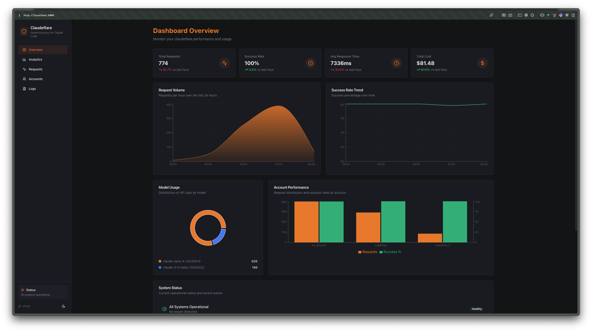
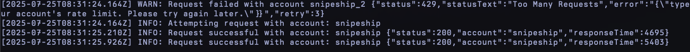
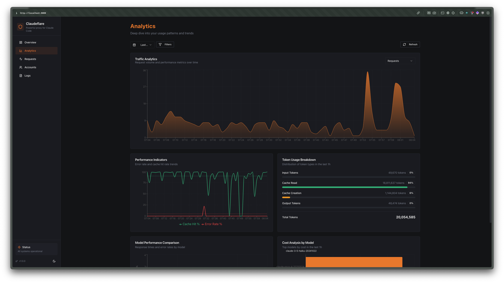

# better-ccflare 🛡️

**Track Every Request. Go Low-Level. Never Hit Rate Limits Again.**

The ultimate Claude API proxy with intelligent load balancing across multiple accounts. Full visibility into every request, response, and rate limit.

**🚨 Major Update (v3.0.0):** This release includes critical security fixes, OAuth token health monitoring, and new provider support (NanoGPT, Minimax). All users should upgrade immediately. See [migration guide](docs/migration-v2-to-v3.md) for details.


https://github.com/user-attachments/assets/c859872f-ca5e-4f8b-b6a0-7cc7461fe62a




## Why better-ccflare?

- **🚀 Zero Rate Limit Errors** - Automatically distribute requests across multiple accounts
- **🤖 Multi-Provider Support** - Claude OAuth, Claude API console, NanoGPT, z.ai, Minimax, Anthropic-compatible, and OpenAI-compatible providers
- **🔒 OAuth Token Health** - Real-time monitoring of OAuth token status with automatic refresh and health indicators
- **🔗 Custom API Endpoints** - Configure custom endpoints for Anthropic accounts for enterprise deployments
- **☁️ OpenAI-Compatible Support** - Use OpenAI-compatible providers like OpenRouter, Together AI, and more with Claude API format
- **🔄 Smart Auto-Fallback** - Automatically switch back to preferred accounts when their rate limits reset
- **⚡ Auto-Refresh** - Automatically start new usage windows when rate limits reset with 30-minute buffer
- **📊 Request-Level Analytics** - Track latency, token usage, and costs in real-time with optimized batch processing
- **🔍 Deep Debugging** - Full request/response logging and error traces
- **🔐 API Authentication** - Optional API key authentication with secure key management
- **⚡ <10ms Overhead** - Minimal performance impact with lazy loading and request deduplication
- **🛡️ Security Hardened** - Critical security fixes for authentication bypass, command injection, and credential leakage
- **💸 Free & Open Source** - Run it yourself, modify it, own your infrastructure

### Why this fork?

This project builds upon the excellent foundation of [snipeship/ccflare](https://github.com/snipeship/ccflare) with significant enhancements:

**🎯 Core Improvements (v3.0.0):**
- **Enhanced Security** - Critical fixes for authentication bypass, command injection, and PKCE implementation
- **OAuth Token Health Monitoring** - Real-time status indicators and automatic token refresh with 30-minute buffer
- **Extended Provider Support** - NanoGPT (with dynamic pricing), Minimax, Anthropic-compatible, and OpenAI-compatible providers
- **Simplified Load Balancing** - Removed tier system for O(1) priority-based selection
- **Real-time Analytics Dashboard** - Beautiful web UI with fixed request history (no disappearing requests)
- **Package Distribution** - Available via npm and bun for easy installation

**🛠️ Developer Experience:**
- **Powerful CLI** - Complete command-line interface for account management and configuration
- **REST API** - Complete API for automation and integration
- **Cross-Platform Binary** - Pre-compiled binary works with Node.js or Bun
- **Comprehensive Logging** - Request/response tracking with searchable history
- **Database Integration** - SQLite for persistent storage and analytics

**📦 Distribution & Updates:**
- **npm/bun Registry** - Install with `npm install -g better-ccflare` or `bun install -g better-ccflare`
- **npx/bunx Support** - Run without installation: `npx better-ccflare` or `bunx better-ccflare`
- **Smart Update Detection** - Web UI detects package manager and shows appropriate update commands
- **Version Management** - Semantic versioning with automatic update notifications

**🏢 Production Ready:**
- **Enterprise Features** - Custom API endpoints, session management, advanced analytics
- **Performance Optimized** - <10ms overhead with request deduplication and caching
- **Reliability** - Automatic error recovery, circuit breakers, and health monitoring
- **Scalability** - Built for high-throughput production environments

## Quick Start

### Install via npm (Linux x86_64)

```bash
npm install -g better-ccflare

# Start better-ccflare (Server + Dashboard)
better-ccflare
```
Continue to [Configure Claude SDK](https://github.com/tombii/better-ccflare#configure-claude-sdk).
### Install via bun

```bash
bun install -g better-ccflare

# Start better-ccflare (Server + Dashboard)
better-ccflare
```
Continue to [Configure Claude SDK](https://github.com/tombii/better-ccflare#configure-claude-sdk).
### Install Pre-compiled Binary (All Architectures)

Download the appropriate binary for your platform from [GitHub Releases](https://github.com/tombii/better-ccflare/releases/latest):

#### Linux x86_64
```bash
wget https://github.com/tombii/better-ccflare/releases/latest/download/better-ccflare-linux-amd64
chmod +x better-ccflare-linux-amd64
./better-ccflare-linux-amd64
```
Continue to [Configure Claude SDK](https://github.com/tombii/better-ccflare#configure-claude-sdk).
#### Linux ARM64 (Raspberry Pi 3/4/5, Oracle Cloud ARM, AWS Graviton)
```bash
wget https://github.com/tombii/better-ccflare/releases/latest/download/better-ccflare-linux-arm64
chmod +x better-ccflare-linux-arm64
./better-ccflare-linux-arm64
```
Continue to [Configure Claude SDK](https://github.com/tombii/better-ccflare#configure-claude-sdk).
#### macOS Intel
```bash
curl -L -o better-ccflare-macos-x86_64 https://github.com/tombii/better-ccflare/releases/latest/download/better-ccflare-macos-x86_64
chmod +x better-ccflare-macos-x86_64

# Remove quarantine attribute (required on macOS to run unsigned binaries)
xattr -d com.apple.quarantine better-ccflare-macos-x86_64

./better-ccflare-macos-x86_64
```
Continue to [Configure Claude SDK](https://github.com/tombii/better-ccflare#configure-claude-sdk).
#### macOS Apple Silicon
```bash
curl -L -o better-ccflare-macos-arm64 https://github.com/tombii/better-ccflare/releases/latest/download/better-ccflare-macos-arm64
chmod +x better-ccflare-macos-arm64

# Remove quarantine attribute (required on macOS to run unsigned binaries)
xattr -d com.apple.quarantine better-ccflare-macos-arm64

./better-ccflare-macos-arm64
```
Continue to [Configure Claude SDK](https://github.com/tombii/better-ccflare#configure-claude-sdk).
**macOS Gatekeeper Notice:** Our macOS binaries are not notarized by Apple as this requires a paid Apple Developer subscription. After downloading, you must remove the quarantine attribute using the `xattr` command shown above to run the binary. If you prefer not to run unsigned binaries, you can [install from source](#install-from-source) instead.

#### Windows x86_64
Download [`better-ccflare-windows-x64.exe`](https://github.com/tombii/better-ccflare/releases/latest/download/better-ccflare-windows-x64.exe) and run it.
Continue to [Configure Claude SDK](https://github.com/tombii/better-ccflare#configure-claude-sdk).
### Run without installation (npx/bunx)

```bash
# Run with npx (downloads and executes latest version)
npx better-ccflare@latest

# Run with bunx (faster for bun users)
bunx better-ccflare@latest
```
Continue to [Configure Claude SDK](https://github.com/tombii/better-ccflare#configure-claude-sdk).
### Install from source

```bash
# Clone and install
git clone https://github.com/tombii/better-ccflare
cd better-ccflare
bun install

# Build dashboard (required before first run)
bun run build

# Start better-ccflare (TUI + Server)
bun run better-ccflare
```
Continue to [Configure Claude SDK](https://github.com/tombii/better-ccflare#configure-claude-sdk).
**Note**: You must run `bun run build` at least once to build the dashboard files before starting the server. This can also be done by running `bun run better-ccflare` which includes the build step.

### Environment Variables

better-ccflare supports several environment variables for configuration:

```bash
# Server Configuration
PORT=8080                              # Server port (default: 8080)
BETTER_CCFLARE_HOST=0.0.0.0           # Server binding host (default: 0.0.0.0, use 127.0.0.1 for localhost-only)
CLIENT_ID=your-client-id              # OAuth client ID
BETTER_CCFLARE_CONFIG_PATH=/path/to/config.json  # Custom config location
BETTER_CCFLARE_DB_PATH=/path/to/database.db  # Custom database path (default: ~/.config/better-ccflare/better-ccflare.db)
                                       # Use this for development/testing with a separate database

# Logging and Debugging
LOG_LEVEL=INFO                         # Log level (ERROR, WARN, INFO, DEBUG)
LOG_FORMAT=json                        # Log format (json or text)
better-ccflare_DEBUG=0                  # Enable debug mode (1 for enabled)

# SSL/TLS Configuration
SSL_KEY_PATH=/path/to/key.pem          # SSL private key path (for HTTPS)
SSL_CERT_PATH=/path/to/cert.pem        # SSL certificate path (for HTTPS)

# Load Balancing
LB_STRATEGY=session                    # Load balancing strategy (default: session)
SESSION_DURATION_MS=18000000           # Session duration in milliseconds (5 hours)

# Retry Configuration
RETRY_ATTEMPTS=3                       # Number of retry attempts
RETRY_DELAY_MS=1000                   # Initial retry delay in milliseconds
RETRY_BACKOFF=2                        # Retry backoff multiplier
```

**Security Notes**:
- Use `BETTER_CCFLARE_HOST=127.0.0.1` to bind only to localhost for better security
- Never commit `.env` files containing sensitive values to version control
- Use environment-specific configuration for production deployments

### Using .env Files

better-ccflare automatically supports `.env` files for easy configuration management. You can create a `.env` file in your project directory:

```bash
# Copy the example .env file
cp .env.example .env
# Edit with your configuration
nano .env
```

**Supported across all deployment methods**:
- **CLI Binary**: Automatically loads `.env` from current working directory
- **Docker Compose**: Automatically loads `.env` from the same directory as `docker-compose.yml`
- **Docker**: Mount your `.env` file or pass variables directly

**Example `.env` file**:
```bash
# Server Configuration
PORT=8080

# SSL/TLS Configuration (optional)
SSL_KEY_PATH=/path/to/ssl/key.pem
SSL_CERT_PATH=/path/to/ssl/cert.pem

# Load Balancing
LB_STRATEGY=session

# Logging and Debugging
LOG_LEVEL=INFO
LOG_FORMAT=pretty

# Database configuration
DATA_RETENTION_DAYS=7
REQUEST_RETENTION_DAYS=365
```

**Usage with different deployment methods**:
```bash
# CLI (binary or local development)
better-ccflare --serve

# Docker Compose (place .env alongside docker-compose.yml)
docker-compose up

# Docker (mount .env file)
docker run -v $(pwd)/.env:/app/.env:ro -p 8080:8080 ghcr.io/tombii/better-ccflare:latest
```

### Docker (Multi-Platform: linux/amd64, linux/arm64)

```bash
# Quick start with docker-compose
curl -O https://raw.githubusercontent.com/tombii/better-ccflare/main/docker-compose.yml

# Optional: Create and configure .env file
cp .env.example .env
# Edit .env with your settings (SSL, port, etc.)
nano .env

# Start with docker-compose (automatically loads .env file)
docker-compose up -d

# Or use docker run with environment variables
docker run -d \
  --name better-ccflare \
  -p 8080:8080 \
  -v better-ccflare-data:/data \
  -e SSL_KEY_PATH=/path/to/ssl/key.pem \
  -e SSL_CERT_PATH=/path/to/ssl/cert.pem \
  ghcr.io/tombii/better-ccflare:latest

# View logs
docker logs -f better-ccflare

# Manage accounts
docker exec -it better-ccflare better-ccflare --add-account myaccount
docker exec -it better-ccflare better-ccflare --list
```

**🆕 Environment Variable Support**: Docker Compose now automatically loads `.env` files from the same directory as `docker-compose.yml`. Simply create a `.env` file alongside your `docker-compose.yml` file and the container will use those settings.

**Available Docker tags:**
- `latest` - Latest stable release
- `main` - Latest build from main branch
- `1.2.28`, `1.2`, `1` - Specific version tags
- `sha-abc123` - Commit-specific tags

See [DOCKER.md](DOCKER.md) for detailed Docker documentation.

## Configure Claude SDK

```bash
# Set the base URL to point to better-ccflare
export ANTHROPIC_BASE_URL=http://localhost:8080
export ANTHROPIC_API_KEY=dummy-key

# Make sure to configure your accounts in the better-ccflare dashboard

# Start claude
claude
```

### SSL/HTTPS Configuration

To enable HTTPS with better-ccflare, you'll need SSL certificates. Here are your options:

#### Option 1: Generate Self-Signed Certificates (Development/Local Use)

```bash
# Generate a self-signed certificate on the better-ccflare host
openssl req -x509 -newkey rsa:2048 -keyout key.pem -out cert.pem -days 365 -nodes \
  -subj "/C=US/ST=State/L=City/O=Organization/CN=yourhostname"

# Start better-ccflare with SSL
export SSL_KEY_PATH=/path/to/key.pem
export SSL_CERT_PATH=/path/to/cert.pem
better-ccflare

# Or use command line flags
better-ccflare --ssl-key /path/to/key.pem --ssl-cert /path/to/cert.pem
```

**Trust the self-signed certificate on client machines:**

For self-signed certificates, you need to add the certificate to your system's trusted certificates:

- **Linux (Ubuntu/Debian):**
  ```bash
  # Copy cert.pem from the better-ccflare host to your client machine
  sudo cp cert.pem /usr/local/share/ca-certificates/better-ccflare.crt
  sudo update-ca-certificates
  ```

- **Linux (Arch/Manjaro):**
  ```bash
  # Copy cert.pem from the better-ccflare host to your client machine
  sudo cp cert.pem /etc/ca-certificates/trust-source/anchors/better-ccflare.crt
  sudo trust extract-compat
  ```

- **macOS:**
  ```bash
  # Copy cert.pem from the better-ccflare host to your client machine
  sudo security add-trusted-cert -d -r trustRoot -k /Library/Keychains/System.keychain cert.pem
  ```

- **Windows (PowerShell as Administrator):**
  ```powershell
  # Copy cert.pem from the better-ccflare host to your client machine
  Import-Certificate -FilePath cert.pem -CertStoreLocation Cert:\LocalMachine\Root
  ```

**Configure Claude Code to use the trusted certificate:**

After adding the certificate to your system's trusted store, configure your environment:

```bash
# Add to your ~/.bashrc or ~/.zshrc
export NODE_OPTIONS="--use-system-ca"
export ANTHROPIC_BASE_URL=https://yourhostname:8080
```

The `NODE_OPTIONS="--use-system-ca"` is **required** for Claude Code and other Node.js-based clients to use the system certificate store. Without this, Node.js will not trust your self-signed certificate even if it's in the system store.

#### Option 2: Use Production Certificates (Production/Remote Access)

If you're running better-ccflare on a server with a domain name, use Let's Encrypt or your certificate provider:

```bash
# Using Let's Encrypt certificates
export SSL_KEY_PATH=/etc/letsencrypt/live/yourdomain.com/privkey.pem
export SSL_CERT_PATH=/etc/letsencrypt/live/yourdomain.com/fullchain.pem
better-ccflare

# Set the base URL to use HTTPS
export ANTHROPIC_BASE_URL=https://yourdomain.com:8080
```

With production certificates from trusted CAs, you don't need `NODE_OPTIONS="--use-system-ca"` as they are already trusted.

#### Option 3: Docker with Traefik (Recommended for Production)

For Docker deployments, we recommend using [Traefik](https://traefik.io/) as a reverse proxy to handle TLS automatically with Let's Encrypt:

```yaml
# docker-compose.yml
version: '3.8'

services:
  traefik:
    image: traefik:v3.0
    command:
      - "--api.insecure=true"
      - "--providers.docker=true"
      - "--entrypoints.web.address=:80"
      - "--entrypoints.websecure.address=:443"
      - "--certificatesresolvers.myresolver.acme.tlschallenge=true"
      - "--certificatesresolvers.myresolver.acme.email=your-email@example.com"
      - "--certificatesresolvers.myresolver.acme.storage=/letsencrypt/acme.json"
    ports:
      - "80:80"
      - "443:443"
    volumes:
      - /var/run/docker.sock:/var/run/docker.sock:ro
      - ./letsencrypt:/letsencrypt
    restart: unless-stopped

  better-ccflare:
    image: ghcr.io/tombii/better-ccflare:latest
    labels:
      - "traefik.enable=true"
      - "traefik.http.routers.ccflare.rule=Host(`your-domain.com`)"
      - "traefik.http.routers.ccflare.entrypoints=websecure"
      - "traefik.http.routers.ccflare.tls.certresolver=myresolver"
      - "traefik.http.services.ccflare.loadbalancer.server.port=8080"
    volumes:
      - ~/.config/better-ccflare:/root/.config/better-ccflare
    restart: unless-stopped
```

**Benefits:**
- Automatic TLS certificate generation and renewal via Let's Encrypt
- No need to manually manage SSL certificates
- Built-in HTTP to HTTPS redirection
- Dashboard for monitoring (port 8080 on Traefik)

**Client Configuration:**
```bash
export ANTHROPIC_BASE_URL=https://your-domain.com
```

No `NODE_OPTIONS` needed - Traefik provides trusted certificates automatically!

#### Troubleshooting SSL Issues

**Problem:** "Unable to connect to API due to poor internet connection" error even with `ANTHROPIC_BASE_URL` set

**Solutions:**
1. Verify the environment variable is set in the same shell/session:
   ```bash
   echo $ANTHROPIC_BASE_URL
   echo $NODE_OPTIONS
   ```

2. Test the SSL connection manually:
   ```bash
   # Should succeed without errors
   curl https://yourhostname:8080/health

   # If you see certificate errors, the cert isn't trusted yet
   curl -k https://yourhostname:8080/health  # -k bypasses cert check for testing
   ```

3. Verify the certificate is in the system store:
   ```bash
   # Linux
   ls -la /etc/ssl/certs/ | grep better-ccflare

   # macOS
   security find-certificate -a -c yourhostname -p /Library/Keychains/System.keychain
   ```

4. Ensure the hostname resolves correctly:
   ```bash
   ping yourhostname
   ```

5. Check that the server is actually running:
   ```bash
   curl -k https://yourhostname:8080/health
   ```

## Features

### 🎯 Intelligent Load Balancing
- **Session-based** - Maintain conversation context for Claude OAuth accounts (5hr usage windows), pay-as-you-go for other providers
- **Auto-fallback** - Automatically switch back to higher priority Claude OAuth accounts when their usage windows reset
- **Auto-refresh** - Automatically start new usage windows when they reset
- **Usage Window Alignment** - Sessions automatically align with Claude OAuth usage window resets for optimal resource utilization

### 📈 Real-Time Analytics
- Token usage tracking per request with optimized batch processing
- Response time monitoring with intelligent caching
- Rate limit detection and warnings
- Cost estimation and budgeting
- Request deduplication for improved performance
- Lazy-loaded analytics components for faster initial load

### 🛠️ Developer Tools
- Powerful CLI (`better-ccflare`)
- Web dashboard (`http://localhost:8080/dashboard`)
- CLI for account management
- REST API for automation

### 🔒 Production Ready
- Automatic failover between accounts
- OAuth token refresh handling
- SQLite database for persistence
- Configurable retry logic
- Custom endpoint support for enterprise deployments
- Enhanced performance with request batching and caching

### ☁️ Multi-Provider Support
- **Claude OAuth** - Anthropic OAuth accounts with 5-hour usage windows and session tracking (rate limit window based)
- **Claude Console API** - Anthropic API key accounts with pay-as-you-go model (no session tracking)
- **z.ai, Minimax** - API key based providers with pay-as-you-go model
- **Anthropic-Compatible** - Custom Anthropic-compatible providers with pay-as-you-go model
- **OpenAI-Compatible** - OpenAI-compatible providers (OpenRouter, Together AI, etc.) with Claude API format
- **Universal API Format** - Use OpenAI-compatible providers (OpenRouter, Together AI, etc.) with Claude API format
- **Automatic Format Conversion** - Seamless conversion between Anthropic and OpenAI request/response formats
- **Model Mapping** - Map Claude models (opus, sonnet, haiku) to equivalent OpenAI models
- **Streaming Support** - Full support for streaming responses from OpenAI-compatible providers
- **API Key Authentication** - Secure API key management for OpenAI-compatible providers
- **Cost Tracking** - Automatic cost calculation for usage monitoring and budgeting

## Documentation

Full documentation available in [`docs/`](docs/):
- [Getting Started](docs/index.md)
- [Architecture](docs/architecture.md)
- [API Reference](docs/api-http.md)
- [Configuration](docs/configuration.md)
- [Load Balancing Strategies](docs/load-balancing.md)
- [Auto-Fallback Guide](docs/auto-fallback.md)
- [Auto-Refresh Guide](docs/auto-refresh.md)
- [OpenAI-Compatible Providers](docs/providers.md)

## Screenshots

<table>
  <tr>
    <td></td>
    <td></td>
  </tr>
  <tr>
    <td align="center"><b>Real-time Dashboard</b></td>
    <td align="center"><b>Request Logs</b></td>
  </tr>
  <tr>
    <td colspan="2"></td>
  </tr>
  <tr>
    <td colspan="2" align="center"><b>Analytics & Usage Tracking</b></td>
  </tr>
</table>

## Requirements

**For installation:**
- **npm** or **bun** package manager (for npm/bun installation)
- **Node.js** >= 18.0.0 (when installed via npm)
- **Bun** >= 1.2.8 (when installed via bun or running from source)
- **Or download pre-compiled binary** - No runtime dependencies required!

**For usage:**
- Claude API accounts (Free, Pro, or Team), z.ai code plan accounts, or Minimax accounts

## Platform Support

| Platform | Architecture | Status |
|----------|-------------|--------|
| Linux | x86_64 | ✅ Supported (npm + binary) |
| Linux | ARM64 (aarch64) | ✅ Supported (binary only) |
| macOS | Intel (x64) | ✅ Supported (npm + binary) |
| macOS | Apple Silicon (ARM64) | ✅ Supported (binary only) |
| Windows | x86_64 | ✅ Supported (binary only) |

**Works on:**
- Oracle Cloud ARM instances (Ampere Altra)
- AWS Graviton instances
- Raspberry Pi 3/4/5 (with 64-bit OS)
- Any x86_64 or ARM64 Linux/macOS/Windows system

**Not supported:**
- ARM32 devices (Raspberry Pi Zero, Pi 1, Pi 2, or 32-bit OS)

## Acknowledgments

Inspired by [snipeship/ccflare](https://github.com/snipeship/ccflare) - thanks for the original idea and implementation!

**Special thanks to our contributors:**
- [@bitcoin4cashqc](https://github.com/bitcoin4cashqc) - SSL/HTTPS support implementation with comprehensive documentation
- [@anonym-uz](https://github.com/anonym-uz) - Critical auto-pause bug fix, analytics performance optimizations, request body truncation, and incremental vacuum implementation
- [@makhweeb](https://github.com/makhweeb) - Enhanced request handling and analytics improvements

## Contributing

We welcome contributions! See [CONTRIBUTING.md](docs/contributing.md) for guidelines.

### Code Review Process

This repository includes an automated Claude code review system:
- **Automatic Review**: Runs automatically when a new pull request is opened
- **Manual Review**: Can be manually triggered by contributors by commenting `/claude-review` on the PR

## License

MIT - See [LICENSE](LICENSE) for details

---

<p align="center">
  Built with ❤️ for developers who ship
</p>

[](https://github.com/hesreallyhim/awesome-claude-code)

[](https://github.com/hesreallyhim/awesome-claude-code)
