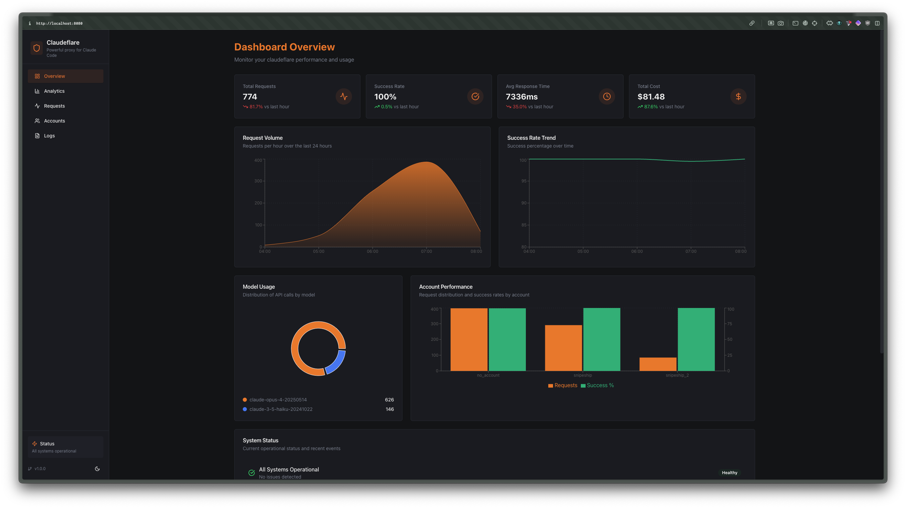

# better-ccflare 🛡️
[](https://github.com/hesreallyhim/awesome-claude-code)

**Track Every Request. Go Low-Level. Never Hit Rate Limits Again.**

The ultimate Claude API proxy with intelligent load balancing across multiple accounts. Full visibility into every request, response, and rate limit.

https://github.com/user-attachments/assets/c859872f-ca5e-4f8b-b6a0-7cc7461fe62a




## Why better-ccflare?

- **🚀 Zero Rate Limit Errors** - Automatically distribute requests across multiple accounts
- **🤖 Multi-Provider Support** - Claude OAuth, Claude API console, Vertex AI, AWS Bedrock, NanoGPT, z.ai, Minimax, OpenRouter, Kilo, Codex (OpenAI OAuth), xAI/Grok, Anthropic-compatible, and OpenAI-compatible providers
- **🔒 OAuth Token Health** - Real-time monitoring of OAuth token status with automatic refresh and health indicators
- **🔗 Custom API Endpoints** - Configure custom endpoints for Anthropic accounts for enterprise deployments
- **☁️ OpenAI-Compatible Support** - Use OpenAI-compatible providers like OpenRouter, Together AI, and more with Claude API format
- **🧩 Codex / Responses API Compatibility** - `POST /v1/responses` and `POST /v1/responses/compact` are translated to Anthropic `/v1/messages`
- **🔄 Smart Auto-Fallback** - Automatically switch back to preferred accounts when their rate limits reset
- **⚡ Auto-Refresh** - Automatically start new usage windows when rate limits reset with 30-minute buffer
- **📊 Request-Level Analytics** - Track latency, token usage, and costs in real-time with optimized batch processing
- **🔍 Deep Debugging** - Full request/response logging and error traces
- **🔐 API Authentication** - Optional API key authentication with secure key management
- **⚡ <10ms Overhead** - Minimal performance impact with lazy loading and request deduplication
- **🛡️ Security Hardened** - Critical security fixes for authentication bypass, command injection, and credential leakage
- **💸 Free & Open Source** - Run it yourself, modify it, own your infrastructure

### Why this fork?

This project builds upon the excellent foundation of [snipeship/ccflare](https://github.com/snipeship/ccflare) with significant enhancements:

**🎯 Core Improvements (v3.0.0):**
- **Enhanced Security** - Critical fixes for authentication bypass, command injection, and PKCE implementation
- **OAuth Token Health Monitoring** - Real-time status indicators and automatic token refresh with 30-minute buffer
- **Extended Provider Support** - AWS Bedrock, NanoGPT (with dynamic pricing), Minimax, OpenRouter, Kilo, Codex (OpenAI OAuth), xAI/Grok, Anthropic-compatible, and OpenAI-compatible providers
- **Simplified Load Balancing** - Removed tier system for O(1) priority-based selection
- **Real-time Analytics Dashboard** - Beautiful web UI with fixed request history (no disappearing requests)
- **Package Distribution** - Available via npm and bun for easy installation

**🛠️ Developer Experience:**
- **Powerful CLI** - Complete command-line interface for account management and configuration
- **REST API** - Complete API for automation and integration
- **Cross-Platform Binary** - Pre-compiled binary works with Node.js or Bun
- **Comprehensive Logging** - Request/response tracking with searchable history
- **Database Integration** - SQLite (default) or PostgreSQL for persistent storage and analytics, supporting Kubernetes multi-pod deployments

**📦 Distribution & Updates:**
- **npm/bun Registry** - Install with `npm install -g better-ccflare` or `bun install -g better-ccflare`
- **npx/bunx Support** - Run without installation: `npx better-ccflare` or `bunx better-ccflare`
- **Smart Update Detection** - Web UI detects package manager and shows appropriate update commands
- **Version Management** - Semantic versioning with automatic update notifications

**🏢 Production Ready:**
- **Enterprise Features** - Custom API endpoints, session management, advanced analytics
- **Performance Optimized** - <10ms overhead with request deduplication and caching
- **Reliability** - Automatic error recovery, circuit breakers, and health monitoring
- **Scalability** - Built for high-throughput production environments
- **PostgreSQL Support** - Set `DATABASE_URL=postgresql://...` to use PostgreSQL for Kubernetes multi-pod deployments where SQLite file-sharing is not feasible

## Quick Start

### Install via npm (Linux x86_64)

```bash
npm install -g better-ccflare

# Start better-ccflare (Server + Dashboard)
better-ccflare
```
Continue to [Configure Claude SDK](https://github.com/tombii/better-ccflare#configure-claude-sdk).

**⚠️ Windows npm Installation Issue**: If you installed via npm on Windows and encounter a path error like `"C:\\Program Files\\nodejs\\\\node_modules\\better-ccflare\\dist\\better-ccflare" is either misspelled or could not be found`, this is a known [npm bug on Windows](https://github.com/npm/cli/issues/969) affecting how npm generates wrapper scripts. See [Windows Troubleshooting](#windows-troubleshooting) for workarounds.
### Install via bun

```bash
bun install -g better-ccflare

# Start better-ccflare (Server + Dashboard)
better-ccflare
```
Continue to [Configure Claude SDK](https://github.com/tombii/better-ccflare#configure-claude-sdk).
### Install Pre-compiled Binary (All Architectures)

Download the appropriate binary for your platform from [GitHub Releases](https://github.com/tombii/better-ccflare/releases/latest):

#### Linux x86_64
```bash
wget https://github.com/tombii/better-ccflare/releases/latest/download/better-ccflare-linux-amd64
chmod +x better-ccflare-linux-amd64
./better-ccflare-linux-amd64
```
Continue to [Configure Claude SDK](https://github.com/tombii/better-ccflare#configure-claude-sdk).
#### Linux ARM64 (Raspberry Pi 3/4/5, Oracle Cloud ARM, AWS Graviton)
```bash
wget https://github.com/tombii/better-ccflare/releases/latest/download/better-ccflare-linux-arm64
chmod +x better-ccflare-linux-arm64
./better-ccflare-linux-arm64
```
Continue to [Configure Claude SDK](https://github.com/tombii/better-ccflare#configure-claude-sdk).
#### macOS Intel
```bash
curl -L -o better-ccflare-macos-x86_64 https://github.com/tombii/better-ccflare/releases/latest/download/better-ccflare-macos-x86_64
chmod +x better-ccflare-macos-x86_64

# Remove quarantine attribute (required on macOS to run unsigned binaries)
xattr -d com.apple.quarantine better-ccflare-macos-x86_64

./better-ccflare-macos-x86_64
```
Continue to [Configure Claude SDK](https://github.com/tombii/better-ccflare#configure-claude-sdk).
#### macOS Apple Silicon
```bash
curl -L -o better-ccflare-macos-arm64 https://github.com/tombii/better-ccflare/releases/latest/download/better-ccflare-macos-arm64
chmod +x better-ccflare-macos-arm64

# Remove quarantine attribute (required on macOS to run unsigned binaries)
xattr -d com.apple.quarantine better-ccflare-macos-arm64

./better-ccflare-macos-arm64
```
Continue to [Configure Claude SDK](https://github.com/tombii/better-ccflare#configure-claude-sdk).

**macOS Gatekeeper Notice:** Our macOS binaries are not notarized by Apple as this requires a paid Apple Developer subscription. After downloading, you must remove the quarantine attribute using the `xattr` command shown above to run the binary. If you prefer not to run unsigned binaries, you can [install from source](#install-from-source) instead.

#### Windows x86_64
Download [`better-ccflare-windows-x64.exe`](https://github.com/tombii/better-ccflare/releases/latest/download/better-ccflare-windows-x64.exe) and run it.
Continue to [Configure Claude SDK](https://github.com/tombii/better-ccflare#configure-claude-sdk).
### Run without installation (npx/bunx)

```bash
# Run with npx (downloads and executes latest version)
npx better-ccflare@latest

# Run with bunx (faster for bun users)
bunx better-ccflare@latest
```
Continue to [Configure Claude SDK](https://github.com/tombii/better-ccflare#configure-claude-sdk).
### Install from source

```bash
# Clone and install
git clone https://github.com/tombii/better-ccflare
cd better-ccflare
bun install

# Build dashboard (required before first run)
bun run build

# Start better-ccflare (TUI + Server)
bun run better-ccflare
```
Continue to [Configure Claude SDK](https://github.com/tombii/better-ccflare#configure-claude-sdk).

**Note**: You must run `bun run build` at least once to build the dashboard files before starting the server. This can also be done by running `bun run better-ccflare` which includes the build step.

### Environment Variables

better-ccflare supports several environment variables for configuration. The most commonly used ones:

```bash
# Server Configuration
PORT=8080                              # Server port (default: 8080)
BETTER_CCFLARE_HOST=0.0.0.0           # Server binding host (default: 0.0.0.0, use 127.0.0.1 for localhost-only)
CLIENT_ID=your-client-id              # OAuth client ID
BETTER_CCFLARE_CONFIG_PATH=/path/to/config.json  # Custom config location
BETTER_CCFLARE_DB_PATH=/path/to/database.db  # Custom database path (default: ~/.config/better-ccflare/better-ccflare.db)
                                       # Use this for development/testing with a separate database

# Logging and Debugging
LOG_LEVEL=INFO                         # Log level (ERROR, WARN, INFO, DEBUG)
LOG_FORMAT=json                        # Log format (json or text)
better-ccflare_DEBUG=0                  # Enable debug mode (1 for enabled)

# SSL/TLS Configuration
SSL_KEY_PATH=/path/to/key.pem          # SSL private key path (for HTTPS)
SSL_CERT_PATH=/path/to/cert.pem        # SSL certificate path (for HTTPS)

# Load Balancing
LB_STRATEGY=session                    # Load balancing strategy (default: session)
SESSION_DURATION_MS=18000000           # Session duration in milliseconds (5 hours)

# Retry Configuration
RETRY_ATTEMPTS=3                       # Number of retry attempts
RETRY_DELAY_MS=1000                   # Initial retry delay in milliseconds
RETRY_BACKOFF=2                        # Retry backoff multiplier

# Storage
STORE_PAYLOADS=false                   # Disable storing request/response bodies (reduces DB size and memory usage)
                                       # Token counts, costs, model, status and timing are still recorded
```

**Security Notes**:
- Use `BETTER_CCFLARE_HOST=127.0.0.1` to bind only to localhost for better security
- Never commit `.env` files containing sensitive values to version control
- Use environment-specific configuration for production deployments

📖 **See [docs/configuration.md](docs/configuration.md) for the complete list** — overload/rate-limit retry tuning, health endpoint detail, agent discovery, payload encryption at rest, model catalog refresh, PostgreSQL pooling, Codex prompt-cache keys, and more.

### Using .env Files

better-ccflare automatically supports `.env` files for easy configuration management. You can create a `.env` file in your project directory:

```bash
# Copy the example .env file
cp .env.example .env
# Edit with your configuration
nano .env
```

**Supported across all deployment methods**:
- **CLI Binary**: Automatically loads `.env` from current working directory
- **Docker Compose**: Automatically loads `.env` from the same directory as `docker-compose.yml`
- **Docker**: Mount your `.env` file or pass variables directly

**Example `.env` file**:
```bash
# Server Configuration
PORT=8080

# SSL/TLS Configuration (optional)
SSL_KEY_PATH=/path/to/ssl/key.pem
SSL_CERT_PATH=/path/to/ssl/cert.pem

# Load Balancing
LB_STRATEGY=session

# Logging and Debugging
LOG_LEVEL=INFO
LOG_FORMAT=pretty

# Database configuration
DATA_RETENTION_DAYS=3
REQUEST_RETENTION_DAYS=90

# Storage (set to false to skip storing request/response bodies, reducing DB size and memory pressure)
STORE_PAYLOADS=true
```

**Usage with different deployment methods**:
```bash
# CLI (binary or local development)
better-ccflare --serve

# Docker Compose (place .env alongside docker-compose.yml)
docker-compose up

# Docker (mount .env file)
docker run -v $(pwd)/.env:/app/.env:ro -p 8080:8080 ghcr.io/tombii/better-ccflare:latest
```

### Docker (Multi-Platform: linux/amd64, linux/arm64)

```bash
# Quick start with docker-compose
curl -O https://raw.githubusercontent.com/tombii/better-ccflare/main/docker-compose.yml

# Optional: Create and configure .env file
cp .env.example .env
# Edit .env with your settings (SSL, port, etc.)
nano .env

# Start with docker-compose (automatically loads .env file)
docker-compose up -d

# Or use docker run with environment variables
docker run -d \
  --name better-ccflare \
  -p 8080:8080 \
  -v better-ccflare-data:/data \
  -e SSL_KEY_PATH=/path/to/ssl/key.pem \
  -e SSL_CERT_PATH=/path/to/ssl/cert.pem \
  ghcr.io/tombii/better-ccflare:latest

# View logs
docker logs -f better-ccflare
```

Once the container is running, **open http://localhost:8080 in your browser** to add and manage accounts through the Web UI. This is the recommended way — using `docker exec` to run CLI commands inside the container won't work for OAuth-based account modes since the container has no browser.

**🆕 Environment Variable Support**: Docker Compose now automatically loads `.env` files from the same directory as `docker-compose.yml`. Simply create a `.env` file alongside your `docker-compose.yml` file and the container will use those settings.

**Available Docker tags:**
- `latest` - Latest stable release
- `main` - Latest build from main branch
- `1.2.28`, `1.2`, `1` - Specific version tags
- `sha-abc123` - Commit-specific tags

See [DOCKER.md](DOCKER.md) for detailed Docker documentation.

### Systemd Deployment

For running better-ccflare as a native systemd service on Linux (without Docker), see the [Systemd Deployment Guide](docs/systemd.md). It covers unit file configuration, memory management with `--smol`, restart policies, and a preflight script that prevents `BUN_JSC_*` environment variable crashes.

## Configure Claude SDK

### Option 1: Using Claude CLI with OAuth (Recommended if you have Claude Pro/Team)

If you have a Claude Pro or Team subscription and are logged into Claude CLI:

```bash
# Set only the base URL - no API key needed!
export ANTHROPIC_BASE_URL=http://localhost:8080

# Make sure to configure your accounts in the better-ccflare dashboard

# Start Claude CLI (uses your existing login)
claude
```

**Important:** When using Claude CLI with an active OAuth login, do **NOT** set `ANTHROPIC_AUTH_TOKEN`. Setting both will trigger a warning from Claude CLI about conflicting authentication methods.

### Option 2: Using API Key Authentication

If you're NOT using Claude CLI's OAuth login, or prefer API key authentication:

```bash
# First, logout from Claude CLI if you're currently logged in
claude /logout

# Then set both the base URL and API key
export ANTHROPIC_BASE_URL=http://localhost:8080

# If better-ccflare has NO API keys configured (open access):
export ANTHROPIC_AUTH_TOKEN=dummy-key

# If better-ccflare HAS API keys configured (protected):
# Generate a key first: better-ccflare --generate-api-key "My VPS"
export ANTHROPIC_AUTH_TOKEN=btr-abcdef1234567890...  # Use your real better-ccflare API key

# Make sure to configure your accounts in the better-ccflare dashboard

# Start Claude CLI
claude
```

### Option 3: Remote/Headless VPS Setup (Secure Proxy)

Use better-ccflare on a trusted server to avoid storing OAuth credentials on untrusted/temporary machines:

**On your trusted server (running better-ccflare):**
```bash
# Add your Claude account with OAuth
better-ccflare --add-account myaccount --mode claude-oauth --priority 0

# Generate an API key for remote access
better-ccflare --generate-api-key "Remote VPS"
# Save the generated key: btr-abcdef1234567890...

# Start the server (ensure it's accessible remotely)
better-ccflare --serve
```

**On your untrusted/temporary VPS:**
```bash
# Set the remote better-ccflare URL and API key
export ANTHROPIC_BASE_URL=https://your-server.com:8080
export ANTHROPIC_AUTH_TOKEN=btr-abcdef1234567890...  # Your better-ccflare API key

# Start Claude CLI (no need to login - better-ccflare handles auth)
claude
```

**How it works:**
- Claude Code CLI sends requests with your better-ccflare API key
- better-ccflare validates the API key and proxies requests using its stored OAuth credentials
- Your OAuth credentials stay secure on your trusted server
- You can use Claude Code on any machine without storing sensitive credentials

### Which method should I use?

- **Have Claude Pro/Team and working locally?** Use Option 1 (OAuth only) - simpler and no API key needed
- **Working on untrusted/temporary machines?** Use Option 3 (Remote VPS setup) - keeps credentials secure
- **Using only API keys in better-ccflare?** Use Option 2 (logout + API key)
- **Getting auth conflict warnings?** You have both methods active - choose one and follow its steps above

### Codex CLI as a Client

better-ccflare supports [Codex CLI](https://github.com/openai/codex) as a client. Codex speaks the OpenAI Responses API; better-ccflare intercepts requests to `/v1/responses` and `/v1/responses/compact` and translates them to Anthropic `POST /v1/messages` internally, routing through your configured account pool.

Configure Codex CLI to point at better-ccflare in `~/.codex/config.toml`:

```toml
openai_base_url = "http://127.0.0.1:8080/v1"
```

Note: use `127.0.0.1` instead of `localhost` — Codex CLI has a known issue where `localhost` resolves to IPv6 first and causes connection failures. The `/v1` suffix is required; Codex appends `/responses` to the base URL.

Or via environment variables:

```bash
export OPENAI_BASE_URL=http://127.0.0.1:8080/v1
export OPENAI_API_KEY=dummy-key
```

Codex CLI requires an API key to start — use `dummy-key` if better-ccflare API key authentication is not enabled, or your real better-ccflare API key if it is.

Known limitations:

- `previous_response_id` is accepted but ignored — Codex uses this only over WebSocket; for regular HTTP requests it always sends the full conversation history in `input`
- Built-in tool types (`web_search_preview`, `code_interpreter`, `file_search`) are silently skipped; only `type: "function"` tools are forwarded to Anthropic
- Claude OAuth accounts (Claude Pro/Team, `provider=anthropic` with OAuth tokens) are automatically excluded from Codex CLI traffic — Anthropic bans these when used outside Claude CLI. Anthropic API key accounts are fine and will be used normally.

### SSL/HTTPS Configuration

To enable HTTPS with better-ccflare, you'll need SSL certificates. Here are your options:

#### Option 1: Generate Self-Signed Certificates (Development/Local Use)

```bash
# Generate a self-signed certificate on the better-ccflare host
openssl req -x509 -newkey rsa:2048 -keyout key.pem -out cert.pem -days 365 -nodes \
  -subj "/C=US/ST=State/L=City/O=Organization/CN=yourhostname"

# Start better-ccflare with SSL
export SSL_KEY_PATH=/path/to/key.pem
export SSL_CERT_PATH=/path/to/cert.pem
better-ccflare

# Or use command line flags
better-ccflare --ssl-key /path/to/key.pem --ssl-cert /path/to/cert.pem
```

**Trust the self-signed certificate on client machines:**

For self-signed certificates, you need to add the certificate to your system's trusted certificates:

- **Linux (Ubuntu/Debian):**
  ```bash
  # Copy cert.pem from the better-ccflare host to your client machine
  sudo cp cert.pem /usr/local/share/ca-certificates/better-ccflare.crt
  sudo update-ca-certificates
  ```

- **Linux (Arch/Manjaro):**
  ```bash
  # Copy cert.pem from the better-ccflare host to your client machine
  sudo cp cert.pem /etc/ca-certificates/trust-source/anchors/better-ccflare.crt
  sudo trust extract-compat
  ```

- **macOS:**
  ```bash
  # Copy cert.pem from the better-ccflare host to your client machine
  sudo security add-trusted-cert -d -r trustRoot -k /Library/Keychains/System.keychain cert.pem
  ```

- **Windows (PowerShell as Administrator):**
  ```powershell
  # Copy cert.pem from the better-ccflare host to your client machine
  Import-Certificate -FilePath cert.pem -CertStoreLocation Cert:\LocalMachine\Root
  ```

**Configure Claude Code to use the trusted certificate:**

After adding the certificate to your system's trusted store, configure your environment:

```bash
# Add to your ~/.bashrc or ~/.zshrc
export NODE_OPTIONS="--use-system-ca"
export ANTHROPIC_BASE_URL=https://yourhostname:8080
```

The `NODE_OPTIONS="--use-system-ca"` is **required** for Claude Code and other Node.js-based clients to use the system certificate store. Without this, Node.js will not trust your self-signed certificate even if it's in the system store.

#### Option 2: Use Production Certificates (Production/Remote Access)

If you're running better-ccflare on a server with a domain name, use Let's Encrypt or your certificate provider:

```bash
# Using Let's Encrypt certificates
export SSL_KEY_PATH=/etc/letsencrypt/live/yourdomain.com/privkey.pem
export SSL_CERT_PATH=/etc/letsencrypt/live/yourdomain.com/fullchain.pem
better-ccflare

# Set the base URL to use HTTPS
export ANTHROPIC_BASE_URL=https://yourdomain.com:8080
```

With production certificates from trusted CAs, you don't need `NODE_OPTIONS="--use-system-ca"` as they are already trusted.

#### Option 3: Docker with Traefik (Recommended for Production)

For Docker deployments, we recommend using [Traefik](https://traefik.io/) as a reverse proxy to handle TLS automatically with Let's Encrypt:

```yaml
# docker-compose.yml
version: '3.8'

services:
  traefik:
    image: traefik:v3.0
    command:
      - "--api.insecure=true"
      - "--providers.docker=true"
      - "--entrypoints.web.address=:80"
      - "--entrypoints.websecure.address=:443"
      - "--certificatesresolvers.myresolver.acme.tlschallenge=true"
      - "--certificatesresolvers.myresolver.acme.email=your-email@example.com"
      - "--certificatesresolvers.myresolver.acme.storage=/letsencrypt/acme.json"
    ports:
      - "80:80"
      - "443:443"
    volumes:
      - /var/run/docker.sock:/var/run/docker.sock:ro
      - ./letsencrypt:/letsencrypt
    restart: unless-stopped

  better-ccflare:
    image: ghcr.io/tombii/better-ccflare:latest
    labels:
      - "traefik.enable=true"
      - "traefik.http.routers.ccflare.rule=Host(`your-domain.com`)"
      - "traefik.http.routers.ccflare.entrypoints=websecure"
      - "traefik.http.routers.ccflare.tls.certresolver=myresolver"
      - "traefik.http.services.ccflare.loadbalancer.server.port=8080"
    volumes:
      - ~/.config/better-ccflare:/root/.config/better-ccflare
    restart: unless-stopped
```

**Benefits:**
- Automatic TLS certificate generation and renewal via Let's Encrypt
- No need to manually manage SSL certificates
- Built-in HTTP to HTTPS redirection
- Dashboard for monitoring (port 8080 on Traefik)

**Client Configuration:**
```bash
export ANTHROPIC_BASE_URL=https://your-domain.com
```

No `NODE_OPTIONS` needed - Traefik provides trusted certificates automatically!

#### Troubleshooting SSL Issues

**Problem:** "Unable to connect to API due to poor internet connection" error even with `ANTHROPIC_BASE_URL` set

**Solutions:**
1. Verify the environment variable is set in the same shell/session:
   ```bash
   echo $ANTHROPIC_BASE_URL
   echo $NODE_OPTIONS
   ```

2. Test the SSL connection manually:
   ```bash
   # Should succeed without errors
   curl https://yourhostname:8080/health

   # If you see certificate errors, the cert isn't trusted yet
   curl -k https://yourhostname:8080/health  # -k bypasses cert check for testing
   ```

3. Verify the certificate is in the system store:
   ```bash
   # Linux
   ls -la /etc/ssl/certs/ | grep better-ccflare

   # macOS
   security find-certificate -a -c yourhostname -p /Library/Keychains/System.keychain
   ```

4. Ensure the hostname resolves correctly:
   ```bash
   ping yourhostname
   ```

5. Check that the server is actually running:
   ```bash
   curl -k https://yourhostname:8080/health
   ```

## Windows Troubleshooting

### Issue: "Command is misspelled or could not be found" after npm install

If you installed better-ccflare via npm on Windows and encounter an error like:

```
The command "C:\Program Files\nodejs\\node_modules\better-ccflare\dist\better-ccflare" is either
misspelled or could not be found.
```

This is a **known npm bug on Windows** (see [npm/cli#969](https://github.com/npm/cli/issues/969) and [nodejs/node#39010](https://github.com/nodejs/node/issues/39010)) affecting how npm generates wrapper scripts with double backslashes in paths.

### Workarounds

**Option 1: Use `npx` (Recommended)**

```powershell
npx better-ccflare
```

This bypasses the npm wrapper script entirely and runs better-ccflare directly.

**Option 2: Use the Pre-compiled Binary**

Download the standalone Windows executable from [GitHub Releases](https://github.com/tombii/better-ccflare/releases/latest):

```powershell
# Download better-ccflare-windows-x64.exe and run it directly
.\better-ccflare-windows-x64.exe
```

**Option 3: Update npm**

Sometimes updating to the latest npm version fixes the issue:

```powershell
npm install -g npm@latest
npm install -g better-ccflare
```

**Option 4: Direct Execution**

If you need to use the npm-installed version, you can execute the binary directly:

```powershell
node "%APPDATA%\npm\node_modules\better-ccflare\dist\better-ccflare"
```

**Option 5: Use Bun Package Manager**

Bun doesn't have this bug and works correctly on Windows:

```powershell
# Install bun from https://bun.sh
bun install -g better-ccflare
better-ccflare
```

### Root Cause

This issue is caused by a bug in npm's wrapper script generation on Windows, where it incorrectly constructs paths with double backslashes (`\\nodejs\\\\node_modules`). This is a longstanding npm bug that affects many CLI packages, not just better-ccflare.

The issue is being tracked in:
- [npm/cli#969](https://github.com/npm/cli/issues/969) - Generated .cmd script bugs
- [nodejs/node#39010](https://github.com/nodejs/node/issues/39010) - Double slashes in Windows paths

We recommend using one of the workarounds above until the npm bug is fixed.

## Features

### 🎯 Intelligent Load Balancing
- **Session-based** - Maintain conversation context for Claude OAuth accounts (5hr usage windows), pay-as-you-go for other providers
- **Auto-fallback** - Automatically switch back to higher priority Claude OAuth accounts when their usage windows reset
- **Auto-refresh** - Automatically start new usage windows when they reset
- **Usage Window Alignment** - Sessions automatically align with Claude OAuth usage window resets for optimal resource utilization
- **Usage Throttling** - Configurable monthly token/cost limits per account with peak-hours auto-pause for Zai accounts
- **503 on Pool Exhaustion** - Returns HTTP 503 when all accounts are rate-limited or paused, enabling client-side retry logic
- **Rate Limit Audit Trail** - Tracks when and why each account became rate-limited (`rate_limited_reason`, `rate_limited_at`)

### 🔗 Combos — Cross-Provider Fallback Chains
- **Named Combos** - Create named fallback chains with ordered (account, model) slots
- **Family Activation** - Assign one combo per model family (Opus, Sonnet, Haiku) — independent activation toggles
- **Auto Waterfall** - Requests automatically fall through slots top-to-bottom, skipping unavailable accounts (rate-limited, paused)
- **Per-Slot Model Override** - Each slot can use a different model, enabling cross-model fallback (e.g., try Opus on provider A, then Sonnet on provider B)
- **SessionStrategy Fallback** - If all combo slots fail, automatically falls back to normal session-based routing
- **Dashboard Management** - Drag-and-drop slot builder with account provider badges, enable/disable per combo, and family assignment UI

### 📈 Real-Time Analytics
- Token usage tracking per request with optimized batch processing
- Response time monitoring with intelligent caching
- Rate limit detection and warnings
- Cost estimation and budgeting
- Request deduplication for improved performance
- Lazy-loaded analytics components for faster initial load
- Advanced filtering by accounts, models, API keys, and request status
- API key performance tracking and detailed analytics

### 🛠️ Developer Tools
- Powerful CLI (`better-ccflare`)
- Web dashboard (`http://localhost:8080/dashboard`)
- CLI for account management
- REST API for automation
- `--doctor` command for database integrity checks and telemetry
- Reasoning effort compatibility layer for OpenAI/Codex routes (downgrade mapping, `count_tokens` support)
- `/health` endpoint with three-state pool status (`healthy`/`degraded`/`unhealthy`), 503 on degraded/unhealthy, optional `?detail=1` behind `HEALTH_DETAIL_ENABLED`

### 🔒 Production Ready
- Automatic failover between accounts
- OAuth token refresh handling
- SQLite database for persistence
- Configurable retry logic
- Custom endpoint support for enterprise deployments
- Enhanced performance with request batching and caching

### ☁️ Multi-Provider Support
- **Claude OAuth** - Anthropic OAuth accounts with 5-hour usage windows and session tracking (rate limit window based)
- **Claude Console API** - Anthropic API key accounts with pay-as-you-go model (no session tracking)
- **AWS Bedrock** - Native AWS Bedrock integration with SigV4 authentication, inference profile support (geographic/global/regional), and automatic credential chain resolution via AWS CLI profiles
- **Vertex AI** - Google Cloud Vertex AI integration with service account authentication
- **z.ai, Minimax** - API key based providers with pay-as-you-go model
- **OpenRouter** - OpenRouter integration with native API support and model mapping
- **xAI/Grok** - Native Grok CLI OAuth import/refresh with per-request token accounting and Grok Build credits usage polling via grok.com gRPC-web
- **Kilo** - Kilo API integration with usage tracking
- **Anthropic-Compatible** - Custom Anthropic-compatible providers with pay-as-you-go model
- **Ollama** - Local Ollama instance (v0.14.0+) via native Anthropic-compatible API at `/v1/messages`, no API key required
- **OpenAI-Compatible** - OpenAI-compatible providers (Together AI, etc.) with Claude API format
- **Universal API Format** - Use OpenAI-compatible providers with Claude API format
- **Automatic Format Conversion** - Seamless conversion between Anthropic and OpenAI request/response formats
- **Model Mapping** - Map Claude models (Opus, Sonnet, Haiku) to equivalent OpenAI models
- **Model Fallbacks** - Automatically retry with a fallback model when the requested model is unavailable (e.g., fallback from Opus to Sonnet on Pro subscriptions)
- **Streaming Support** - Full support for streaming responses from OpenAI-compatible providers
- **API Key Authentication** - Secure API key management for OpenAI-compatible providers
- **Cost Tracking** - Automatic cost calculation for usage monitoring and budgeting

## Troubleshooting Database Issues

If you encounter "All accounts failed" errors, the database runs integrity checks automatically on startup and will guide you to repair if needed. You can also manually run:

```bash
bun run cli --repair-db
```

This will check integrity, fix NULL values, validate constraints, and optimize the database. See the [Troubleshooting Guide](docs/troubleshooting.md#database-corruption-or-integrity-errors) for more details.

## Documentation

Full documentation available in [`docs/`](docs/):
- [Getting Started](docs/index.md)
- [CLI Commands](docs/cli.md)
- [Troubleshooting](docs/troubleshooting.md)
- [Architecture](docs/architecture.md)
- [API Reference](docs/api-http.md)
- [Configuration](docs/configuration.md)
- [Load Balancing Strategies](docs/load-balancing.md)
- [Auto-Fallback Guide](docs/auto-fallback.md)
- [Auto-Refresh Guide](docs/auto-refresh.md)
- [OpenAI-Compatible Providers](docs/providers.md)
- [Combos — Fallback Chains](docs/combos.md)

## Screenshots

<table>
  <tr>
    <td></td>
    <td></td>
  </tr>
  <tr>
    <td align="center"><b>Real-time Dashboard</b></td>
    <td align="center"><b>Request Logs</b></td>
  </tr>
  <tr>
    <td colspan="2"></td>
  </tr>
  <tr>
    <td colspan="2" align="center"><b>Analytics & Usage Tracking</b></td>
  </tr>
</table>

## Requirements

**For installation:**
- **npm** or **bun** package manager (for npm/bun installation)
- **Node.js** >= 18.0.0 (when installed via npm)
- **Bun** >= 1.2.8 (when installed via bun or running from source)
- **Or download pre-compiled binary** - No runtime dependencies required!

**For usage:**
- Claude API accounts (Free, Pro, or Team), z.ai code plan accounts, or Minimax accounts

## Platform Support

| Platform | Architecture | Status |
|----------|-------------|--------|
| Linux | x86_64 | ✅ Supported (npm + binary) |
| Linux | ARM64 (aarch64) | ✅ Supported (binary only) |
| macOS | Intel (x64) | ✅ Supported (npm + binary) |
| macOS | Apple Silicon (ARM64) | ✅ Supported (binary only) |
| Windows | x86_64 | ✅ Supported (binary only) |

**Works on:**
- Oracle Cloud ARM instances (Ampere Altra)
- AWS Graviton instances
- Raspberry Pi 3/4/5 (with 64-bit OS)
- Any x86_64 or ARM64 Linux/macOS/Windows system

**Not supported:**
- ARM32 devices (Raspberry Pi Zero, Pi 1, Pi 2, or 32-bit OS)

## Sponsors

| | |
|---|---|
| <a href="https://signpath.io/"></a> | Free code signing on Windows provided by [SignPath.io](https://signpath.io/), certificate by [SignPath Foundation](https://signpath.org/). |

## Acknowledgements

Inspired by [snipeship/ccflare](https://github.com/snipeship/ccflare) - thanks for the original idea and implementation!

**Special thanks to our contributors** (see [full details](./docs/acknowledgements.md)):

- [@bitcoin4cashqc](https://github.com/bitcoin4cashqc)
- [@anonym-uz](https://github.com/anonym-uz)
- [@makhweeb](https://github.com/makhweeb)
- [@jw409](https://github.com/jw409) — [#106](https://github.com/tombii/better-ccflare/pull/106)
- [@materemias](https://github.com/materemias) — [#49](https://github.com/tombii/better-ccflare/pull/49), [#54](https://github.com/tombii/better-ccflare/pull/54), [#186](https://github.com/tombii/better-ccflare/pull/186)
- [@tqtensor](https://github.com/tqtensor) — [#67](https://github.com/tombii/better-ccflare/pull/67)
- [@lunetics](https://github.com/lunetics) — [#68](https://github.com/tombii/better-ccflare/pull/68), [#70](https://github.com/tombii/better-ccflare/pull/70), [#71](https://github.com/tombii/better-ccflare/pull/71), [#296](https://github.com/tombii/better-ccflare/pull/296), [#299](https://github.com/tombii/better-ccflare/pull/299), [#300](https://github.com/tombii/better-ccflare/pull/300), [#311](https://github.com/tombii/better-ccflare/pull/311), [#325](https://github.com/tombii/better-ccflare/pull/325), [#329](https://github.com/tombii/better-ccflare/pull/329), [#330](https://github.com/tombii/better-ccflare/pull/330), [#331](https://github.com/tombii/better-ccflare/pull/331), [#332](https://github.com/tombii/better-ccflare/pull/332), [#333](https://github.com/tombii/better-ccflare/pull/333), [#336](https://github.com/tombii/better-ccflare/pull/336), [#342](https://github.com/tombii/better-ccflare/pull/342), [#353](https://github.com/tombii/better-ccflare/pull/353), [#354](https://github.com/tombii/better-ccflare/pull/354), [#355](https://github.com/tombii/better-ccflare/pull/355), [#358](https://github.com/tombii/better-ccflare/pull/358), [#360](https://github.com/tombii/better-ccflare/pull/360), [#362](https://github.com/tombii/better-ccflare/pull/362), [#363](https://github.com/tombii/better-ccflare/pull/363), [#364](https://github.com/tombii/better-ccflare/pull/364), [#381](https://github.com/tombii/better-ccflare/pull/381)
- [@troykelly](https://github.com/troykelly) — [#81](https://github.com/tombii/better-ccflare/pull/81), [#88](https://github.com/tombii/better-ccflare/pull/88)
- [@cowwoc](https://github.com/cowwoc) — [#149](https://github.com/tombii/better-ccflare/pull/149), [#150](https://github.com/tombii/better-ccflare/pull/150), [#151](https://github.com/tombii/better-ccflare/pull/151), [#152](https://github.com/tombii/better-ccflare/pull/152), [#155](https://github.com/tombii/better-ccflare/pull/155), [#156](https://github.com/tombii/better-ccflare/pull/156), [#159](https://github.com/tombii/better-ccflare/pull/159), [#161](https://github.com/tombii/better-ccflare/pull/161), [#162](https://github.com/tombii/better-ccflare/pull/162), [#163](https://github.com/tombii/better-ccflare/pull/163), [#164](https://github.com/tombii/better-ccflare/pull/164), [#165](https://github.com/tombii/better-ccflare/pull/165), [#167](https://github.com/tombii/better-ccflare/pull/167), [#172](https://github.com/tombii/better-ccflare/pull/172), [#188](https://github.com/tombii/better-ccflare/pull/188), [#203](https://github.com/tombii/better-ccflare/pull/203)
- [@wonkooklee](https://github.com/wonkooklee) — [#243](https://github.com/tombii/better-ccflare/pull/243)
- [@Cotch22](https://github.com/Cotch22) — [#246](https://github.com/tombii/better-ccflare/pull/246)
- [@zenprocess](https://github.com/zenprocess) — [#107](https://github.com/tombii/better-ccflare/pull/107), [#193](https://github.com/tombii/better-ccflare/pull/193), [#196](https://github.com/tombii/better-ccflare/pull/196), [#260](https://github.com/tombii/better-ccflare/pull/260), [#273](https://github.com/tombii/better-ccflare/pull/273), [#343](https://github.com/tombii/better-ccflare/pull/343), [#344](https://github.com/tombii/better-ccflare/pull/344), [#345](https://github.com/tombii/better-ccflare/pull/345), [#346](https://github.com/tombii/better-ccflare/pull/346), [#349](https://github.com/tombii/better-ccflare/pull/349), [#350](https://github.com/tombii/better-ccflare/pull/350), [#352](https://github.com/tombii/better-ccflare/pull/352), [#353](https://github.com/tombii/better-ccflare/pull/353), [#361](https://github.com/tombii/better-ccflare/pull/361), [#365](https://github.com/tombii/better-ccflare/pull/365), [#367](https://github.com/tombii/better-ccflare/pull/367), [#369](https://github.com/tombii/better-ccflare/pull/369), [#370](https://github.com/tombii/better-ccflare/pull/370), [#371](https://github.com/tombii/better-ccflare/pull/371), [#372](https://github.com/tombii/better-ccflare/pull/372), [#376](https://github.com/tombii/better-ccflare/pull/376), [#377](https://github.com/tombii/better-ccflare/pull/377), [#380](https://github.com/tombii/better-ccflare/pull/380), [#383](https://github.com/tombii/better-ccflare/pull/383), [#385](https://github.com/tombii/better-ccflare/pull/385), [#386](https://github.com/tombii/better-ccflare/pull/386), [#387](https://github.com/tombii/better-ccflare/pull/387), [#388](https://github.com/tombii/better-ccflare/pull/388)
- [@robsonek](https://github.com/robsonek) — [#294](https://github.com/tombii/better-ccflare/pull/294), [#375](https://github.com/tombii/better-ccflare/pull/375), [#407](https://github.com/tombii/better-ccflare/pull/407)
- [@issmirnov](https://github.com/issmirnov) — [#252](https://github.com/tombii/better-ccflare/pull/252), [#280](https://github.com/tombii/better-ccflare/pull/280)
- [@CorentinLumineau](https://github.com/CorentinLumineau) — [#197](https://github.com/tombii/better-ccflare/pull/197)
- [@d4rken](https://github.com/d4rken) — [#204](https://github.com/tombii/better-ccflare/pull/204), [#205](https://github.com/tombii/better-ccflare/pull/205), [#206](https://github.com/tombii/better-ccflare/pull/206), [#207](https://github.com/tombii/better-ccflare/pull/207), [#208](https://github.com/tombii/better-ccflare/pull/208), [#209](https://github.com/tombii/better-ccflare/pull/209), [#210](https://github.com/tombii/better-ccflare/pull/210), [#212](https://github.com/tombii/better-ccflare/pull/212), [#213](https://github.com/tombii/better-ccflare/pull/213), [#214](https://github.com/tombii/better-ccflare/pull/214), [#215](https://github.com/tombii/better-ccflare/pull/215), [#218](https://github.com/tombii/better-ccflare/pull/218), [#219](https://github.com/tombii/better-ccflare/pull/219), [#220](https://github.com/tombii/better-ccflare/pull/220), [#221](https://github.com/tombii/better-ccflare/pull/221), [#222](https://github.com/tombii/better-ccflare/pull/222), [#223](https://github.com/tombii/better-ccflare/pull/223), [#224](https://github.com/tombii/better-ccflare/pull/224), [#225](https://github.com/tombii/better-ccflare/pull/225), [#226](https://github.com/tombii/better-ccflare/pull/226), [#227](https://github.com/tombii/better-ccflare/pull/227), [#228](https://github.com/tombii/better-ccflare/pull/228), [#229](https://github.com/tombii/better-ccflare/pull/229), [#230](https://github.com/tombii/better-ccflare/pull/230), [#231](https://github.com/tombii/better-ccflare/pull/231), [#234](https://github.com/tombii/better-ccflare/pull/234), [#235](https://github.com/tombii/better-ccflare/pull/235), [#236](https://github.com/tombii/better-ccflare/pull/236), [#237](https://github.com/tombii/better-ccflare/pull/237)
- [@zionts](https://github.com/zionts) — [#259](https://github.com/tombii/better-ccflare/pull/259), [#285](https://github.com/tombii/better-ccflare/pull/285)
- [@StartupBros](https://github.com/StartupBros) — [#274](https://github.com/tombii/better-ccflare/pull/274), [#275](https://github.com/tombii/better-ccflare/pull/275), [#277](https://github.com/tombii/better-ccflare/pull/277), [#278](https://github.com/tombii/better-ccflare/pull/278), [#279](https://github.com/tombii/better-ccflare/pull/279), [#281](https://github.com/tombii/better-ccflare/pull/281), [#303](https://github.com/tombii/better-ccflare/pull/303), [#304](https://github.com/tombii/better-ccflare/pull/304), [#306](https://github.com/tombii/better-ccflare/pull/306), [#307](https://github.com/tombii/better-ccflare/pull/307), [#310](https://github.com/tombii/better-ccflare/pull/310), [#313](https://github.com/tombii/better-ccflare/pull/313), [#314](https://github.com/tombii/better-ccflare/pull/314), [#315](https://github.com/tombii/better-ccflare/pull/315), [#316](https://github.com/tombii/better-ccflare/pull/316), [#317](https://github.com/tombii/better-ccflare/pull/317), [#320](https://github.com/tombii/better-ccflare/pull/320), [#321](https://github.com/tombii/better-ccflare/pull/321), [#322](https://github.com/tombii/better-ccflare/pull/322), [#323](https://github.com/tombii/better-ccflare/pull/323), [#324](https://github.com/tombii/better-ccflare/pull/324), [#396](https://github.com/tombii/better-ccflare/pull/396), [#397](https://github.com/tombii/better-ccflare/pull/397), [#398](https://github.com/tombii/better-ccflare/pull/398), [#408](https://github.com/tombii/better-ccflare/pull/408), [#409](https://github.com/tombii/better-ccflare/pull/409)
- [@goldmedal](https://github.com/goldmedal) — [#405](https://github.com/tombii/better-ccflare/pull/405), fixes [#404](https://github.com/tombii/better-ccflare/issues/404)
- [@flex-seongmin](https://github.com/flex-seongmin) — [#334](https://github.com/tombii/better-ccflare/pull/334)
- [@CooLowbro](https://github.com/CooLowbro) — [#339](https://github.com/tombii/better-ccflare/pull/339), [#394](https://github.com/tombii/better-ccflare/pull/394), [#395](https://github.com/tombii/better-ccflare/pull/395), [#399](https://github.com/tombii/better-ccflare/pull/399), [#403](https://github.com/tombii/better-ccflare/pull/403), [#427](https://github.com/tombii/better-ccflare/pull/427), [#428](https://github.com/tombii/better-ccflare/pull/428), [#429](https://github.com/tombii/better-ccflare/pull/429)
- [@vansh2408](https://github.com/vansh2408) — [#359](https://github.com/tombii/better-ccflare/pull/359)

## Contributing

We welcome contributions! See [CONTRIBUTING.md](docs/contributing.md) for guidelines.

### Code Review Process

This repository includes an automated Claude code review system:
- **Automatic Review**: Runs automatically when a new pull request is opened
- **Manual Review**: Can be manually triggered by contributors by commenting `/claude-review` on the PR

## License

MIT - See [LICENSE](LICENSE) for details

---

<p align="center">
  Built with ❤️ for developers who ship
</p>
