# ccflare Architecture Documentation

## Overview

ccflare is a sophisticated load balancer proxy system designed to distribute requests across multiple OAuth accounts for AI services (currently focused on Anthropic's Claude API). It prevents rate limiting by intelligently routing requests through different authenticated accounts using a session-based load balancing strategy.

The system is built with a modular, microservices-inspired architecture using TypeScript and Bun runtime, emphasizing separation of concerns, extensibility, and real-time monitoring capabilities. Recent enhancements include asynchronous database operations, streaming response capture for analytics, advanced request filtering, and agent detection with model preference management.

## System Overview

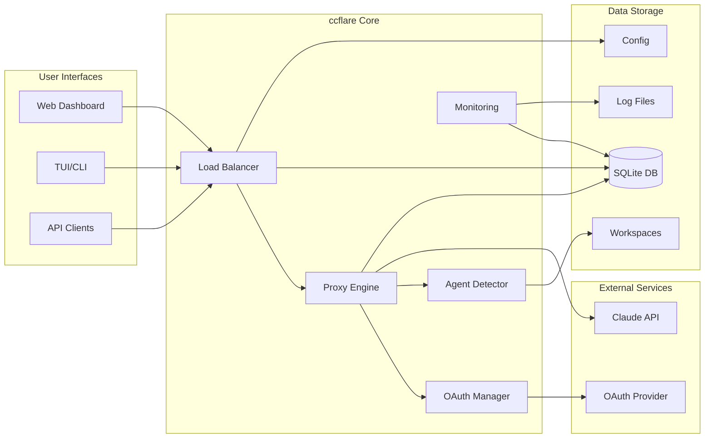

## High-Level Architecture Diagram

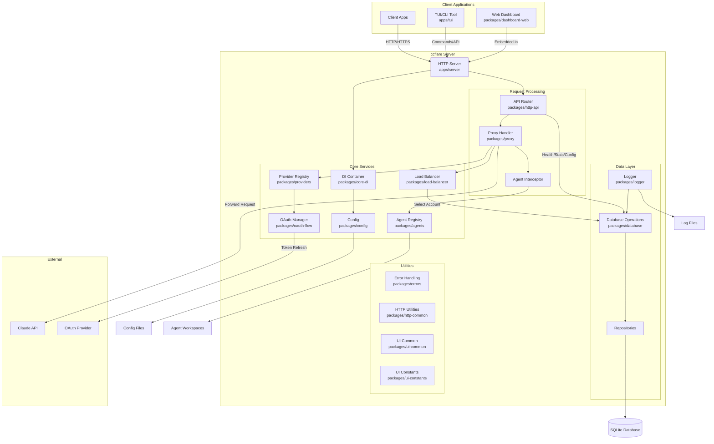

## Component Architecture

### Project Structure

The project is organized as a Bun monorepo with clear separation of concerns:

```
ccflare/
├── apps/                    # Deployable applications
│   ├── lander/            # Static landing page
│   ├── server/            # Main HTTP server
│   └── tui/               # Terminal UI with integrated CLI
├── packages/              # Shared libraries
│   ├── agents/            # Agent discovery and workspace management
│   ├── cli-commands/      # CLI command implementations
│   ├── config/            # Configuration management
│   ├── core/              # Core utilities and types
│   ├── core-di/           # Dependency injection
│   ├── dashboard-web/     # React dashboard
│   ├── database/          # SQLite operations with repository pattern
│   ├── errors/            # Error handling utilities
│   ├── http-api/          # REST API handlers
│   ├── http-common/       # Common HTTP utilities
│   ├── load-balancer/     # Load balancing strategies
│   ├── logger/            # Logging utilities
│   ├── oauth-flow/        # OAuth authentication flow
│   ├── providers/         # AI provider integrations
│   ├── proxy/             # Request proxy logic with agent interceptor
│   ├── tui-core/          # TUI screen components
│   ├── types/             # Shared TypeScript types
│   ├── ui-common/         # Shared UI components and formatters
│   └── ui-constants/      # UI constants and configuration
```

### 1. Server Application (`apps/server`)

The main HTTP server that orchestrates all components:

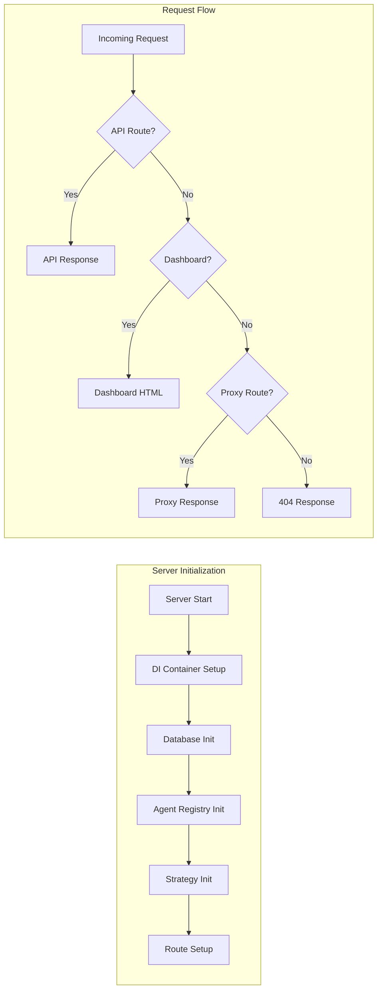

**Key Responsibilities:**
- HTTP server setup using Bun's native server
- Dependency injection container management
- Route handling delegation
- Static asset serving for dashboard
- Graceful shutdown coordination
- Strategy hot-reloading based on configuration changes
- Agent registry initialization

### 2. TUI Application with Integrated CLI (`apps/tui`)

The Terminal User Interface application that also serves as the CLI:

```mermaid
graph TB
    subgraph "TUI/CLI Entry Point"
        MAIN[main.ts]
        ARGS[Parse Arguments]
        
        subgraph "CLI Commands"
            SERVE[--serve]
            ADD[--add-account]
            LIST[--list]
            REMOVE[--remove]
            STATS[--stats]
            LOGS[--logs]
            ANALYZE[--analyze]
        end
        
        subgraph "Interactive Mode"
            TUI[TUI Interface]
            AUTO_SERVER[Auto-start Server]
        end
    end
    
    MAIN --> ARGS
    ARGS -->|CLI Command| CLI Commands
    ARGS -->|No Command| Interactive Mode
    TUI --> AUTO_SERVER
```

**Features:**
- Unified binary for both CLI and TUI functionality
- Auto-starts server when launching interactive TUI
- Account management commands
- Statistics viewing
- Log streaming
- Performance analysis
- Configuration updates

### 3. Agents Package (`packages/agents`)

Manages agent discovery and workspace registration:

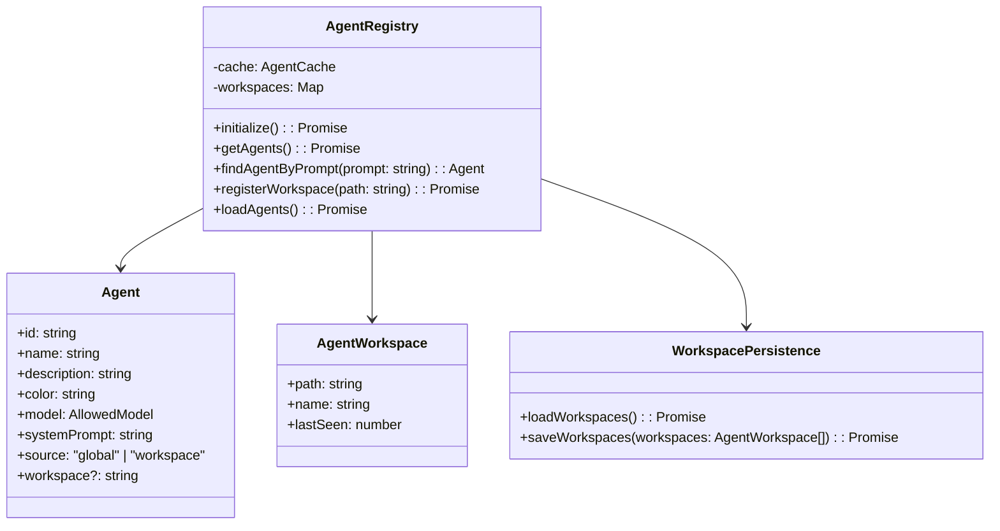

**Agent Discovery Process:**
1. **Global Agents**: Loaded from `~/.config/ccflare/agents/` directory
2. **Workspace Agents**: Dynamically discovered from `<workspace>/.claude/agents/` directories
3. **Agent Format**: Markdown files with frontmatter containing metadata
4. **Workspace Detection**: Automatically registers workspaces from system prompts containing CLAUDE.md references
5. **Model Preferences**: Per-agent model preferences stored in database

### 4. Load Balancer Package (`packages/load-balancer`)

Implements the session-based load balancing strategy:

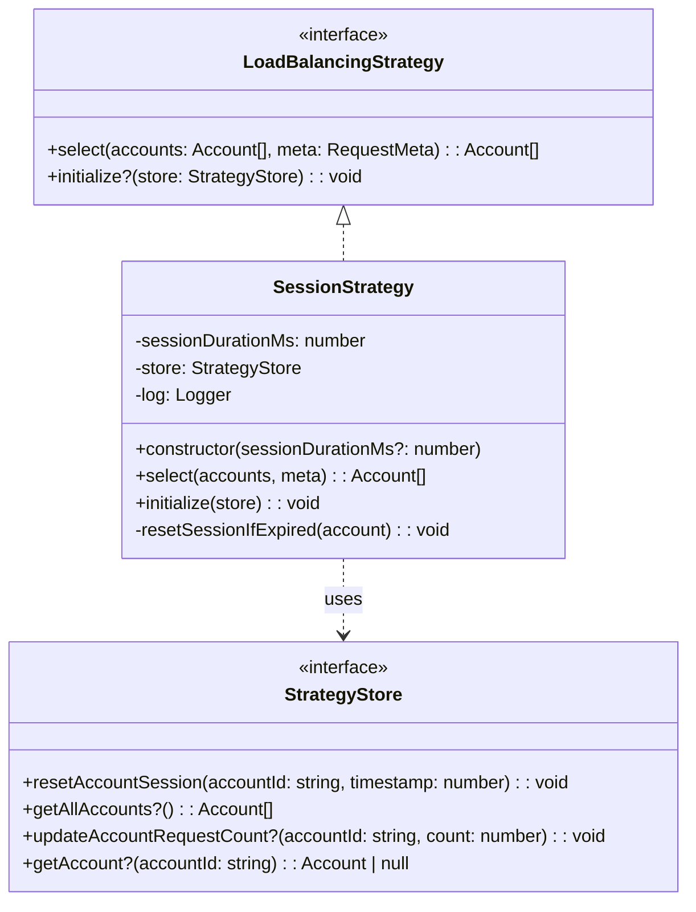

**Session Strategy:**
- **Session**: The only available strategy, maintains sticky sessions for a configured duration (default 5 hours)
- Minimizes account switching to avoid triggering Claude's anti-abuse systems
- Automatically handles failover when the active session account becomes unavailable
- Tracks session start time and request count per session

**Note:** Other strategies (round-robin, least-requests, weighted) were removed from the codebase as they could trigger account bans.

### 5. Provider Package (`packages/providers`)

Manages AI service providers with extensible architecture:

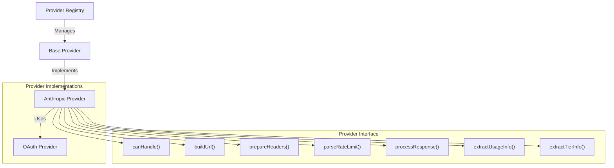

**Provider Features:**
- Provider registration and discovery
- OAuth token management with PKCE flow
- Rate limit parsing and tracking
- Usage metrics extraction
- Account tier detection
- Extensible for additional AI providers

### 6. Database Package (`packages/database`)

SQLite-based persistence layer with repository pattern and asynchronous writes:

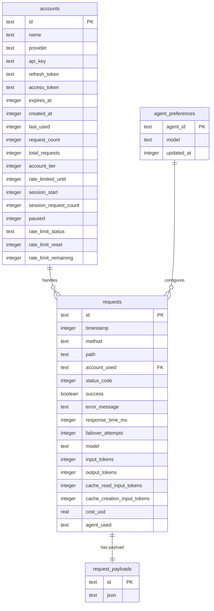

**Repository Pattern:**
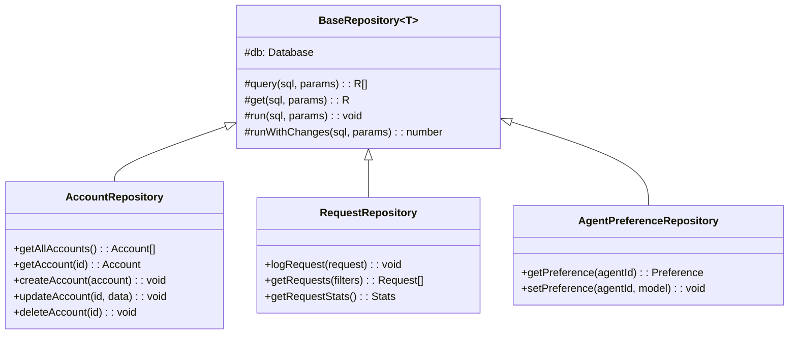

**Database Operations:**
- Account CRUD operations
- Request logging and analytics
- Rate limit tracking
- Session management
- Usage statistics
- Agent preference storage
- Migration system for schema evolution
- **AsyncDbWriter**: Queue-based asynchronous writes to prevent blocking
  - Processes database writes in batches every 100ms
  - Ensures graceful shutdown with queue flushing
  - Prevents database write bottlenecks during high load

### 7. Proxy Package (`packages/proxy`)

Core request forwarding logic with agent detection and streaming support:

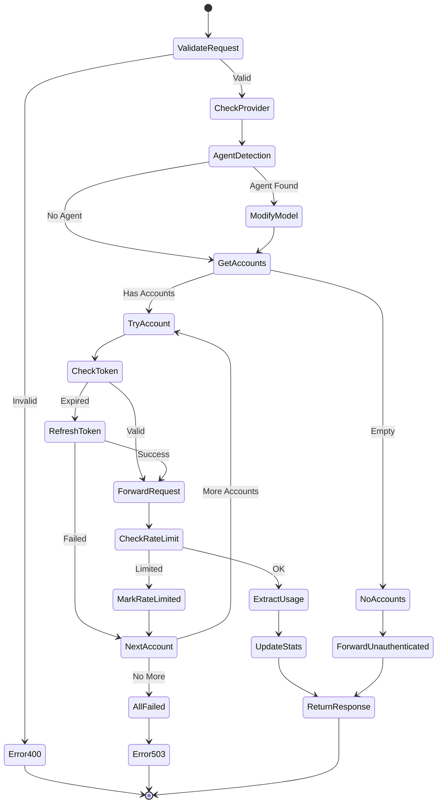

**Agent Interceptor:**
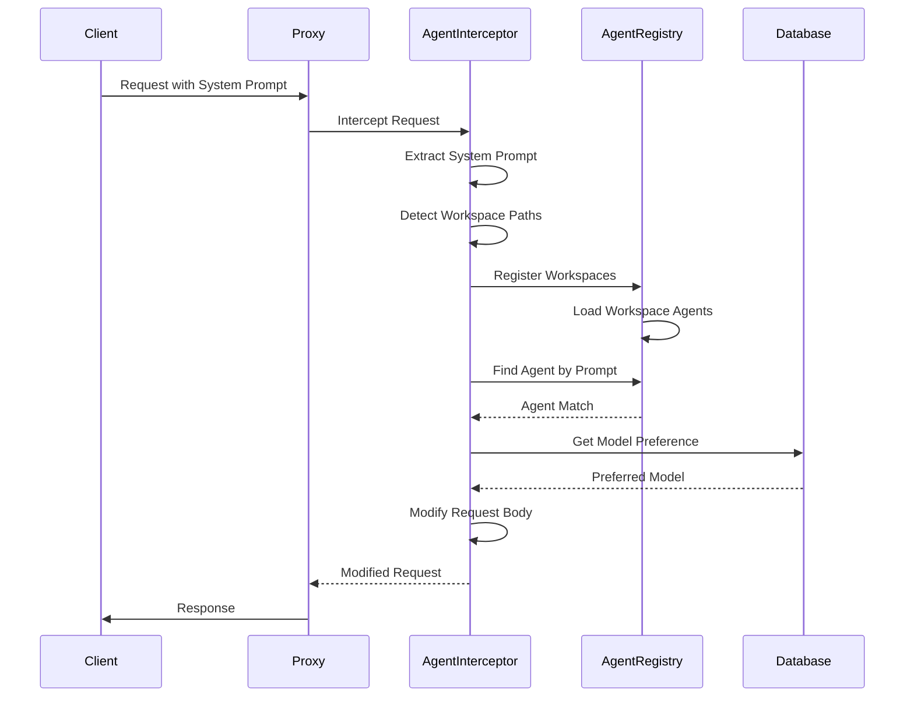

**Proxy Features:**
- Request validation and routing
- Token refresh with stampede prevention
- Retry logic with exponential backoff
- Rate limit detection and account marking
- Usage tracking and cost calculation
- Request/response payload logging
- **Agent Detection**: Automatically detects agent usage from system prompts
- **Model Override**: Applies agent-specific model preferences
- **Streaming Response Capture**: 
  - Tees streaming responses for analytics without blocking
  - Configurable buffer size (default 256KB)
  - Captures partial response bodies for debugging
- **Request Body Buffering**:
  - Buffers small request bodies (up to 256KB) for retry scenarios
  - Enables request replay on failover without client resend

### 8. OAuth Flow Package (`packages/oauth-flow`)

Manages the OAuth authentication flow:

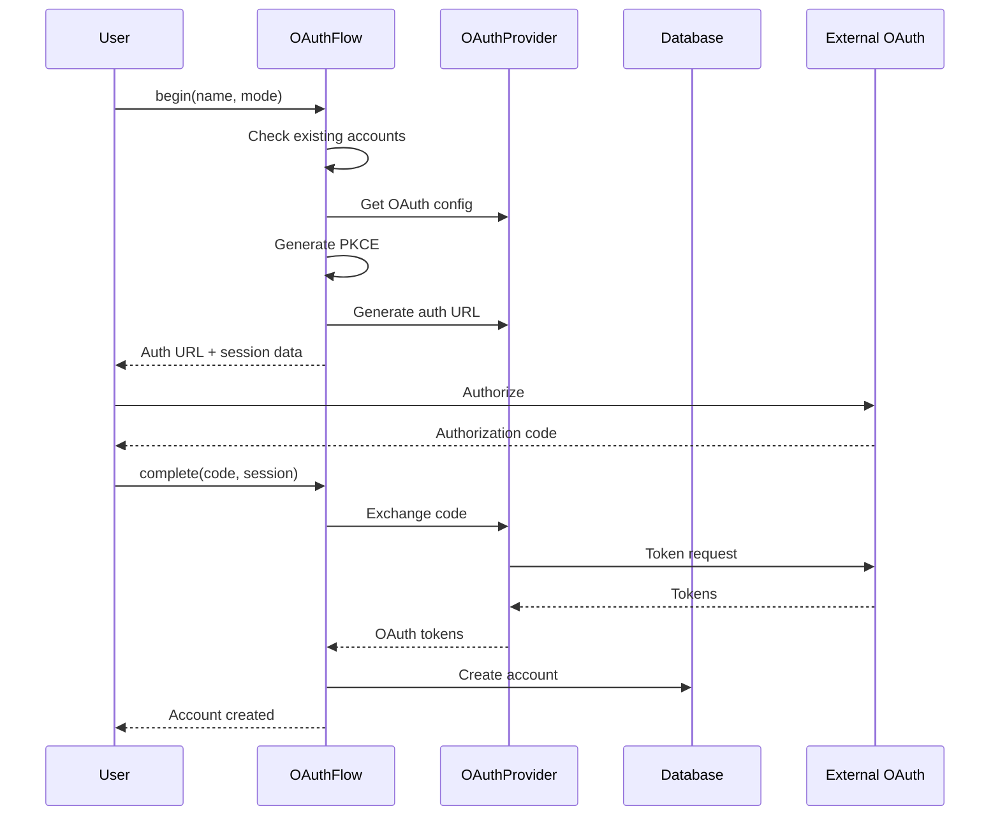

**Features:**
- PKCE (Proof Key for Code Exchange) support
- Session management
- Token exchange
- Account creation with tier support

### 9. HTTP API Package (`packages/http-api`)

RESTful API endpoints:

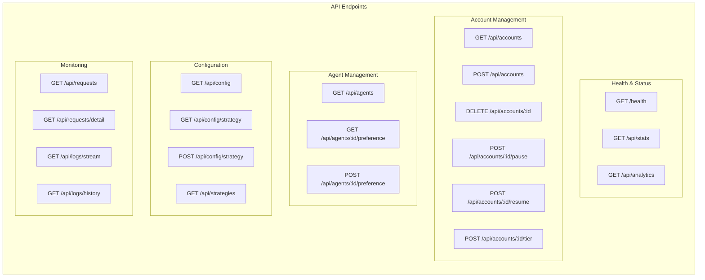

**Analytics Endpoint Enhancements:**
- **GET /api/analytics**: Advanced analytics with filtering support
  - Filter by time range (1h, 6h, 24h, 7d, 30d)
  - Filter by accounts (comma-separated list)
  - Filter by models (comma-separated list)
  - Filter by status (all, success, error)
  - Returns comprehensive metrics including:
    - Time series data with configurable bucketing
    - Token breakdown (input, cache, output)
    - Model distribution and performance metrics
    - Cost analysis by model
    - Account performance statistics
    - Agent usage statistics

### 10. Error Handling Package (`packages/errors`)

Centralized error handling utilities:

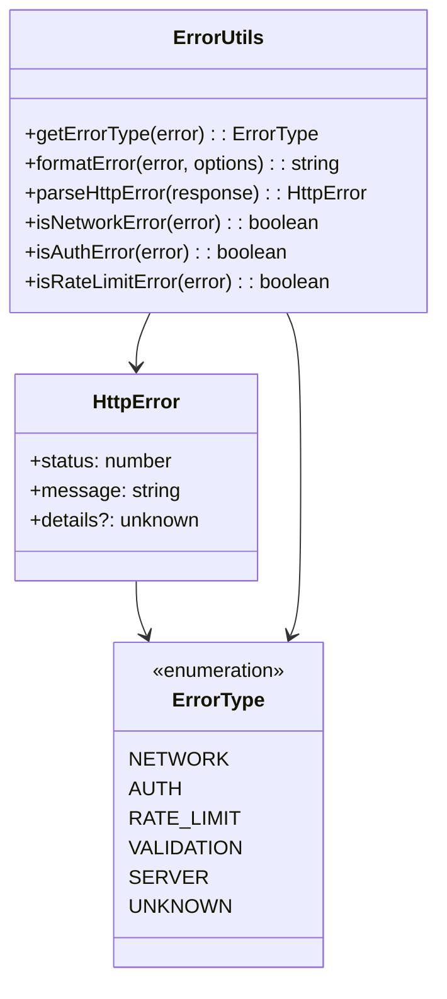

**Features:**
- Common HTTP error factories
- Error type detection
- User-friendly error formatting
- Response error parsing
- Type guards for specific error types

### 11. HTTP Common Package (`packages/http-common`)

Common HTTP utilities:

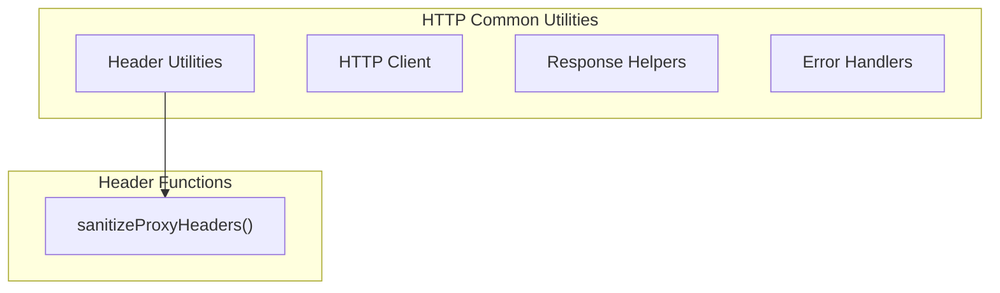

**Key Utilities:**
- **sanitizeProxyHeaders**: Removes hop-by-hop headers after automatic decompression
  - Removes: content-encoding, content-length, transfer-encoding
  - Ensures proper header forwarding through proxy
- HTTP client wrapper
- Response helpers
- Error handling utilities

### 12. UI Common Package (`packages/ui-common`)

Shared UI components and formatting utilities:

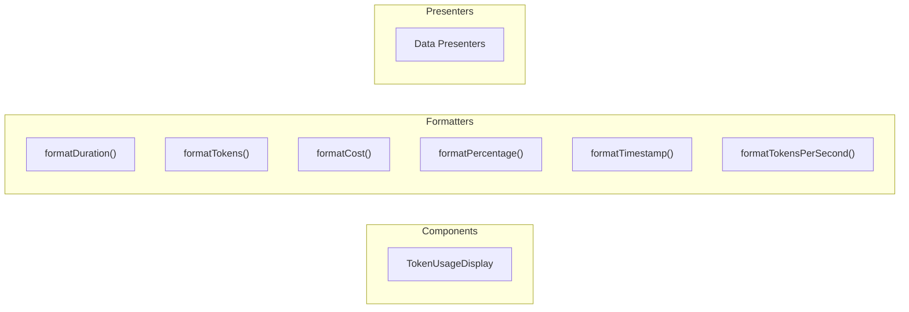

**Features:**
- Reusable React components
- Consistent data formatting across UI
- Token usage visualization
- Cost and performance metrics display

### 13. UI Constants Package (`packages/ui-constants`)

UI configuration and constants:

```typescript
// Color palette
export const COLORS = {
    primary: "#f38020",
    success: "#10b981",
    warning: "#f59e0b",
    error: "#ef4444",
    blue: "#3b82f6",
    purple: "#8b5cf6",
    pink: "#ec4899",
}

// Time ranges for analytics
export type TimeRange = "1h" | "6h" | "24h" | "7d" | "30d"

// Chart configurations
export const CHART_HEIGHTS = {
    small: 250,
    medium: 300,
    large: 400,
}

// Refresh intervals
export const REFRESH_INTERVALS = {
    default: 30000, // 30 seconds
    fast: 10000,    // 10 seconds
    slow: 60000,    // 1 minute
}
```

### 14. Core Packages

#### Core DI (`packages/core-di`)

Dependency injection container for managing service instances:

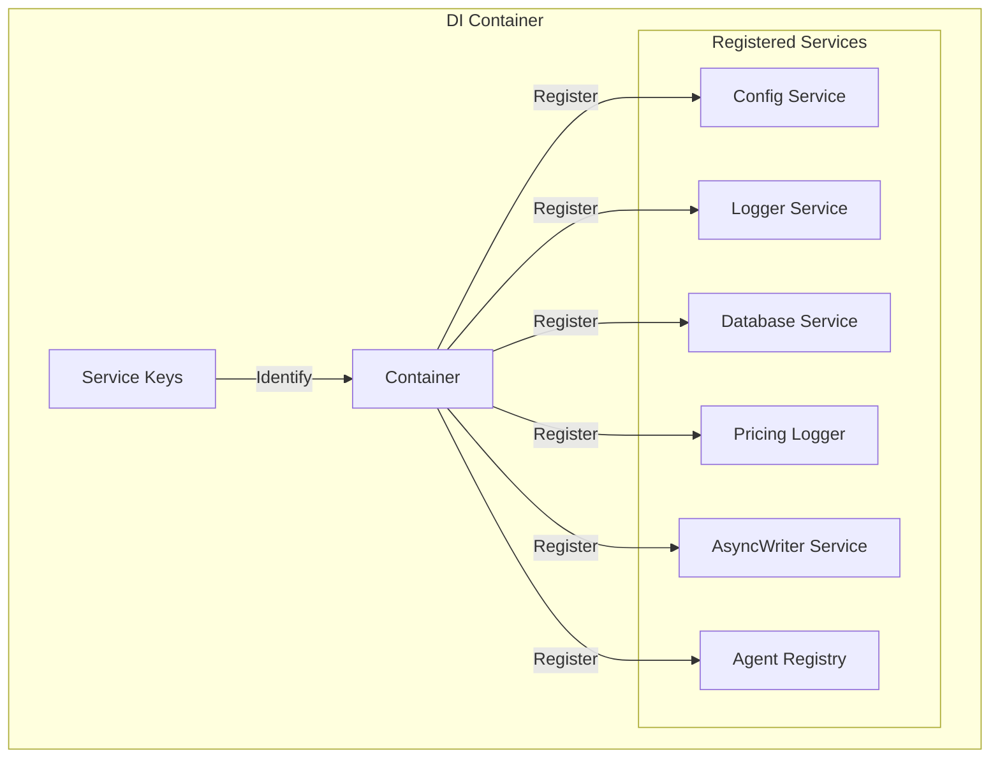

**Features:**
- Service registration and resolution
- Singleton pattern for shared instances
- Type-safe service keys
- Lifecycle management
- AsyncWriter integration for non-blocking database operations

#### Core (`packages/core`)

Shared utilities and types:
- Strategy interfaces and base implementations
- Account availability checks
- Pricing calculations
- Lifecycle management (graceful shutdown)
- Strategy store interface
- Common error types

#### Config (`packages/config`)

Configuration management:
- Runtime configuration
- Strategy selection
- Port and session duration settings
- File-based persistence
- Change event notifications
- **New Configuration Options**:
  - `streamBodyMaxBytes`: Controls streaming response buffer size (default: 256KB)
  - Environment variable support for all settings
  - Dynamic configuration reloading

#### Types (`packages/types`)

Shared TypeScript type definitions:
- API response types
- Strategy enums
- Logging interfaces
- Common data structures
- Agent types and interfaces

### 15. Dashboard Package (`packages/dashboard-web`)

React-based monitoring dashboard:

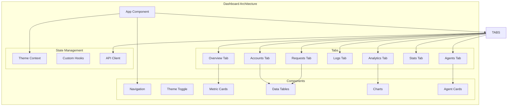

**New Features:**
- Agent management tab
- Model preference configuration
- Agent usage analytics
- Workspace visualization

## Agent System Architecture

The agent system allows ccflare to automatically detect and apply model preferences based on the agent being used:

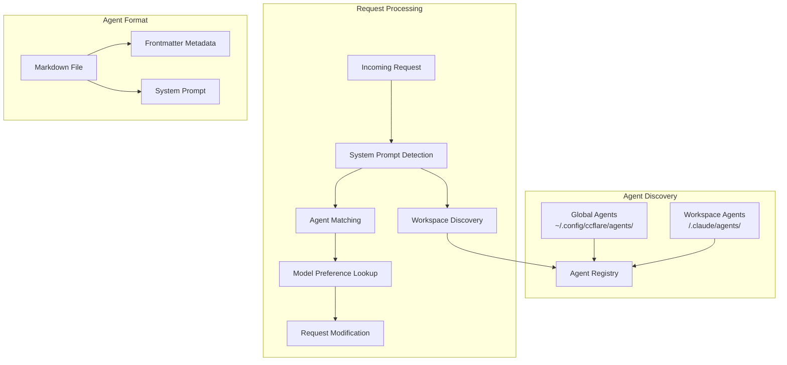

**Agent File Format:**
```markdown
---
name: "Agent Name"
description: "Agent description"
color: "blue"
model: "claude-opus-4-20250514"  # Optional, UI preference takes precedence
---

Your system prompt goes here...
```

**Workspace Discovery Process:**
1. System prompt analysis for CLAUDE.md references
2. Extraction of repository paths
3. Automatic workspace registration
4. Agent loading from `.claude/agents/` directories

## Applications

### 1. Server App (`apps/server`)

The main HTTP server application that:
- Hosts the proxy endpoints
- Serves the web dashboard
- Provides REST API endpoints
- Manages WebSocket connections for real-time updates
- Initializes agent registry

### 2. TUI App with Integrated CLI (`apps/tui`)

Unified terminal application built with Ink (React for CLI):
- **Interactive Mode**: 
  - Real-time monitoring dashboard in the terminal
  - Auto-starts server if not running
  - Interactive account management
  - Log streaming
  - Request monitoring
- **CLI Mode**: 
  - Account management (add, remove, list, pause, resume)
  - Statistics viewing
  - Log streaming with tail functionality
  - Performance analysis
  - Server startup with `--serve`
  - Configuration updates

**Note**: There is no separate CLI app - all CLI functionality is integrated into the TUI binary.

### 3. Landing Page (`apps/lander`)

Static landing page for the project:
- Project overview
- Screenshots
- Getting started guide
- Built with vanilla HTML/CSS

## Component Interaction Patterns

### Request Flow with Agent Detection

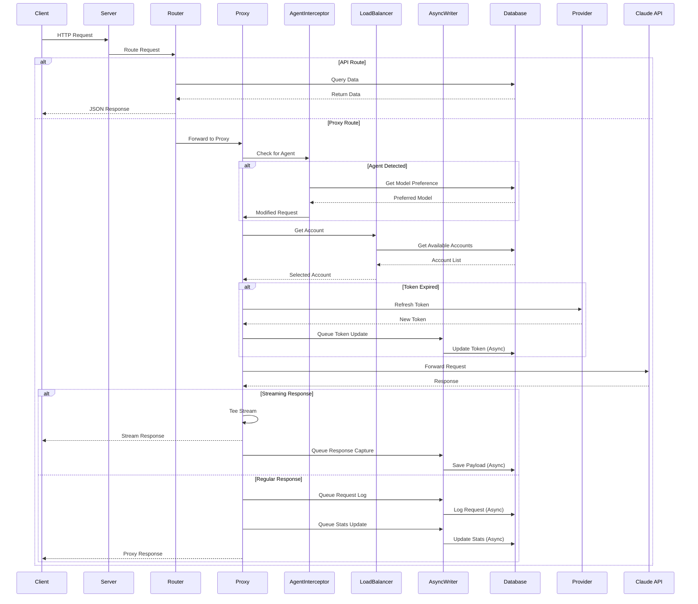

### Account Lifecycle

```mermaid
stateDiagram-v2
    [*] --> Created: Add Account
    Created --> Active: OAuth Success
    
    Active --> RateLimited: Hit Rate Limit
    Active --> Paused: Manual Pause
    Active --> Expired: Token Expired
    
    RateLimited --> Active: Reset Time Reached
    Paused --> Active: Manual Resume
    Expired --> Active: Token Refresh
    
    Active --> Removed: Delete Account
    Paused --> Removed: Delete Account
    Removed --> [*]
```

### Agent Lifecycle

```mermaid
stateDiagram-v2
    [*] --> GlobalAgent: Place in global directory
    [*] --> WorkspaceAgent: Place in workspace
    
    GlobalAgent --> Discovered: Registry scan
    WorkspaceAgent --> Discovered: Workspace registration
    
    Discovered --> Available: Loaded successfully
    Discovered --> Invalid: Parse failure
    
    Available --> InUse: System prompt match
    InUse --> ModelOverride: Preference exists
    InUse --> DefaultModel: No preference
    
    Available --> Updated: File modified
    Updated --> Available: Reload
    
    Available --> Removed: File deleted
    Removed --> [*]
```

### Streaming Architecture

ccflare implements sophisticated streaming support for handling large language model responses:

```mermaid
graph TB
    subgraph "Streaming Pipeline"
        REQ[Incoming Request]
        PROXY[Proxy Handler]
        
        subgraph "Stream Processing"
            TEE[Stream Tee]
            CLIENT[Client Stream]
            CAPTURE[Analytics Capture]
        end
        
        subgraph "Storage"
            BUFFER[Memory Buffer]
            ASYNC[AsyncWriter Queue]
            DB[(Database)]
        end
    end
    
    REQ --> PROXY
    PROXY --> TEE
    TEE --> CLIENT
    TEE --> CAPTURE
    CAPTURE --> BUFFER
    BUFFER --> ASYNC
    ASYNC --> DB
    
    style TEE fill:#f9f,stroke:#333,stroke-width:2px
    style ASYNC fill:#9f9,stroke:#333,stroke-width:2px
```

**Stream Tee Features:**
- Non-blocking stream duplication
- Configurable buffer limits (default 256KB)
- Graceful truncation for large responses
- Error handling without stream interruption
- Metadata preservation (truncation flags)

## Key Architectural Decisions

### 1. Modular Package Structure
- **Decision**: Organize code into focused packages with clear boundaries
- **Rationale**: Enables independent development, testing, and potential microservice migration
- **Trade-offs**: Some code duplication vs. tight coupling

### 2. SQLite for Persistence
- **Decision**: Use SQLite as the primary database
- **Rationale**: Zero-configuration, file-based, sufficient for expected load
- **Trade-offs**: Limited concurrent writes vs. operational simplicity

### 3. Bun Runtime
- **Decision**: Use Bun instead of Node.js
- **Rationale**: Better performance, built-in TypeScript, native SQLite support
- **Trade-offs**: Smaller ecosystem vs. performance gains

### 4. Strategy Pattern for Load Balancing
- **Decision**: Implement load balancing as pluggable strategies
- **Rationale**: Easy to add new algorithms, runtime switching
- **Trade-offs**: Additional abstraction vs. flexibility

### 5. Provider Abstraction
- **Decision**: Abstract AI providers behind a common interface
- **Rationale**: Future-proof for multiple AI services
- **Trade-offs**: Over-engineering for single provider vs. extensibility

### 6. Asynchronous Database Writes
- **Decision**: Implement AsyncDbWriter for non-blocking database operations
- **Rationale**: Prevent database writes from blocking request processing
- **Trade-offs**: Eventual consistency vs. immediate durability

### 7. Streaming Response Capture
- **Decision**: Tee streaming responses for analytics without blocking
- **Rationale**: Enable debugging and analytics for streaming LLM responses
- **Trade-offs**: Memory usage vs. complete observability

### 8. Real-time Monitoring
- **Decision**: Include comprehensive logging and real-time dashboards
- **Rationale**: Critical for debugging rate limits and performance
- **Trade-offs**: Storage overhead vs. observability

### 9. Repository Pattern for Database
- **Decision**: Implement repository pattern for database operations
- **Rationale**: Clean separation of data access logic, easier testing
- **Trade-offs**: Additional abstraction layer vs. maintainability

### 10. Agent System Integration
- **Decision**: Build agent detection and model preference into proxy layer
- **Rationale**: Transparent model switching without client changes
- **Trade-offs**: Request inspection overhead vs. flexibility

### 11. Unified TUI/CLI Binary
- **Decision**: Combine TUI and CLI into single binary
- **Rationale**: Simpler distribution, shared codebase, consistent behavior
- **Trade-offs**: Larger binary size vs. deployment simplicity

## Technology Stack

### Runtime & Language
- **Bun**: High-performance JavaScript runtime
- **TypeScript**: Type-safe development
- **React**: Dashboard UI framework
- **Ink**: Terminal UI framework
- **Tailwind CSS**: Utility-first styling

### Data Storage
- **SQLite**: Primary database
- **File System**: Log storage, configuration, agent definitions

### Key Libraries
- **@tanstack/react-query**: Dashboard data fetching
- **@nivo/charts**: Analytics visualization
- **Commander**: CLI argument parsing
- **PKCE**: OAuth security

### Development Tools
- **Biome**: Linting and formatting
- **Bun**: Monorepo management and build system
- **TypeScript**: Build system

## Security Considerations

1. **Token Storage**: OAuth tokens encrypted at rest
2. **API Authentication**: Currently relies on network security (localhost)
3. **Rate Limit Protection**: Automatic account rotation prevents service disruption
4. **Request Logging**: 
   - Sensitive data can be logged (configurable)
   - Request bodies buffered only for small payloads
   - Streaming responses captured with size limits
5. **Data Retention**: Automatic cleanup of old request payloads (configurable)
6. **Agent Security**: 
   - System prompts validated before agent matching
   - Model preferences require explicit configuration
   - Workspace registration limited to existing directories

## Performance Characteristics

1. **Request Overhead**: ~5-10ms for load balancing decision + agent detection
2. **Token Refresh**: Cached to prevent stampedes
3. **Database Operations**: 
   - Read operations: Direct synchronous access
   - Write operations: Queued through AsyncDbWriter (sub-millisecond enqueue)
   - Batch processing: Every 100ms for optimal throughput
4. **Memory Usage**: 
   - Base: Scales with active connections
   - Streaming: Up to 256KB per active stream (configurable)
   - AsyncWriter queue: Minimal, processes continuously
   - Agent cache: 5-minute TTL, lazy loading
5. **Streaming Performance**:
   - Zero-copy stream forwarding to clients
   - Parallel capture for analytics
   - Graceful degradation on memory pressure
6. **Agent Detection**:
   - System prompt analysis: <1ms for typical prompts
   - Workspace discovery: Cached after first detection
   - Model preference lookup: O(1) database query

## Future Extensibility

The architecture supports:
1. Additional AI providers (OpenAI, Cohere, etc.)
2. Distributed deployment with external database
3. Webhook notifications for events
4. Advanced analytics and ML-based load prediction
5. Multi-region deployment for global distribution
6. Real-time metrics export (Prometheus, DataDog)
7. Request replay and debugging tools
8. A/B testing for load balancing strategies
9. Plugin system for custom agents
10. GraphQL API layer
11. Multi-tenant support
12. Advanced agent capabilities (tool use, memory)

## Deployment Architecture

### Current Single-Instance Deployment

```mermaid
graph TB
    subgraph "Local Machine"
        SERVER[ccflare Server<br/>Port 8080]
        DB[(SQLite DB)]
        LOGS[Log Files]
        CONFIG[Config Files]
        AGENTS[Agent Definitions]
    end
    
    subgraph "Clients"
        LOCAL[Local Apps]
        REMOTE[Remote Clients]
        CLAUDE_CODE[Claude Code]
    end
    
    LOCAL -->|localhost:8080| SERVER
    REMOTE -->|http://host:8080| SERVER
    CLAUDE_CODE -->|Proxy Requests| SERVER
    SERVER --> DB
    SERVER --> LOGS
    SERVER --> CONFIG
    SERVER --> AGENTS
```

### Potential Distributed Architecture

```mermaid
graph TB
    subgraph "Load Balancer Tier"
        LB1[HAProxy/Nginx]
    end
    
    subgraph "Application Tier"
        APP1[ccflare Instance 1]
        APP2[ccflare Instance 2]
        APP3[ccflare Instance N]
    end
    
    subgraph "Data Tier"
        REDIS[(Redis Cache)]
        PG[(PostgreSQL)]
        S3[S3-Compatible<br/>Log Storage]
        CONSUL[Consul<br/>Agent Registry]
    end
    
    subgraph "Monitoring"
        PROM[Prometheus]
        GRAF[Grafana]
        SENTRY[Sentry]
    end
    
    LB1 --> APP1
    LB1 --> APP2
    LB1 --> APP3
    
    APP1 --> REDIS
    APP2 --> REDIS
    APP3 --> REDIS
    
    APP1 --> PG
    APP2 --> PG
    APP3 --> PG
    
    APP1 --> S3
    APP2 --> S3
    APP3 --> S3
    
    APP1 --> CONSUL
    APP2 --> CONSUL
    APP3 --> CONSUL
    
    APP1 --> PROM
    APP2 --> PROM
    APP3 --> PROM
    
    PROM --> GRAF
    APP1 --> SENTRY
    APP2 --> SENTRY
    APP3 --> SENTRY
```

## Monorepo Benefits

1. **Code Sharing**: Packages can be easily shared between applications
2. **Atomic Changes**: Related changes across packages can be committed together
3. **Consistent Tooling**: Single set of build tools and configurations
4. **Simplified Dependencies**: Internal packages are linked, not published
5. **Better Refactoring**: Easy to move code between packages

## Development Workflow

1. **Local Development**: `bun dev` starts all necessary services
2. **Testing**: Per-package tests with shared test utilities
3. **Building**: Bun handles build orchestration
4. **Type Safety**: TypeScript project references ensure type consistency
5. **Linting/Formatting**: Biome provides consistent code style
6. **Agent Development**: Drop markdown files in agent directories

## Recent Architectural Changes

### Version 2.0 Enhancements (Current)

1. **Asynchronous Database Operations**
   - Added AsyncDbWriter for non-blocking database writes
   - Improved request throughput by preventing database bottlenecks
   - Graceful shutdown with queue flushing

2. **Streaming Response Analytics**
   - Implemented stream teeing for response capture
   - Configurable buffer sizes for memory management
   - Partial response logging for debugging

3. **Enhanced Analytics API**
   - Advanced filtering by accounts, models, and status
   - Time-based bucketing for different time ranges
   - Comprehensive performance metrics per model
   - Cost analysis and token breakdown

4. **Request Handling Improvements**
   - Small request body buffering for retry scenarios
   - Better error handling and payload capture
   - Streaming response support with minimal overhead

5. **Configuration Enhancements**
   - New `streamBodyMaxBytes` setting
   - Environment variable support for all settings
   - Dynamic configuration updates without restart

6. **Agent System**
   - Automatic agent discovery from workspaces
   - System prompt-based agent detection
   - Per-agent model preferences
   - Workspace persistence and management

7. **Unified TUI/CLI**
   - Single binary for all terminal interactions
   - Auto-server startup in interactive mode
   - Comprehensive CLI commands
   - Performance analysis tools

8. **Enhanced Error Handling**
   - Centralized error utilities
   - Type-safe error detection
   - User-friendly error formatting

9. **UI Improvements**
   - Agent management interface
   - Model preference configuration
   - Enhanced analytics visualizations
   - Consistent formatting utilities