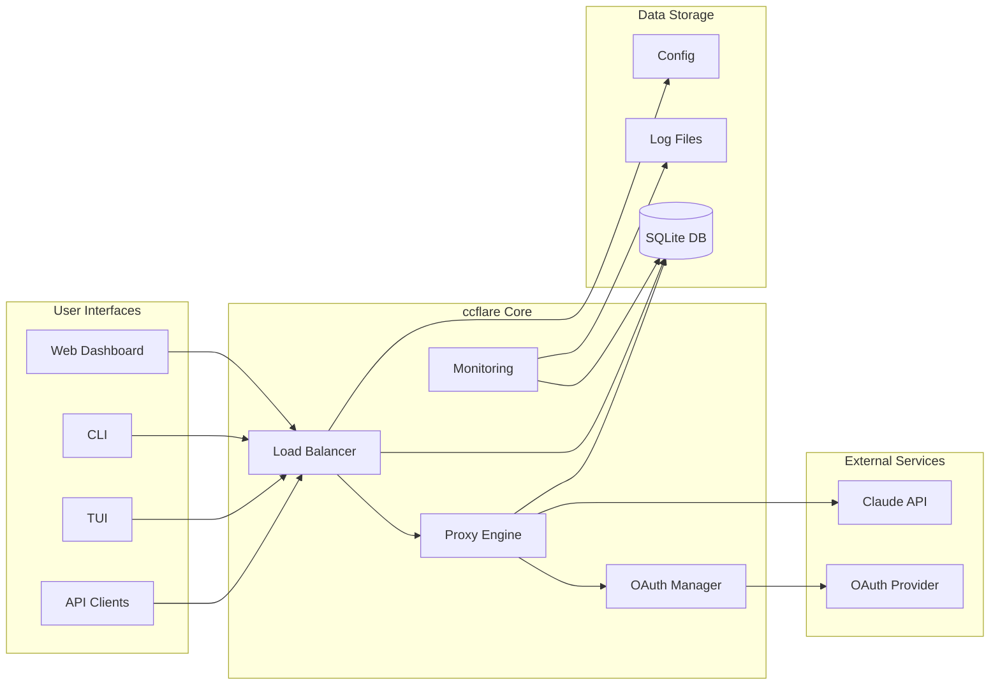
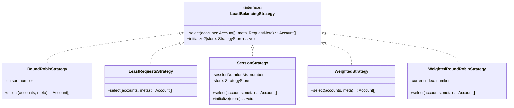
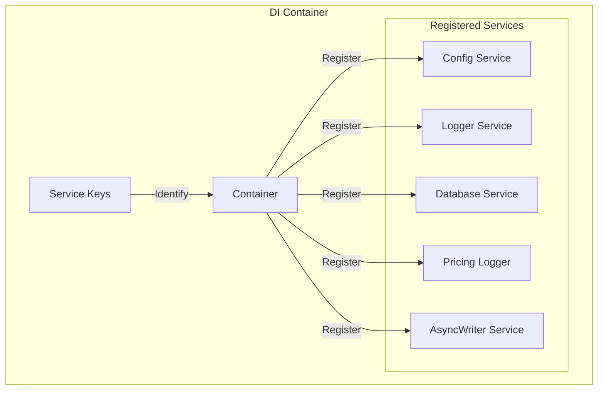
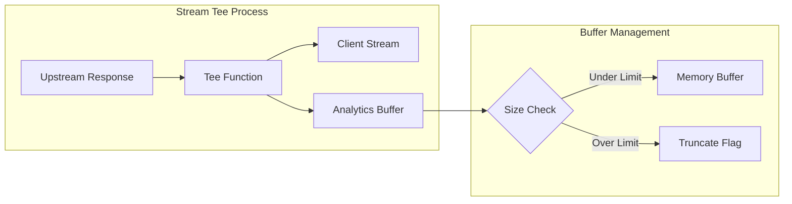
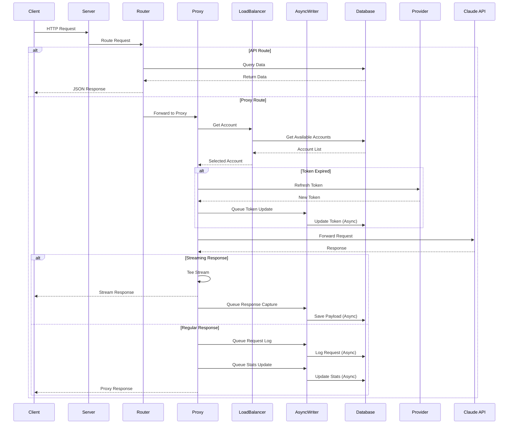
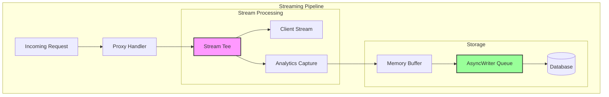
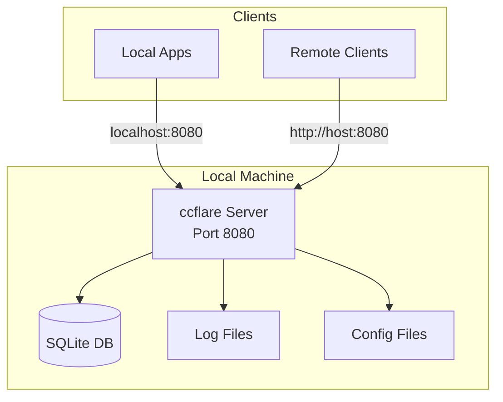

# ccflare Architecture Documentation

## Overview

ccflare is a sophisticated load balancer proxy system designed to distribute requests across multiple OAuth accounts for AI services (currently focused on Anthropic's Claude API). It prevents rate limiting by intelligently routing requests through different authenticated accounts using various load balancing strategies.

The system is built with a modular, microservices-inspired architecture using TypeScript and Bun runtime, emphasizing separation of concerns, extensibility, and real-time monitoring capabilities. Recent enhancements include asynchronous database operations, streaming response capture for analytics, and advanced request filtering.

## System Overview



## High-Level Architecture Diagram


## Component Architecture

### Project Structure

The project is organized as a Bun monorepo with clear separation of concerns:

```
ccflare/
├── apps/                    # Deployable applications
│   ├── cli/                # Command-line interface
│   ├── lander/            # Static landing page
│   ├── server/            # Main HTTP server
│   └── tui/               # Terminal UI (Ink-based)
├── packages/              # Shared libraries
│   ├── cli-commands/      # CLI command implementations
│   ├── config/            # Configuration management
│   ├── core/              # Core utilities and types
│   ├── core-di/           # Dependency injection
│   ├── dashboard-web/     # React dashboard
│   ├── database/          # SQLite operations
│   ├── http-api/          # REST API handlers
│   ├── load-balancer/     # Load balancing strategies
│   ├── logger/            # Logging utilities
│   ├── providers/         # AI provider integrations
│   ├── proxy/             # Request proxy logic
│   ├── tui-core/          # TUI screen components
│   └── types/             # Shared TypeScript types
```

### 1. Server Application (`apps/server`)

The main HTTP server that orchestrates all components:


**Key Responsibilities:**
- HTTP server setup using Bun's native server
- Dependency injection container management
- Route handling delegation
- Static asset serving for dashboard
- Graceful shutdown coordination
- Strategy hot-reloading based on configuration changes

### 2. Load Balancer Package (`packages/load-balancer`)

Implements multiple load balancing strategies:



**Strategy Descriptions:**
- **RoundRobin**: Distributes requests evenly across all available accounts
- **LeastRequests**: Prioritizes accounts with the lowest request count
- **Session**: Maintains sticky sessions for a configured duration (default 5 hours)
- **Weighted**: Considers account tier when distributing load
- **WeightedRoundRobin**: Round-robin with tier-based weighting

### 3. Provider Package (`packages/providers`)

Manages AI service providers with extensible architecture:

```mermaid
graph TB
    subgraph "Provider System"
        REG[Provider Registry]
        BASE[Base Provider]
        
        subgraph "Provider Implementations"
            ANTH[Anthropic Provider]
            OAUTH_PROV[OAuth Provider]
        end
        
        subgraph "Provider Interface"
            HANDLE[canHandle()]
            BUILD[buildUrl()]
            PREP[prepareHeaders()]
            PARSE[parseRateLimit()]
            PROC[processResponse()]
            USAGE[extractUsageInfo()]
            TIER[extractTierInfo()]
        end
    end
    
    REG -->|Manages| BASE
    BASE -->|Implements| ANTH
    ANTH -->|Uses| OAUTH_PROV
    ANTH --> HANDLE
    ANTH --> BUILD
    ANTH --> PREP
    ANTH --> PARSE
    ANTH --> PROC
    ANTH --> USAGE
    ANTH --> TIER
```

**Provider Features:**
- Provider registration and discovery
- OAuth token management with PKCE flow
- Rate limit parsing and tracking
- Usage metrics extraction
- Account tier detection
- Extensible for additional AI providers

### 4. Database Package (`packages/database`)

SQLite-based persistence layer with asynchronous write capabilities:


**Database Operations:**
- Account CRUD operations
- Request logging and analytics
- Rate limit tracking
- Session management
- Usage statistics
- Migration system for schema evolution
- **AsyncDbWriter**: Queue-based asynchronous writes to prevent blocking
  - Processes database writes in batches every 100ms
  - Ensures graceful shutdown with queue flushing
  - Prevents database write bottlenecks during high load

### 5. Proxy Package (`packages/proxy`)

Core request forwarding logic with streaming support:


**Proxy Features:**
- Request validation and routing
- Token refresh with stampede prevention
- Retry logic with exponential backoff
- Rate limit detection and account marking
- Usage tracking and cost calculation
- Request/response payload logging
- **Streaming Response Capture**: 
  - Tees streaming responses for analytics without blocking
  - Configurable buffer size (default 256KB)
  - Captures partial response bodies for debugging
- **Request Body Buffering**:
  - Buffers small request bodies (up to 256KB) for retry scenarios
  - Enables request replay on failover without client resend

### 6. HTTP API Package (`packages/http-api`)

RESTful API endpoints:

```mermaid
graph LR
    subgraph "API Endpoints"
        subgraph "Health & Status"
            HEALTH[GET /health]
            STATS[GET /api/stats]
            ANALYTICS[GET /api/analytics]
        end
        
        subgraph "Account Management"
            LIST_ACC[GET /api/accounts]
            ADD_ACC[POST /api/accounts]
            DEL_ACC[DELETE /api/accounts/:id]
            PAUSE_ACC[POST /api/accounts/:id/pause]
            RESUME_ACC[POST /api/accounts/:id/resume]
            TIER_ACC[POST /api/accounts/:id/tier]
        end
        
        subgraph "Configuration"
            GET_CFG[GET /api/config]
            GET_STRAT[GET /api/config/strategy]
            SET_STRAT[POST /api/config/strategy]
            LIST_STRAT[GET /api/strategies]
        end
        
        subgraph "Monitoring"
            REQ_SUM[GET /api/requests]
            REQ_DET[GET /api/requests/detail]
            LOG_STREAM[GET /api/logs/stream]
            LOG_HIST[GET /api/logs/history]
        end
    end

**Analytics Endpoint Enhancements:**
- **GET /api/analytics**: Advanced analytics with filtering support
  - Filter by time range (1h, 6h, 24h, 7d, 30d)
  - Filter by accounts (comma-separated list)
  - Filter by models (comma-separated list)
  - Filter by status (all, success, error)
  - Returns comprehensive metrics including:
    - Time series data with configurable bucketing
    - Token breakdown (input, cache, output)
    - Model distribution and performance metrics
    - Cost analysis by model
    - Account performance statistics
```

### 7. Core Packages

#### Core DI (`packages/core-di`)

Dependency injection container for managing service instances:



**Features:**
- Service registration and resolution
- Singleton pattern for shared instances
- Type-safe service keys
- Lifecycle management
- AsyncWriter integration for non-blocking database operations

#### Core (`packages/core`)

Shared utilities and types:
- Strategy interfaces and base implementations
- Account availability checks
- Pricing calculations
- Lifecycle management (graceful shutdown)
- Strategy store interface

#### Config (`packages/config`)

Configuration management:
- Runtime configuration
- Strategy selection
- Port and session duration settings
- File-based persistence
- Change event notifications
- **New Configuration Options**:
  - `streamBodyMaxBytes`: Controls streaming response buffer size (default: 256KB)
  - Environment variable support for all settings
  - Dynamic configuration reloading

#### Types (`packages/types`)

Shared TypeScript type definitions:
- API response types
- Strategy enums
- Logging interfaces
- Common data structures

### 8. CLI Commands Package (`packages/cli-commands`)

Command implementations for the CLI:


### 9. TUI Core Package (`packages/tui-core`)

Terminal UI functionality:
- Account management screens
- Log viewing
- Request monitoring
- Statistics display
- Server status

### 10. Stream Tee Utility (`packages/proxy/src/stream-tee.ts`)

Stream processing utility for non-blocking analytics:



**Features:**
- Zero-copy forwarding to client
- Configurable buffer limits
- Graceful truncation handling
- Error isolation from main stream

### 11. Dashboard Package (`packages/dashboard-web`)

React-based monitoring dashboard:


## Applications

### 1. Server App (`apps/server`)

The main HTTP server application that:
- Hosts the proxy endpoints
- Serves the web dashboard
- Provides REST API endpoints
- Manages WebSocket connections for real-time updates

### 2. CLI App (`apps/cli`)

Command-line interface for managing ccflare:
- Account management (add, remove, list)
- Statistics viewing
- Configuration updates
- Uses `packages/cli-commands` for implementation

### 3. TUI App (`apps/tui`)

Terminal User Interface built with Ink (React for CLI):
- Real-time monitoring dashboard in the terminal
- Interactive account management
- Log streaming
- Request monitoring
- Uses `packages/tui-core` for screens

### 4. Landing Page (`apps/lander`)

Static landing page for the project:
- Project overview
- Screenshots
- Getting started guide
- Built with vanilla HTML/CSS

## Component Interaction Patterns

### Request Flow Sequence



### Account Lifecycle


### Streaming Architecture

ccflare implements sophisticated streaming support for handling large language model responses:



**Stream Tee Features:**
- Non-blocking stream duplication
- Configurable buffer limits (default 256KB)
- Graceful truncation for large responses
- Error handling without stream interruption
- Metadata preservation (truncation flags)

## Key Architectural Decisions

### 1. Modular Package Structure
- **Decision**: Organize code into focused packages with clear boundaries
- **Rationale**: Enables independent development, testing, and potential microservice migration
- **Trade-offs**: Some code duplication vs. tight coupling

### 2. SQLite for Persistence
- **Decision**: Use SQLite as the primary database
- **Rationale**: Zero-configuration, file-based, sufficient for expected load
- **Trade-offs**: Limited concurrent writes vs. operational simplicity

### 3. Bun Runtime
- **Decision**: Use Bun instead of Node.js
- **Rationale**: Better performance, built-in TypeScript, native SQLite support
- **Trade-offs**: Smaller ecosystem vs. performance gains

### 4. Strategy Pattern for Load Balancing
- **Decision**: Implement load balancing as pluggable strategies
- **Rationale**: Easy to add new algorithms, runtime switching
- **Trade-offs**: Additional abstraction vs. flexibility

### 5. Provider Abstraction
- **Decision**: Abstract AI providers behind a common interface
- **Rationale**: Future-proof for multiple AI services
- **Trade-offs**: Over-engineering for single provider vs. extensibility

### 6. Asynchronous Database Writes
- **Decision**: Implement AsyncDbWriter for non-blocking database operations
- **Rationale**: Prevent database writes from blocking request processing
- **Trade-offs**: Eventual consistency vs. immediate durability

### 7. Streaming Response Capture
- **Decision**: Tee streaming responses for analytics without blocking
- **Rationale**: Enable debugging and analytics for streaming LLM responses
- **Trade-offs**: Memory usage vs. complete observability

### 8. Real-time Monitoring
- **Decision**: Include comprehensive logging and real-time dashboards
- **Rationale**: Critical for debugging rate limits and performance
- **Trade-offs**: Storage overhead vs. observability

## Technology Stack

### Runtime & Language
- **Bun**: High-performance JavaScript runtime
- **TypeScript**: Type-safe development
- **React**: Dashboard UI framework
- **Tailwind CSS**: Utility-first styling

### Data Storage
- **SQLite**: Primary database
- **File System**: Log storage

### Key Libraries
- **@tanstack/react-query**: Dashboard data fetching
- **@nivo/charts**: Analytics visualization
- **Ink**: Terminal UI framework
- **Commander**: CLI framework

### Development Tools
- **Biome**: Linting and formatting
- **Bun**: Monorepo management and build system
- **TypeScript**: Build system

## Security Considerations

1. **Token Storage**: OAuth tokens encrypted at rest
2. **API Authentication**: Currently relies on network security (localhost)
3. **Rate Limit Protection**: Automatic account rotation prevents service disruption
4. **Request Logging**: 
   - Sensitive data can be logged (configurable)
   - Request bodies buffered only for small payloads
   - Streaming responses captured with size limits
5. **Data Retention**: Automatic cleanup of old request payloads (configurable)

## Performance Characteristics

1. **Request Overhead**: ~5-10ms for load balancing decision
2. **Token Refresh**: Cached to prevent stampedes
3. **Database Operations**: 
   - Read operations: Direct synchronous access
   - Write operations: Queued through AsyncDbWriter (sub-millisecond enqueue)
   - Batch processing: Every 100ms for optimal throughput
4. **Memory Usage**: 
   - Base: Scales with active connections
   - Streaming: Up to 256KB per active stream (configurable)
   - AsyncWriter queue: Minimal, processes continuously
5. **Streaming Performance**:
   - Zero-copy stream forwarding to clients
   - Parallel capture for analytics
   - Graceful degradation on memory pressure

## Future Extensibility

The architecture supports:
1. Additional AI providers (OpenAI, Cohere, etc.)
2. Distributed deployment with external database
3. Webhook notifications for events
4. Advanced analytics and ML-based load prediction
5. Multi-region deployment for global distribution
6. Real-time metrics export (Prometheus, DataDog)
7. Request replay and debugging tools
8. A/B testing for load balancing strategies

## Deployment Architecture

### Current Single-Instance Deployment



### Potential Distributed Architecture


## Monorepo Benefits

1. **Code Sharing**: Packages can be easily shared between applications
2. **Atomic Changes**: Related changes across packages can be committed together
3. **Consistent Tooling**: Single set of build tools and configurations
4. **Simplified Dependencies**: Internal packages are linked, not published
5. **Better Refactoring**: Easy to move code between packages

## Development Workflow

1. **Local Development**: `bun dev` starts all necessary services
2. **Testing**: Per-package tests with shared test utilities
3. **Building**: Bun handles build orchestration
4. **Type Safety**: TypeScript project references ensure type consistency
5. **Linting/Formatting**: Biome provides consistent code style

## Recent Architectural Changes

### Version 2.0 Enhancements (Current)

1. **Asynchronous Database Operations**
   - Added AsyncDbWriter for non-blocking database writes
   - Improved request throughput by preventing database bottlenecks
   - Graceful shutdown with queue flushing

2. **Streaming Response Analytics**
   - Implemented stream teeing for response capture
   - Configurable buffer sizes for memory management
   - Partial response logging for debugging

3. **Enhanced Analytics API**
   - Advanced filtering by accounts, models, and status
   - Time-based bucketing for different time ranges
   - Comprehensive performance metrics per model
   - Cost analysis and token breakdown

4. **Request Handling Improvements**
   - Small request body buffering for retry scenarios
   - Better error handling and payload capture
   - Streaming response support with minimal overhead

5. **Configuration Enhancements**
   - New `streamBodyMaxBytes` setting
   - Environment variable support for all settings
   - Dynamic configuration updates without restart