# Claudeflare Data Flow Documentation

## Overview

Claudeflare is a load balancer proxy for Claude API that distributes requests across multiple OAuth accounts to avoid rate limiting. This document details the complete data flow through the system, including request lifecycle, error handling, token refresh, and rate limit management.

## Table of Contents

1. [Overview of Request Lifecycle](#overview-of-request-lifecycle)
2. [Sequence Diagrams](#sequence-diagrams)
   - [Successful Request Flow](#successful-request-flow)
   - [Rate Limited Request Flow](#rate-limited-request-flow)
   - [Token Refresh Flow](#token-refresh-flow)
   - [Failed Request with Retry Flow](#failed-request-with-retry-flow)
3. [Error Handling Flows](#error-handling-flows)
4. [Request Retry Logic](#request-retry-logic)
5. [Database Update Patterns](#database-update-patterns)

## Overview of Request Lifecycle

The request lifecycle in Claudeflare follows these main stages:

1. **Request Reception**: Client sends request to Claudeflare server
2. **Route Determination**: Server checks if it's an API request, dashboard request, or proxy request
3. **Account Selection**: Load balancer strategy selects available accounts based on configured algorithm
4. **Token Validation**: System checks if account has valid access token, refreshes if needed
5. **Request Forwarding**: Proxy forwards request to Anthropic API with authentication
6. **Response Handling**: System processes response, extracts usage data, checks rate limits
7. **Data Persistence**: Updates database with request history, usage stats, and rate limit info
8. **Response Streaming**: Returns response to client, preserving streaming capabilities

## Sequence Diagrams

### Successful Request Flow

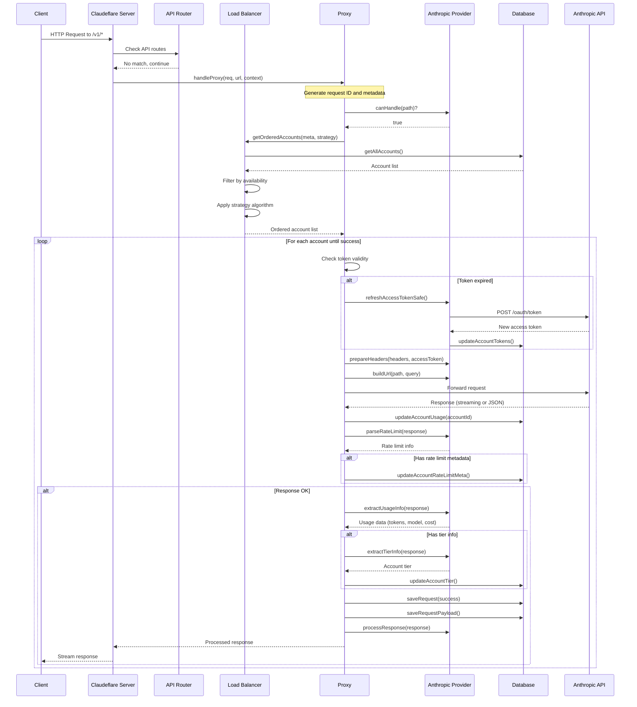

### Rate Limited Request Flow

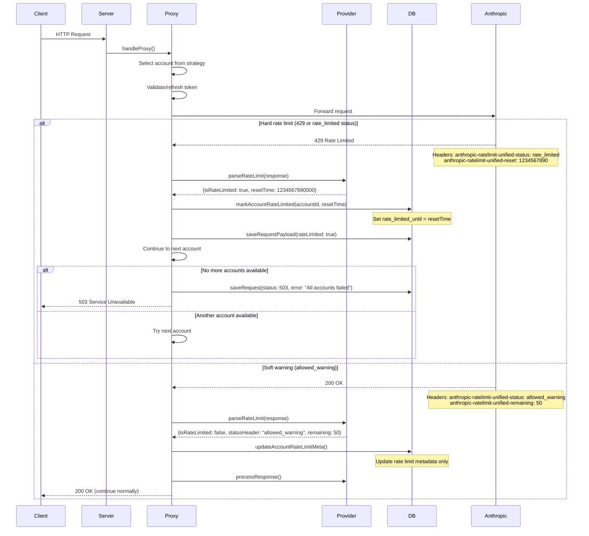

### Token Refresh Flow

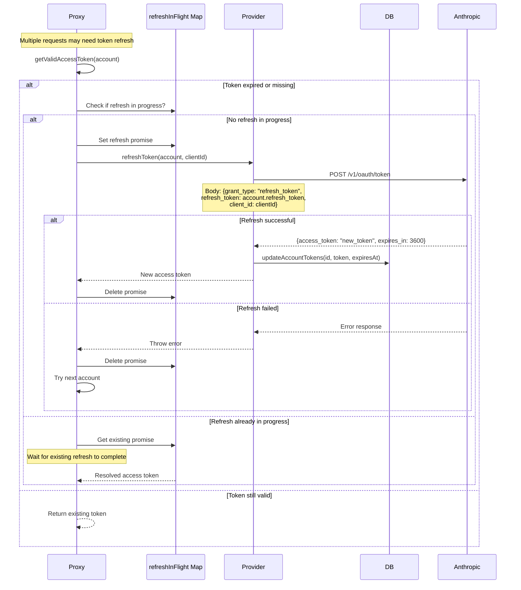

### Failed Request with Retry Flow

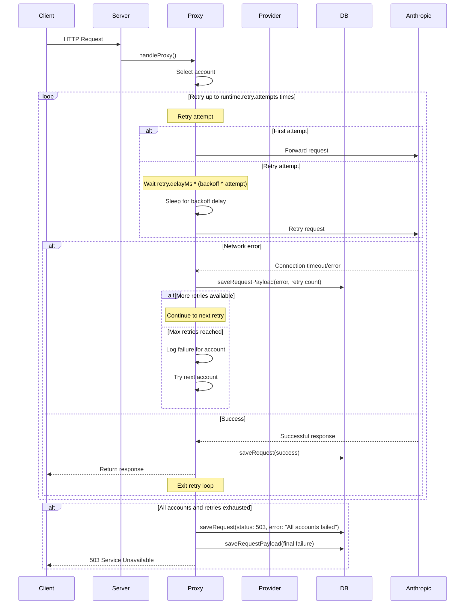

## Error Handling Flows

### Provider Cannot Handle Path

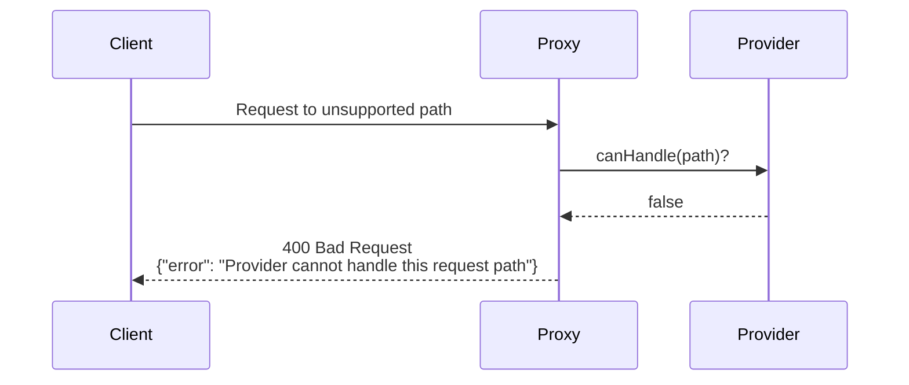

### No Available Accounts (Fallback Mode)

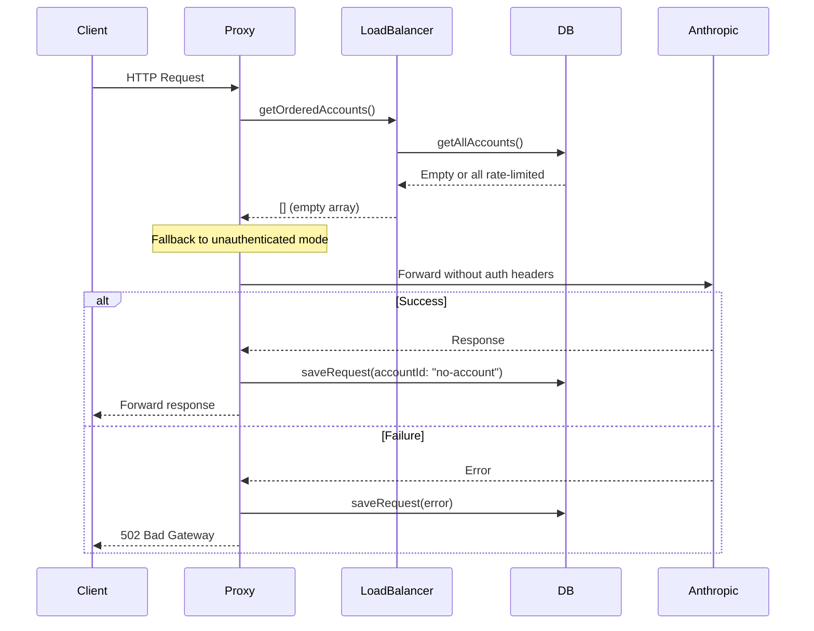

## Request Retry Logic

The retry mechanism follows an exponential backoff strategy:

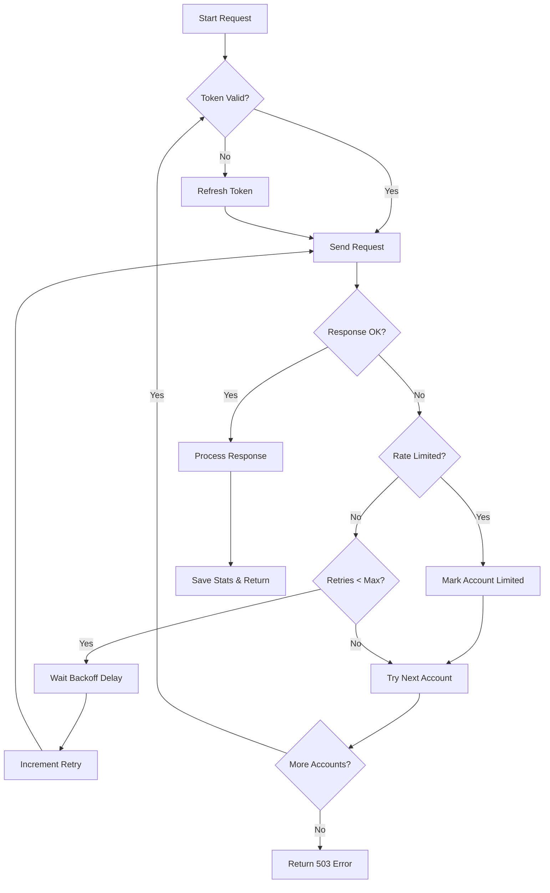

### Retry Configuration

- **Initial delay**: `runtime.retry.delayMs` (default from config)
- **Backoff multiplier**: `runtime.retry.backoff`
- **Max attempts**: `runtime.retry.attempts`
- **Delay calculation**: `delayMs * (backoff ^ attemptNumber)`

## Database Update Patterns

### Request Lifecycle Updates

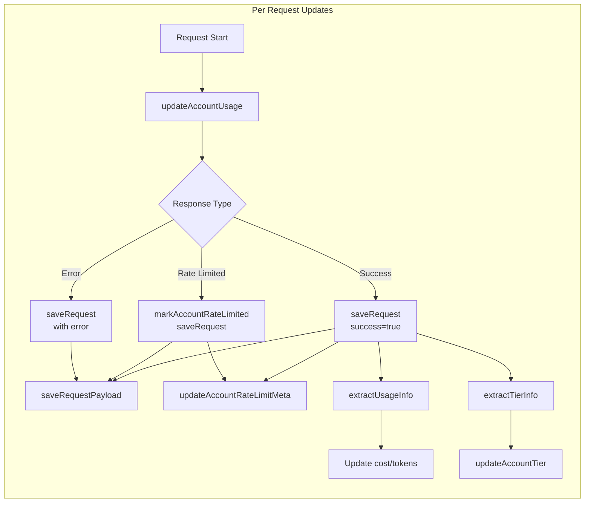

### Account State Management

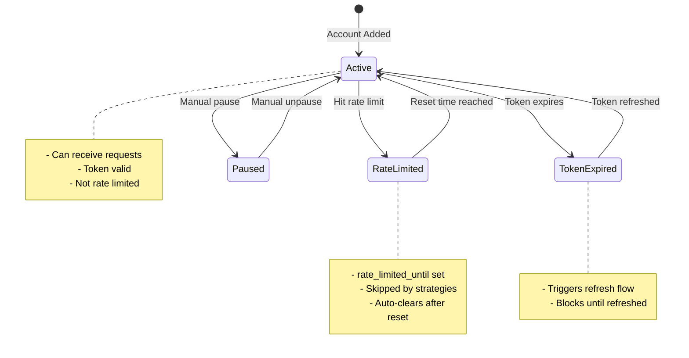

### Session Management (Session Strategy)

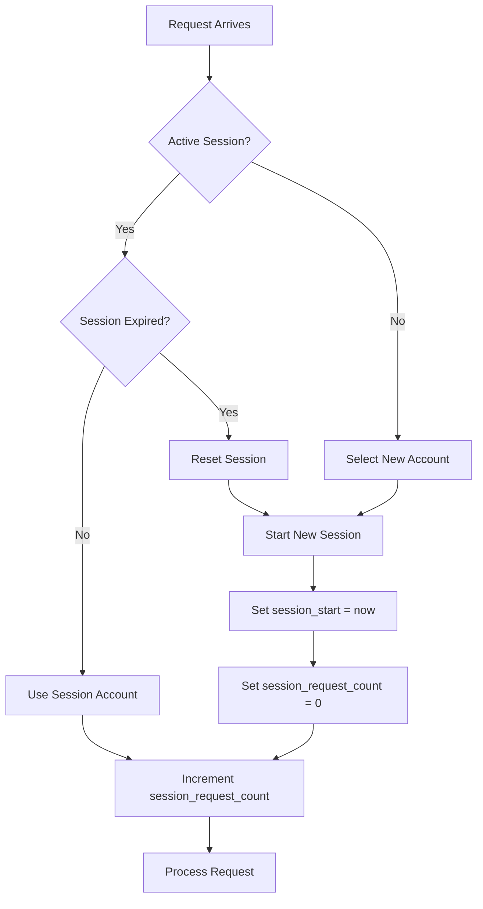

### Database Tables Updated

1. **accounts** table:
   - `last_used`: Updated on every request
   - `request_count`: Incremented per request
   - `total_requests`: Lifetime counter
   - `rate_limited_until`: Set when rate limited
   - `access_token` & `expires_at`: Updated on token refresh
   - `account_tier`: Updated when detected from response
   - `session_start` & `session_request_count`: For session strategy
   - `rate_limit_status`, `rate_limit_reset`, `rate_limit_remaining`: Rate limit metadata

2. **requests** table:
   - One row per request with status, timing, and usage data
   - Links to account used (or "no-account" for fallback)
   - Stores error messages for failed requests

3. **request_payloads** table:
   - Stores full request/response bodies (base64 encoded)
   - Includes headers and metadata
   - Used for debugging and replay

### Update Transaction Flow

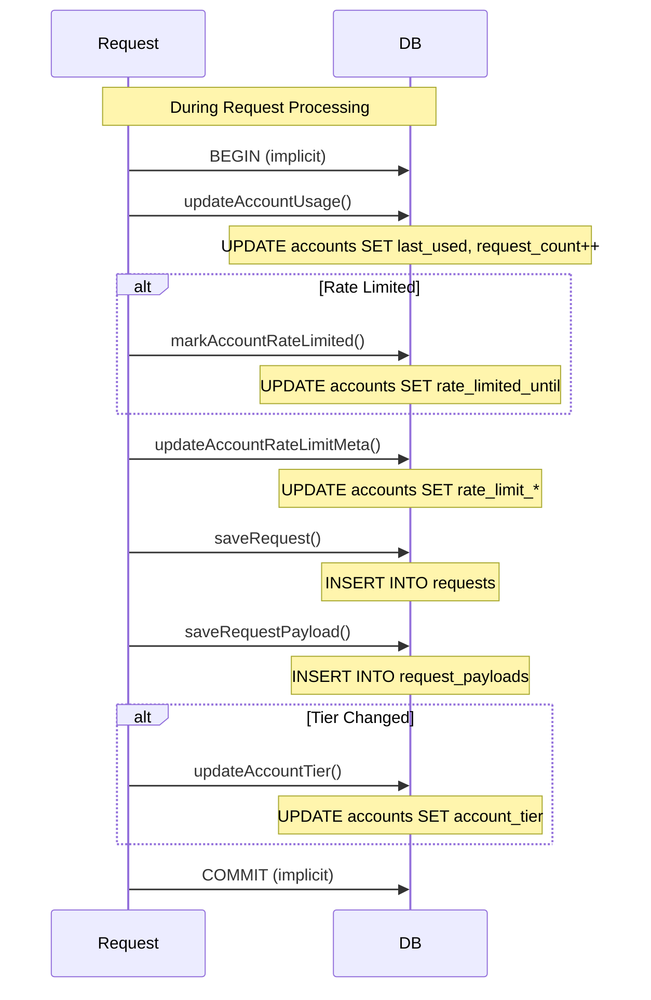

## Summary

The Claudeflare data flow is designed to:

1. **Maximize availability** through multiple account rotation and retry logic
2. **Prevent stampedes** with singleton token refresh promises
3. **Track everything** for debugging and analytics
4. **Handle failures gracefully** with fallback modes and clear error reporting
5. **Respect rate limits** intelligently, distinguishing between hard limits and warnings
6. **Optimize performance** through streaming responses and efficient database updates

The system ensures reliable Claude API access while providing comprehensive monitoring and management capabilities through its dashboard and API endpoints.