# ccflare Data Flow Documentation

## Overview

ccflare is a load balancer proxy for Claude API that distributes requests across multiple OAuth accounts to avoid rate limiting. This document details the complete data flow through the system, including request lifecycle, error handling, token refresh, rate limit management, and streaming response capture.

## Table of Contents

1. [Architecture Overview](#architecture-overview)
2. [Overview of Request Lifecycle](#overview-of-request-lifecycle)
3. [Sequence Diagrams](#sequence-diagrams)
   - [Successful Request Flow](#successful-request-flow)
   - [Rate Limited Request Flow](#rate-limited-request-flow)
   - [Token Refresh Flow](#token-refresh-flow)
   - [Failed Request with Retry Flow](#failed-request-with-retry-flow)
   - [Streaming Response Flow](#streaming-response-flow)
4. [Error Handling Flows](#error-handling-flows)
5. [Request Retry Logic](#request-retry-logic)
6. [Database Update Patterns](#database-update-patterns)
7. [Asynchronous Database Operations](#asynchronous-database-operations)

## Architecture Overview

ccflare uses a modular architecture with the following key components:

- **Server**: Main HTTP server handling routing between API, dashboard, and proxy requests
- **Proxy**: Core request forwarding logic with retry, rate limiting, and usage tracking
- **Provider System**: Abstraction layer for different AI providers (currently Anthropic)
- **Load Balancer**: Strategy pattern implementation for account selection
- **AsyncDbWriter**: Asynchronous database write queue to prevent blocking
- **Stream Tee**: Captures streaming responses for analytics without blocking the client
- **Service Container**: Dependency injection for component management

## Overview of Request Lifecycle

The request lifecycle in ccflare follows these main stages:

1. **Request Reception**: Client sends request to ccflare server
2. **Route Determination**: Server checks if it's an API request, dashboard request, or proxy request
3. **Account Selection**: Load balancer strategy selects available accounts based on configured algorithm
4. **Token Validation**: System checks if account has valid access token, refreshes if needed
5. **Request Forwarding**: Proxy forwards request to Anthropic API with authentication
6. **Response Handling**: System processes response, extracts usage data, checks rate limits
7. **Stream Capture**: For streaming responses, uses teeStream to capture content without blocking
8. **Data Persistence**: Queues database updates via AsyncDbWriter for non-blocking writes
9. **Response Streaming**: Returns response to client, preserving streaming capabilities
10. **Async Processing**: Background processing of usage data, cost calculation, and analytics

## Sequence Diagrams

### Successful Request Flow

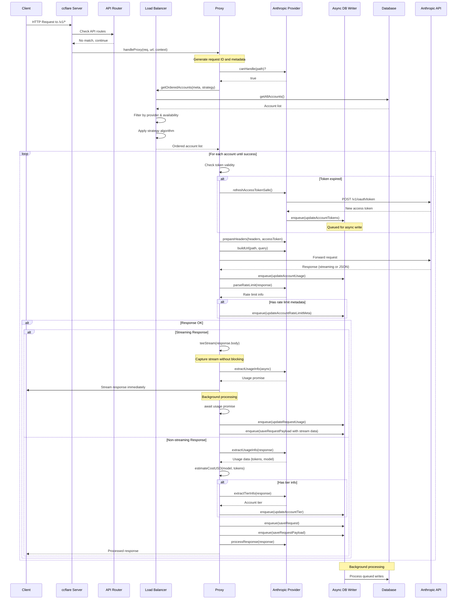

### Rate Limited Request Flow

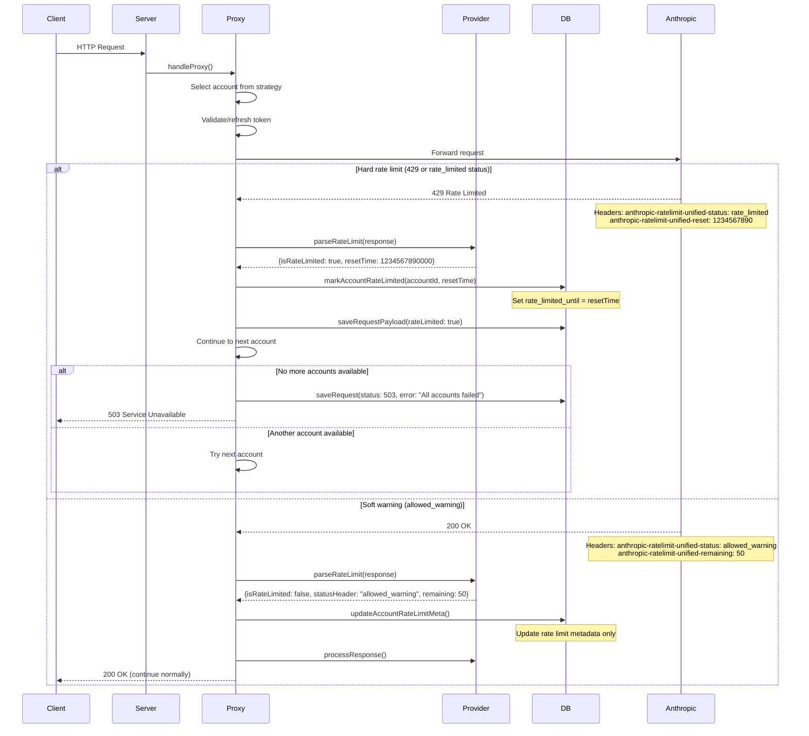

### Token Refresh Flow

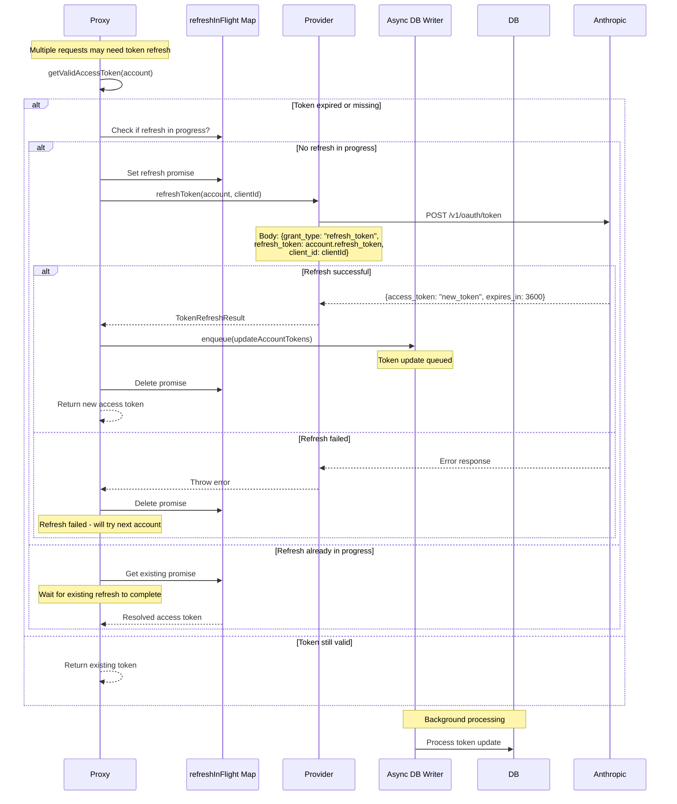

### Failed Request with Retry Flow

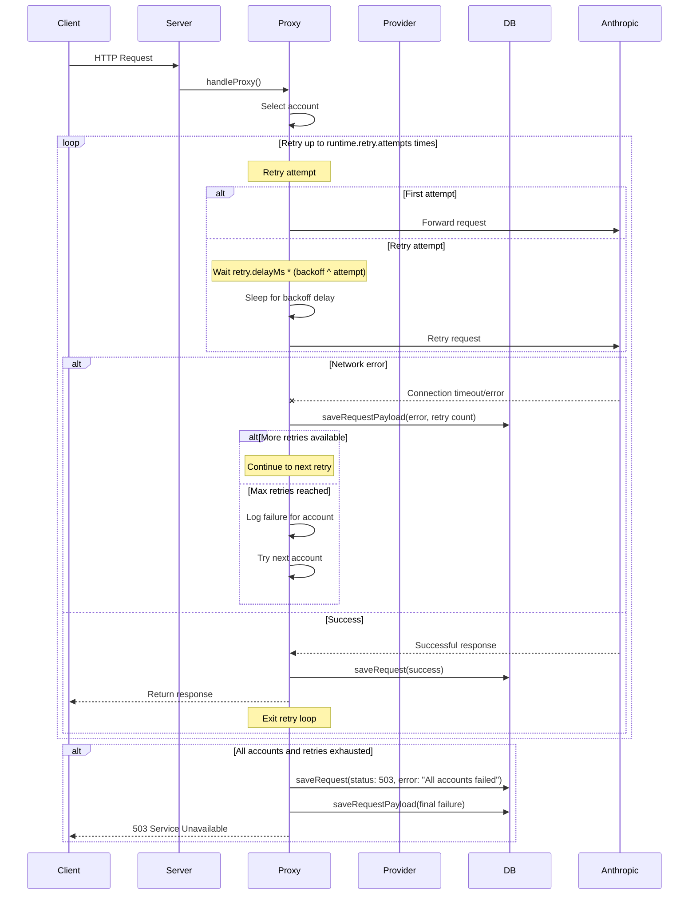

### Streaming Response Flow

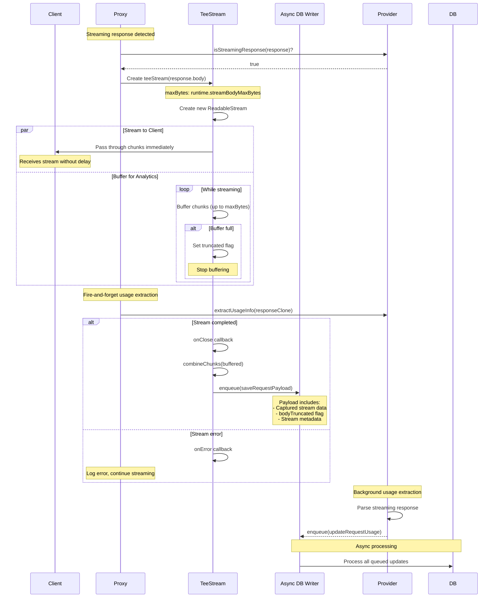

## Error Handling Flows

### Provider Cannot Handle Path

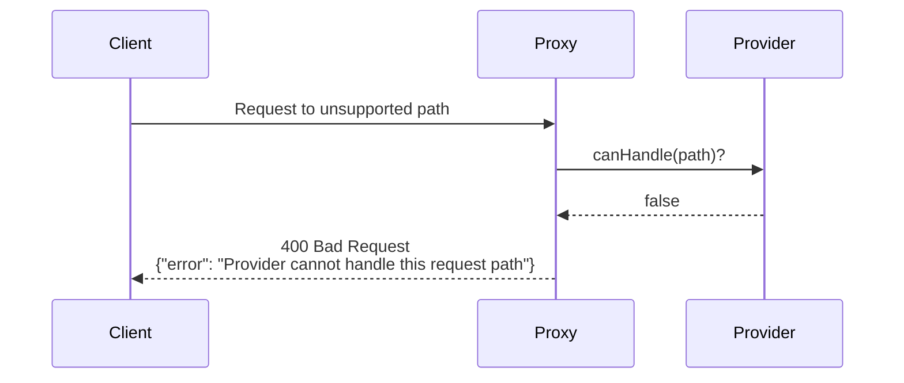

### No Available Accounts (Fallback Mode)

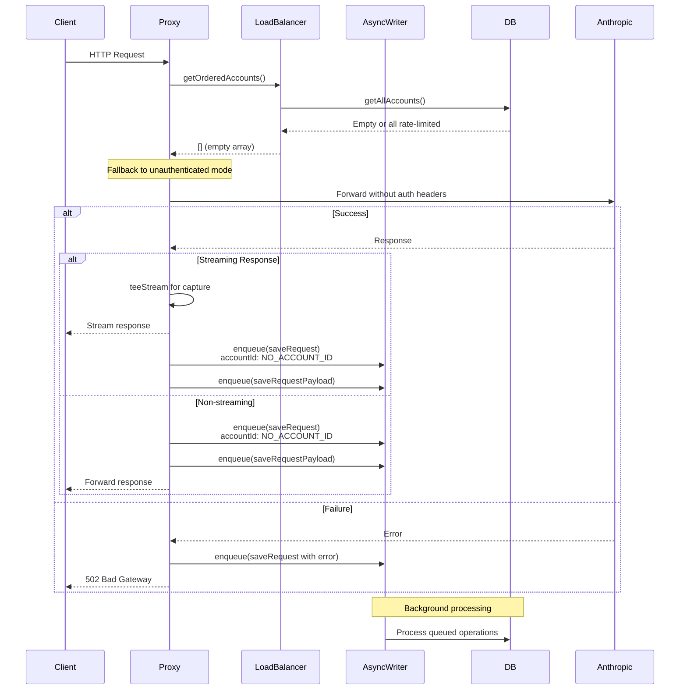

## Request Retry Logic

The retry mechanism follows an exponential backoff strategy:

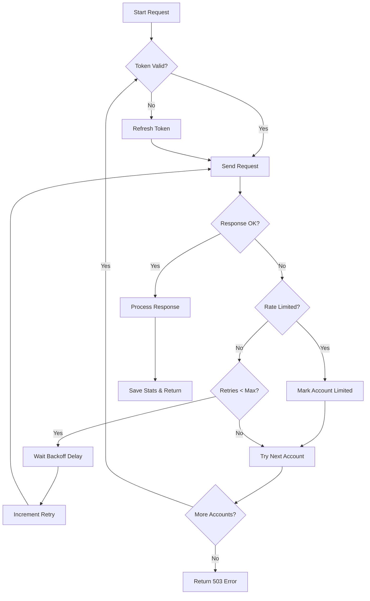

### Retry Configuration

- **Initial delay**: `runtime.retry.delayMs` (default: 1000ms, configurable)
- **Backoff multiplier**: `runtime.retry.backoff` (default: 2, configurable)
- **Max attempts**: `runtime.retry.attempts` (default: 3, configurable)
- **Delay calculation**: `delayMs * (backoff ^ attemptNumber)`
- **Stream body max bytes**: Default: 1MB (1024 * 1024 bytes) in teeStream

Configuration can be set via:
1. Environment variables: `RETRY_ATTEMPTS`, `RETRY_DELAY_MS`, `RETRY_BACKOFF`
2. Config file: `retry_attempts`, `retry_delay_ms`, `retry_backoff`
3. Default values in code

## Database Update Patterns

### Request Lifecycle Updates

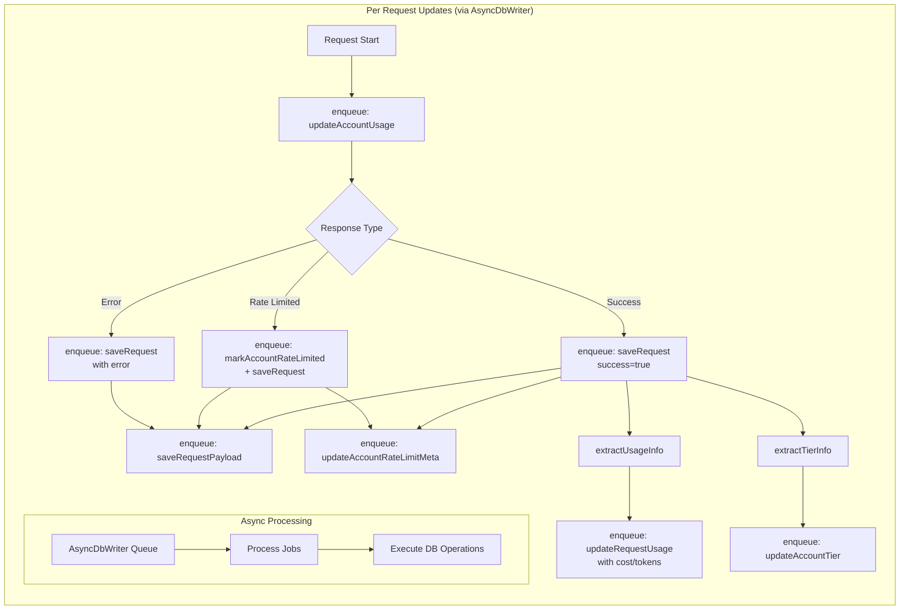

### Account State Management

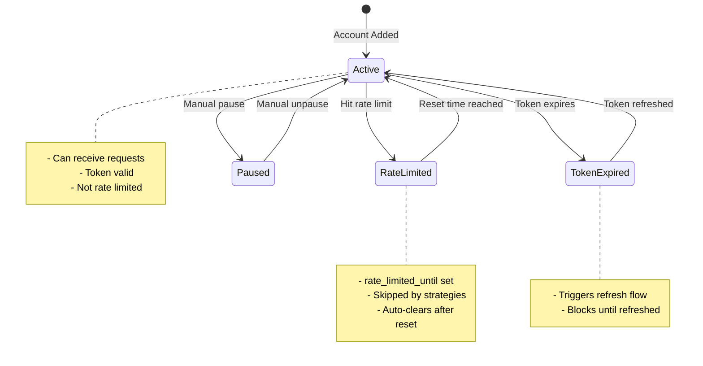

### Session Management (Session Strategy)

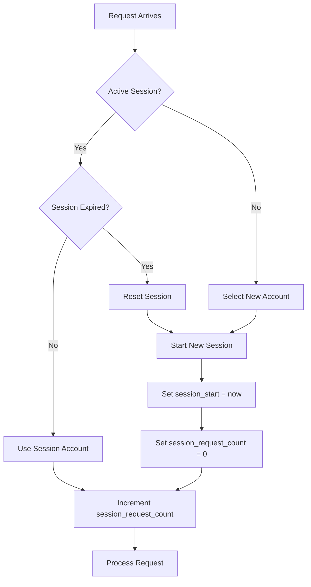

### Database Tables Updated

1. **accounts** table:
   - `last_used`: Updated on every request
   - `request_count`: Incremented per request
   - `total_requests`: Lifetime counter
   - `rate_limited_until`: Set when rate limited
   - `access_token` & `expires_at`: Updated on token refresh
   - `account_tier`: Updated when detected from response
   - `session_start` & `session_request_count`: For session strategy
   - `rate_limit_status`, `rate_limit_reset`, `rate_limit_remaining`: Rate limit metadata
   - `provider`: Provider type (e.g., "anthropic")

2. **requests** table:
   - One row per request with status, timing, and usage data
   - Links to account used (or "no-account" for fallback)
   - Stores error messages for failed requests
   - Enhanced usage tracking:
     - `model`: AI model used
     - `input_tokens`, `output_tokens`: Token counts
     - `cache_read_input_tokens`, `cache_creation_input_tokens`: Cache token details
     - `cost_usd`: Calculated cost in USD

3. **request_payloads** table:
   - Stores full request/response bodies (base64 encoded)
   - Includes headers and metadata
   - Enhanced metadata:
     - `isStream`: Whether response was streamed
     - `bodyTruncated`: If stream body exceeded maxBytes
     - `rateLimited`: If request hit rate limits
   - Used for debugging, replay, and analytics

### Update Transaction Flow

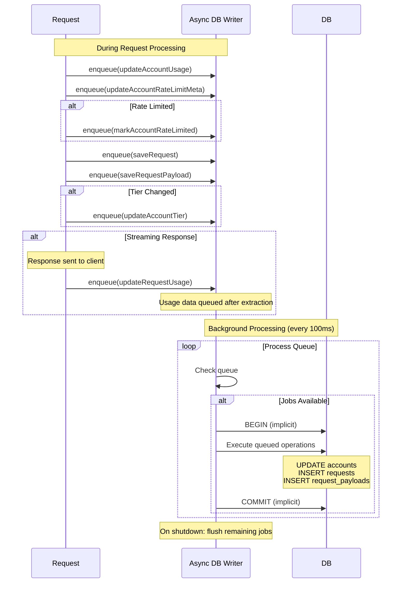

## Asynchronous Database Operations

The AsyncDbWriter component ensures non-blocking database operations:

### Architecture

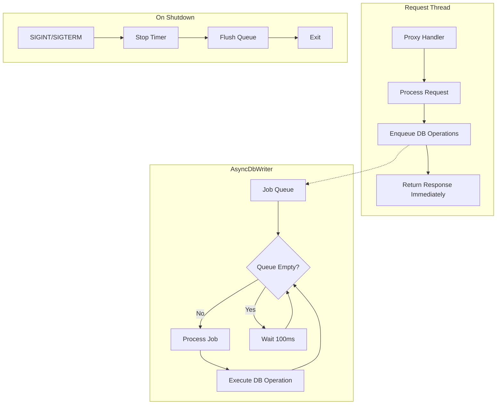

### Key Features

1. **Non-blocking Operations**: All database writes are queued, allowing requests to complete without waiting
2. **Batch Processing**: Queue processed every 100ms or immediately when jobs are added
3. **Graceful Shutdown**: Ensures all queued operations complete before process exit
4. **Error Isolation**: Failed DB operations don't affect request processing
5. **Memory Efficient**: Processes queue continuously to prevent unbounded growth

## Summary

The ccflare data flow is designed to:

1. **Maximize availability** through multiple account rotation and retry logic
2. **Prevent stampedes** with singleton token refresh promises
3. **Track everything** for debugging, analytics, and replay capabilities
4. **Handle failures gracefully** with fallback modes and clear error reporting
5. **Respect rate limits** intelligently, distinguishing between hard limits and warnings
6. **Optimize performance** through:
   - Non-blocking async database writes
   - Streaming response passthrough with tee capture
   - Efficient request/response payload storage
7. **Support analytics** by capturing streaming responses without impacting performance
8. **Enable debugging** through comprehensive request/response payload storage

The system ensures reliable Claude API access while providing comprehensive monitoring and management capabilities through its dashboard and API endpoints. Recent enhancements include streaming response capture for analytics, asynchronous database operations for better performance, and enhanced cost tracking with detailed token breakdowns.