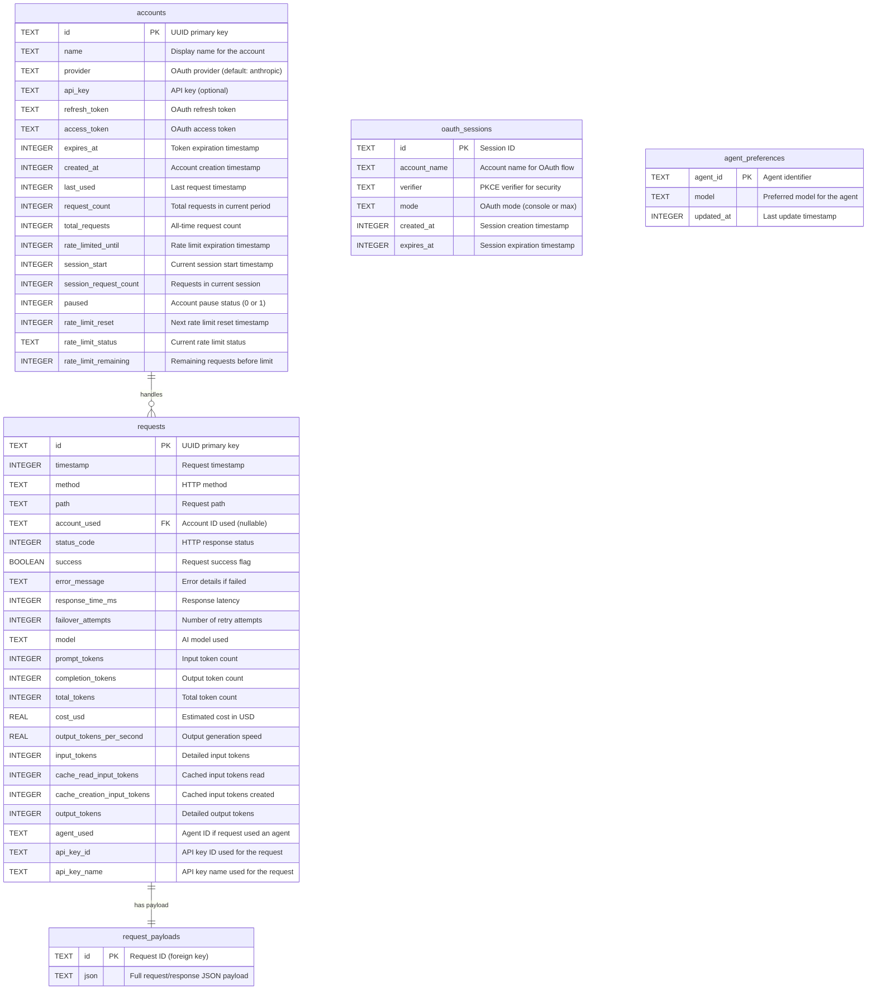

# Database Documentation

## Overview

better-ccflare uses SQLite as its database engine, providing a lightweight, serverless, and efficient storage solution for managing OAuth accounts, request history, and usage statistics. The database is designed to support high-performance load balancing operations while maintaining detailed audit trails and rate limit tracking.

### Key Features
- **Zero-configuration** deployment with SQLite
- **Automatic migrations** to handle schema evolution
- **Thread-safe operations** using Bun's SQLite bindings
- **Comprehensive indexing** for fast query performance
- **Foreign key constraints** for data integrity
- **Asynchronous write operations** for improved performance
- **Singleton pattern** with dependency injection support

## Database Schema

### Entity Relationship Diagram



## Table Documentation

### accounts Table

The `accounts` table stores OAuth account information and usage statistics for load balancing.

| Column | Type | Constraints | Description |
|--------|------|-------------|-------------|
| `id` | TEXT | PRIMARY KEY | UUID identifier for the account |
| `name` | TEXT | NOT NULL | Human-readable name for the account |
| `provider` | TEXT | DEFAULT 'anthropic' | OAuth provider identifier |
| `api_key` | TEXT | NULL | Optional API key for non-OAuth providers |
| `refresh_token` | TEXT | NOT NULL | OAuth refresh token for token renewal |
| `access_token` | TEXT | NULL | Current OAuth access token |
| `expires_at` | INTEGER | NULL | Unix timestamp when access token expires |
| `created_at` | INTEGER | NOT NULL | Unix timestamp when account was added |
| `last_used` | INTEGER | NULL | Unix timestamp of last request |
| `request_count` | INTEGER | DEFAULT 0 | Rolling window request count |
| `total_requests` | INTEGER | DEFAULT 0 | All-time request count |
| `rate_limited_until` | INTEGER | NULL* | Unix timestamp when rate limit expires |
| `session_start` | INTEGER | NULL* | Start of current usage session |
| `session_request_count` | INTEGER | DEFAULT 0* | Requests in current session |
| `paused` | INTEGER | DEFAULT 0* | 1 if account is paused, 0 if active |
| `rate_limit_reset` | INTEGER | NULL* | Next rate limit window reset time |
| `rate_limit_status` | TEXT | NULL* | Current rate limit status message |
| `rate_limit_remaining` | INTEGER | NULL* | Remaining requests in current window |

*Note: Columns marked with * are added via migrations and may not exist in databases created before the migration was introduced.

### requests Table

The `requests` table logs all proxied requests for analytics and debugging.

| Column | Type | Constraints | Description |
|--------|------|-------------|-------------|
| `id` | TEXT | PRIMARY KEY | UUID identifier for the request |
| `timestamp` | INTEGER | NOT NULL | Unix timestamp when request was made |
| `method` | TEXT | NOT NULL | HTTP method (GET, POST, etc.) |
| `path` | TEXT | NOT NULL | Request path/endpoint |
| `account_used` | TEXT | NULL | Account ID that handled the request |
| `status_code` | INTEGER | NULL | HTTP response status code |
| `success` | BOOLEAN | NULL | 1 for success, 0 for failure |
| `error_message` | TEXT | NULL | Error details if request failed |
| `response_time_ms` | INTEGER | NULL | Total response time in milliseconds |
| `failover_attempts` | INTEGER | DEFAULT 0 | Number of retry attempts |
| `model` | TEXT | NULL* | AI model used (e.g., claude-3-sonnet) |
| `prompt_tokens` | INTEGER | DEFAULT 0* | Legacy: Input token count |
| `completion_tokens` | INTEGER | DEFAULT 0* | Legacy: Output token count |
| `total_tokens` | INTEGER | DEFAULT 0* | Legacy: Total token count |
| `cost_usd` | REAL | DEFAULT 0* | Estimated cost in USD |
| `input_tokens` | INTEGER | DEFAULT 0* | Detailed input token count |
| `cache_read_input_tokens` | INTEGER | DEFAULT 0* | Tokens read from cache |
| `cache_creation_input_tokens` | INTEGER | DEFAULT 0* | Tokens written to cache |
| `output_tokens` | INTEGER | DEFAULT 0* | Detailed output token count |
| `output_tokens_per_second` | REAL | NULL* | Output generation speed (tokens/sec) |
| `agent_used` | TEXT | NULL* | Agent ID if request used an agent |
| `api_key_id` | TEXT | NULL* | API key ID used for the request |
| `api_key_name` | TEXT | NULL* | API key name used for the request |

*Note: Columns marked with * are added via migrations and may not exist in databases created before the migration was introduced.

**Indexes:**
- `idx_requests_timestamp` on `timestamp DESC` for efficient time-based queries
- `idx_requests_timestamp_account` on `timestamp DESC, account_used` for time-based account queries
- `idx_requests_model_timestamp` on `model, timestamp DESC` WHERE `model IS NOT NULL` for model analytics
- `idx_requests_success_timestamp` on `success, timestamp DESC` for success rate calculations
- `idx_requests_account_timestamp` on `account_used, timestamp DESC` for per-account analytics
- `idx_requests_cost_model` on `cost_usd, model, timestamp DESC` WHERE `cost_usd > 0 AND model IS NOT NULL` for cost analysis
- `idx_requests_response_time` on `model, response_time_ms` WHERE `response_time_ms IS NOT NULL AND model IS NOT NULL` for response time analysis
- `idx_requests_tokens` on `timestamp DESC, total_tokens` WHERE `total_tokens > 0` for token usage analysis
- `idx_requests_api_key` on `api_key_id` WHERE `api_key_id IS NOT NULL` for API key filtering
- `idx_requests_api_key_timestamp` on `api_key_id, timestamp DESC` WHERE `api_key_id IS NOT NULL` for API key analytics
- `idx_requests_api_key` on `api_key_id` WHERE `api_key_id IS NOT NULL` for API key filtering
- `idx_requests_api_key_timestamp` on `api_key_id, timestamp DESC` WHERE `api_key_id IS NOT NULL` for API key analytics with time-based queries

### request_payloads Table

The `request_payloads` table stores full request and response bodies for detailed analysis.

| Column | Type | Constraints | Description |
|--------|------|-------------|-------------|
| `id` | TEXT | PRIMARY KEY, FOREIGN KEY | References requests.id |
| `json` | TEXT | NOT NULL | Complete request/response JSON data |

**Foreign Key Constraints:**
- `id` references `requests(id)` with `ON DELETE CASCADE`

### oauth_sessions Table

The `oauth_sessions` table stores temporary OAuth PKCE (Proof Key for Code Exchange) data for secure authentication flows.

| Column | Type | Constraints | Description |
|--------|------|-------------|-------------|
| `id` | TEXT | PRIMARY KEY | Session identifier (UUID) |
| `account_name` | TEXT | NOT NULL | Name for the account being created |
| `verifier` | TEXT | NOT NULL | PKCE code verifier for security |
| `mode` | TEXT | NOT NULL | OAuth mode ('console' or 'claude-oauth') |
| `created_at` | INTEGER | NOT NULL | Unix timestamp when session was created |
| `expires_at` | INTEGER | NOT NULL | Unix timestamp when session expires |

**Indexes:**
- `idx_oauth_sessions_expires` on `expires_at` for efficient cleanup of expired sessions

### agent_preferences Table

The `agent_preferences` table stores user-defined model preferences for specific agents.

| Column | Type | Constraints | Description |
|--------|------|-------------|-------------|
| `agent_id` | TEXT | PRIMARY KEY | Unique identifier for the agent |
| `model` | TEXT | NOT NULL | Preferred model for this agent |
| `updated_at` | INTEGER | NOT NULL | Unix timestamp of last update |

### strategies Table (Not Yet Implemented)

**Note**: The codebase references a `strategies` table through the `StrategyRepository`, but this table is not currently created in the schema. When implemented, it would store:

| Column | Type | Constraints | Description |
|--------|------|-------------|-------------|
| `name` | TEXT | PRIMARY KEY | Strategy identifier |
| `config` | TEXT | NOT NULL | JSON configuration for the strategy |
| `updated_at` | INTEGER | NOT NULL | Unix timestamp of last update |

This table would be used for storing custom load balancing strategies and routing configurations.

## Migration System

The database uses an incremental migration system that:

1. **Ensures Base Schema**: Creates core tables if they don't exist
2. **Applies Migrations**: Checks for missing columns and adds them incrementally
3. **Preserves Data**: All migrations are additive, never destructive
4. **Logs Changes**: Outputs migration progress to console

### Migration Process

```typescript
// Migration execution order:
1. ensureSchema(db)      // Creates base tables
2. runMigrations(db)     // Applies incremental changes
```

Key migrations include:
- Rate limiting columns (`rate_limited_until`, `rate_limit_status`, etc.)
- Session tracking (`session_start`, `session_request_count`)
- Account priorities and pausing
- Token usage tracking for cost analysis
- Output tokens per second tracking
- Agent usage tracking
- Performance indexes for common query patterns

## Database Architecture

### Core Components

#### DatabaseOperations
The main database access layer that implements both `StrategyStore` and `Disposable` interfaces:
- Uses Repository Pattern for clean separation of concerns
- Manages direct SQLite connections via Bun's native SQLite bindings
- Handles all CRUD operations for accounts and requests
- Supports runtime configuration injection for session management
- Thread-safe for concurrent operations

#### DatabaseFactory
Singleton pattern implementation for global database instance management:
- Ensures a single database connection throughout the application
- Provides `initialize()` and `getInstance()` methods
- Integrates with the dependency injection container

#### AsyncDbWriter
Asynchronous write queue for non-blocking database operations:
- Batches write operations to improve performance
- Processes queue every 100ms or immediately when jobs are added
- Gracefully flushes pending operations on shutdown
- Prevents blocking the main thread during heavy write loads

#### Repository Pattern Architecture
The database uses a clean Repository Pattern with the following repositories:
- **AccountRepository**: Manages all account-related operations
- **RequestRepository**: Handles request logging and analytics queries
- **OAuthRepository**: Manages OAuth session storage and cleanup
- **StrategyRepository**: Handles strategy configuration storage (pending table implementation)
- **StatsRepository**: Provides consolidated statistics and analytics
- **AgentPreferenceRepository**: Manages agent-specific model preferences

Each repository:
- Extends a common `BaseRepository` class for shared functionality
- Encapsulates SQL queries and data transformations
- Provides type-safe interfaces for database operations
- Handles data mapping between database rows and application models

### Dependency Injection Integration
The database integrates with the DI container:
```typescript
// Registration in container
container.registerInstance(SERVICE_KEYS.Database, dbOps);

// Resolution from container
const db = container.resolve<DatabaseOperations>(SERVICE_KEYS.Database);
```

## Database Location and Configuration

### Default Location

The database file is stored in a platform-specific configuration directory:

- **macOS**: `~/Library/Application Support/better-ccflare/better-ccflare.db`
- **Linux**: `~/.config/better-ccflare/better-ccflare.db`
- **Windows**: `%APPDATA%\better-ccflare\better-ccflare.db`

### Custom Location

You can override the default location using the `better-ccflare_DB_PATH` environment variable:

```bash
export better-ccflare_DB_PATH=/custom/path/to/database.db
```

### Runtime Configuration

The database supports runtime configuration for dynamic behavior:
```typescript
interface RuntimeConfig {
  sessionDurationMs?: number; // Default: 5 hours (5 * 60 * 60 * 1000)
}
```

### Database Initialization

The database is automatically initialized with:
- Directory creation if needed
- Schema creation on first use
- Migration application on startup
- Foreign key constraint enforcement

## Query Patterns and Indexes

### Common Query Patterns

1. **Account Selection for Load Balancing**
```sql
SELECT * FROM accounts 
WHERE paused = 0 
  AND (rate_limited_until IS NULL OR rate_limited_until < ?)
ORDER BY session_request_count ASC
```

2. **Request History Analysis**
```sql
SELECT * FROM requests 
WHERE timestamp >= ? 
ORDER BY timestamp DESC
LIMIT ?
```

3. **Usage Statistics by Account**
```sql
SELECT 
  account_used,
  COUNT(*) as request_count,
  AVG(response_time_ms) as avg_response_time,
  SUM(cost_usd) as total_cost
FROM requests
WHERE timestamp >= ?
GROUP BY account_used
```

4. **Request Payloads with Account Names**
```sql
SELECT rp.id, rp.json, a.name as account_name
FROM request_payloads rp
JOIN requests r ON rp.id = r.id
LEFT JOIN accounts a ON r.account_used = a.id
ORDER BY r.timestamp DESC
LIMIT ?
```

### Index Strategy

Current indexes optimize for:
- **Time-series queries**: `idx_requests_timestamp` enables fast filtering and sorting by time
- **Primary key lookups**: Automatic indexes on all primary keys
- **Foreign key joins**: Automatic indexes for referential integrity

### Performance Indexes

The database includes comprehensive performance indexes that are automatically added during initialization:

**Account Table Indexes:**
- `idx_accounts_paused` on `paused` WHERE `paused = 0` - For quickly finding active accounts
- `idx_accounts_name` on `name` - For account name lookups in analytics joins
- `idx_accounts_rate_limited` on `rate_limited_until` WHERE `rate_limited_until IS NOT NULL` - For rate limit checks
- `idx_accounts_session` on `session_start, session_request_count` WHERE `session_start IS NOT NULL` - For session management
- `idx_accounts_request_count` on `request_count DESC, last_used` - For account ordering in load balancer

**Request Table Indexes:**
- `idx_requests_timestamp` on `timestamp DESC` - For time-based queries
- `idx_requests_timestamp_account` on `timestamp DESC, account_used` - For time-based account queries
- `idx_requests_model_timestamp` on `model, timestamp DESC` WHERE `model IS NOT NULL` - For model analytics
- `idx_requests_success_timestamp` on `success, timestamp DESC` - For success rate calculations
- `idx_requests_account_timestamp` on `account_used, timestamp DESC` - For per-account analytics
- `idx_requests_cost_model` on `cost_usd, model, timestamp DESC` WHERE `cost_usd > 0 AND model IS NOT NULL` - For cost analysis
- `idx_requests_response_time` on `model, response_time_ms` WHERE `response_time_ms IS NOT NULL AND model IS NOT NULL` - For response time analysis (p95 calculations)
- `idx_requests_tokens` on `timestamp DESC, total_tokens` WHERE `total_tokens > 0` - For token usage analysis

**OAuth Sessions Table Indexes:**
- `idx_oauth_sessions_expires` on `expires_at` - For efficient cleanup of expired sessions

## Performance Considerations

### SQLite Optimization

The database is automatically configured with the following optimizations:

1. **WAL Mode**: Write-Ahead Logging is enabled by default for better concurrency:
```sql
PRAGMA journal_mode = WAL;
```

2. **Busy Timeout**: Set to 5 seconds to handle concurrent access:
```sql
PRAGMA busy_timeout = 5000;
```

3. **Synchronous Mode**: Set to NORMAL for better performance while maintaining safety:
```sql
PRAGMA synchronous = NORMAL;
```

4. **Query Optimization**:
   - Prepared statements are used throughout via Bun's query API
   - Comprehensive indexing strategy based on actual query patterns
   - Partial indexes with WHERE clauses for efficient filtering

5. **Periodic Optimization**: The database supports an `optimize()` method that runs:
```sql
PRAGMA optimize;
PRAGMA wal_checkpoint(PASSIVE);
```

### Data Growth Management

Default data retention:
- Payloads: 7 days (configurable via `DATA_RETENTION_DAYS` / `data_retention_days`)
- Request metadata: 365 days (configurable via `REQUEST_RETENTION_DAYS` / `request_retention_days`)

The server performs automatic cleanup at startup (one-shot), removing payloads older than the payload retention window, then removing any orphaned payloads. It also deletes request rows older than the request metadata retention window.

You can change both via environment variables, the config file, or the dashboard (Overview → Data Retention). A manual “Clean up now” action is also available. There is no periodic cleanup job; use the manual action if needed between restarts.

1. **Payload Storage**: Periodic cleanup of old payloads:
```sql
DELETE FROM request_payloads WHERE id IN (
  SELECT id FROM requests WHERE timestamp < ?
);
DELETE FROM request_payloads WHERE id NOT IN (SELECT id FROM requests);
```

2. **Request Metadata**: Optional cleanup of old request records:
```sql
DELETE FROM requests WHERE timestamp < ?;
```

3. **Compaction**: After cleanup, SQLite doesn't shrink the main DB file automatically. To reclaim disk space:
```sql
PRAGMA wal_checkpoint(TRUNCATE);
VACUUM;
```
The dashboard exposes a "Compact database" button that runs these for you. Expect a brief pause during compaction.

4. **Statistics Aggregation**: Pre-aggregate statistics for common time windows to reduce query complexity.

## API Methods

### Core Database Operations

#### Account Management
- `getAllAccounts()`: Retrieve all accounts with computed fields
- `getAccount(accountId: string)`: Get a specific account by ID
- `updateAccountTokens(accountId, accessToken, expiresAt)`: Update OAuth tokens
- `updateAccountUsage(accountId)`: Increment usage counters and manage sessions
- `pauseAccount(accountId)` / `resumeAccount(accountId)`: Toggle account availability

#### Rate Limiting
- `markAccountRateLimited(accountId, until)`: Set rate limit expiration
- `updateAccountRateLimitMeta(accountId, status, reset, remaining?)`: Update rate limit metadata
- `resetAccountSession(accountId, timestamp)`: Reset session counters

#### Request Tracking
- `saveRequestMeta(id, method, path, accountUsed, statusCode, timestamp?)`: Save basic request metadata
- `saveRequest(id, method, path, ...)`: Log request with full metadata including usage and agent info
- `updateRequestUsage(requestId, usage)`: Update token usage after request completion
- `saveRequestPayload(id, data)`: Store request/response JSON
- `getRequestPayload(id)`: Retrieve specific payload
- `listRequestPayloads(limit?)`: List recent payloads
- `listRequestPayloadsWithAccountNames(limit?)`: List payloads with account names

#### OAuth Session Management
- `createOAuthSession(sessionId, accountName, verifier, mode, ttlMinutes?)`: Create OAuth session
- `getOAuthSession(sessionId)`: Retrieve session data
- `deleteOAuthSession(sessionId)`: Delete specific session
- `cleanupExpiredOAuthSessions()`: Remove expired sessions

#### Agent Preferences
- `getAgentPreference(agentId)`: Get model preference for an agent
- `getAllAgentPreferences()`: List all agent preferences
- `setAgentPreference(agentId, model)`: Set model preference
- `deleteAgentPreference(agentId)`: Remove agent preference

#### Analytics and Reporting
- `getRecentRequests(limit?)`: Get recent request history
- `getRequestStats(since?)`: Get aggregate request statistics
- `aggregateStats(rangeMs?)`: Get comprehensive analytics data
- `getRecentErrors(limit?)`: List recent error messages
- `getTopModels(limit?)`: Get most used models
- `getRequestsByAccount(since?)`: Get per-account request breakdown

## CLI Commands

The database can be managed through CLI commands:

### Account Management
```bash
# Add a new account
bun cli add <name> [--mode <max|console>] [--priority <0-100>]

# List all accounts with status
bun cli list

# Remove an account
bun cli remove <name>

# Pause/resume an account
bun cli pause <name>
bun cli resume <name>
```

### Database Maintenance
```bash
# Reset all usage statistics
bun cli reset-stats

# Clear all request history
bun cli clear-history
```

These commands directly interact with the database through the `DatabaseOperations` class.

## Backup and Maintenance

### Backup Strategies

1. **File-based Backup**: Simple copy of the SQLite file when the application is stopped:
```bash
cp better-ccflare.db better-ccflare.db.backup
```

2. **Online Backup**: Use SQLite's backup API for hot backups:
```sql
VACUUM INTO 'backup.db';
```

3. **Automated Backups**: Schedule regular backups using cron or system schedulers:
```bash
# Daily backup with rotation
0 2 * * * cp /path/to/better-ccflare.db /backups/better-ccflare-$(date +\%Y\%m\%d).db
```

### Maintenance Operations

The following maintenance operations are available through the CLI:

1. **Reset Statistics**:
```bash
# Resets request_count, session_start, and session_request_count for all accounts
bun cli reset-stats
```

2. **Clear History**:
```bash
# Removes all entries from the requests table
bun cli clear-history
```

3. **Manual Cleanup** (via SQL):
```sql
-- Clean up old requests (keep last 30 days)
DELETE FROM requests WHERE timestamp < strftime('%s', 'now') * 1000 - 30 * 24 * 60 * 60 * 1000;

-- Clean up orphaned payloads
DELETE FROM request_payloads WHERE id NOT IN (SELECT id FROM requests);
```

### Integrity Checks

Regular integrity checks should be performed:
```sql
-- Check database integrity
PRAGMA integrity_check;

-- Check foreign key constraints
PRAGMA foreign_key_check;

-- Analyze and optimize
ANALYZE;
VACUUM;
```

### Monitoring

Key metrics to monitor:
- Database file size growth
- Query performance (especially account selection)
- Request table row count
- Failed request rate
- Rate limit violations per account

## Security Considerations

1. **Token Storage**: OAuth tokens are stored in plaintext. In production environments, consider:
   - Encrypting sensitive columns
   - Using OS-level file encryption
   - Restricting file permissions

2. **Access Control**: Ensure proper file permissions:
```bash
chmod 600 better-ccflare.db
```

3. **SQL Injection**: The codebase uses parameterized queries throughout, providing protection against SQL injection.

## Future Enhancements

1. **Partitioning**: Consider partitioning the requests table by timestamp for better performance with large datasets.

2. **Replication**: Add read replicas for analytics queries without impacting operational performance.

3. **Migration Versioning**: Implement a formal migration version tracking system with a `migrations` table to track applied migrations.

4. **Audit Logging**: Add a separate audit table for security-sensitive operations like account modifications and token refreshes.

5. **Performance Metrics**: Store query performance metrics for optimization.

6. **Encryption**: Implement column-level encryption for sensitive data (tokens, API keys).

7. **Compression**: Enable compression for the `request_payloads` table to reduce storage requirements.

8. **Analytics Tables**: Create pre-aggregated tables for common analytics queries.

9. **Strategies Table**: Implement the `strategies` table that is referenced in the codebase but not yet created in the schema. This table would store:
   - Strategy configurations for load balancing algorithms
   - Custom routing rules
   - Performance tuning parameters

10. **Connection Pooling**: Implement connection pooling for high-concurrency scenarios.

11. **Streaming Backups**: Implement streaming backups to cloud storage providers.

12. **Request Archival**: Implement automatic archival of old request data to separate tables or external storage.
