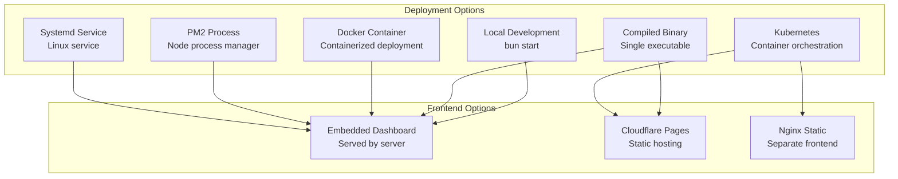
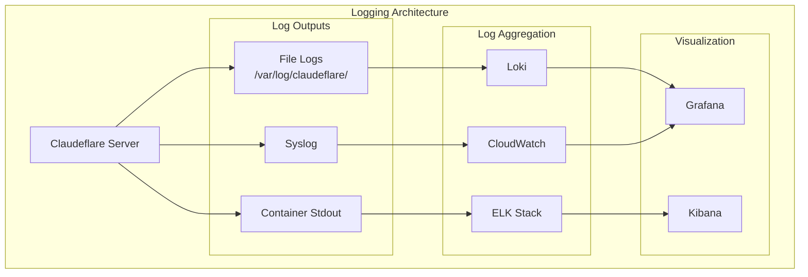
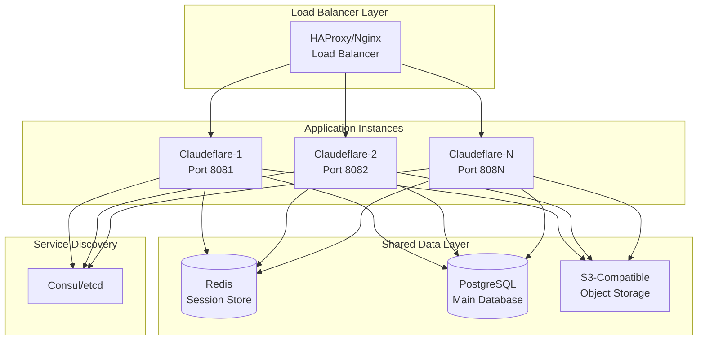

# Claudeflare Deployment Documentation

## Overview

Claudeflare is a load balancer proxy for Claude API accounts that can be deployed in various configurations, from simple local development to production-grade distributed systems. This document covers all deployment options, from single-instance setups to scalable architectures.

> **Recent Updates**: Claudeflare now includes a Terminal User Interface (TUI) for interactive monitoring and management, alongside the web dashboard. The async database writer improves performance for high-throughput scenarios.

## Table of Contents

1. [Deployment Options Overview](#deployment-options-overview)
2. [Local Development Setup](#local-development-setup)
3. [Production Deployment](#production-deployment)
   - [System Requirements](#system-requirements)
   - [Bun Binary Compilation](#bun-binary-compilation)
   - [Process Management](#process-management)
4. [Docker Deployment](#docker-deployment)
5. [Cloudflare Pages (Dashboard Only)](#cloudflare-pages-dashboard-only)
6. [Reverse Proxy Setup](#reverse-proxy-setup)
7. [Monitoring and Logging](#monitoring-and-logging)
8. [Performance Tuning](#performance-tuning)
9. [Scaling Considerations](#scaling-considerations)
10. [Environment Variables Reference](#environment-variables-reference)

## Deployment Options Overview



## Local Development Setup

### Prerequisites

- Bun runtime (>= 1.2.8)
- SQLite (included with Bun)
- Git

### Quick Start

```bash
# Clone the repository
git clone https://github.com/snipeship/claudeflare.git
cd claudeflare

# Install dependencies
bun install

# Start Claudeflare (TUI + Server combined)
bun run claudeflare

# Or start components separately:
# Terminal UI only
bun run tui

# Server only
bun run server

# Server with hot-reload
bun run dev:server

# In another terminal, add Claude accounts
bun cli add myaccount
```

### Development Configuration

```bash
# Environment variables for development
export PORT=8080
export LB_STRATEGY=session  # Only 'session' strategy is supported
export LOG_LEVEL=DEBUG
export LOG_FORMAT=pretty  # Options: pretty, json
export CF_STREAM_BODY_MAX_BYTES=262144  # 256KB default

# Start with custom config
bun run claudeflare
```

## Production Deployment

### System Requirements

#### Minimum Requirements
- CPU: 2 cores
- RAM: 2GB
- Storage: 10GB (for logs and database)
- OS: Linux (Ubuntu 20.04+, Debian 11+), macOS, Windows Server 2019+

#### Recommended Requirements
- CPU: 4+ cores
- RAM: 4GB+
- Storage: 50GB+ SSD
- Network: Low-latency connection to Claude API

### Bun Binary Compilation

Compile Claudeflare into a single executable for easy deployment:

```bash
# Build all components
bun run build  # Builds dashboard and TUI

# Build the server binary
cd apps/server
bun build src/server.ts --compile --outfile dist/claudeflare-server

# Build the CLI binary
cd ../cli
bun build src/cli.ts --compile --outfile dist/cli

# Build the TUI binary (optional, for standalone TUI deployment)
cd ../tui
bun build src/main.ts --compile --outfile dist/claudeflare-tui

# Copy binaries to deployment location
cp apps/server/dist/claudeflare-server /opt/claudeflare/
cp apps/cli/dist/cli /opt/claudeflare/claudeflare-cli
cp apps/tui/dist/claudeflare-tui /opt/claudeflare/  # Optional
```

#### Binary Deployment Structure

```
/opt/claudeflare/
├── claudeflare-server      # Main server binary
├── claudeflare-cli         # CLI tool binary
├── claudeflare-tui         # TUI binary (optional)
├── config/
│   └── claudeflare.json    # Configuration
└── data/
    ├── claude-accounts.db  # SQLite database
    └── logs/               # Log files
```

### Process Management

#### PM2 Setup

```bash
# Install PM2 globally
npm install -g pm2

# Create ecosystem file
cat > ecosystem.config.js << 'EOF'
module.exports = {
  apps: [{
    name: 'claudeflare',
    script: '/opt/claudeflare/claudeflare-server',
    instances: 1,
    exec_mode: 'fork',
    env: {
      PORT: 8080,
      LB_STRATEGY: 'session',
      LOG_LEVEL: 'INFO',
      LOG_FORMAT: 'json',
      CF_STREAM_BODY_MAX_BYTES: 262144,
      CLAUDEFLARE_CONFIG_PATH: '/opt/claudeflare/config/claudeflare.json'
    },
    error_file: '/opt/claudeflare/data/logs/error.log',
    out_file: '/opt/claudeflare/data/logs/out.log',
    log_file: '/opt/claudeflare/data/logs/combined.log',
    time: true,
    autorestart: true,
    max_restarts: 10,
    min_uptime: '10s',
    watch: false
  }]
};
EOF

# Start with PM2
pm2 start ecosystem.config.js
pm2 save
pm2 startup
```

#### Systemd Service

Create a systemd service file:

```bash
# Create service file
sudo cat > /etc/systemd/system/claudeflare.service << 'EOF'
[Unit]
Description=Claudeflare Load Balancer
After=network.target

[Service]
Type=simple
User=claudeflare
Group=claudeflare
WorkingDirectory=/opt/claudeflare
ExecStart=/opt/claudeflare/claudeflare-server
Restart=always
RestartSec=5

# Environment
Environment="PORT=8080"
Environment="LB_STRATEGY=session"
Environment="LOG_LEVEL=INFO"
Environment="LOG_FORMAT=json"
Environment="CF_STREAM_BODY_MAX_BYTES=262144"
Environment="CLAUDEFLARE_CONFIG_PATH=/opt/claudeflare/config/claudeflare.json"

# Security
NoNewPrivileges=true
PrivateTmp=true
ProtectSystem=strict
ProtectHome=true
ReadWritePaths=/opt/claudeflare/data

# Resource limits
LimitNOFILE=65536
LimitNPROC=4096

[Install]
WantedBy=multi-user.target
EOF

# Create user and directories
sudo useradd -r -s /bin/false claudeflare
sudo mkdir -p /opt/claudeflare/{config,data/logs}
sudo chown -R claudeflare:claudeflare /opt/claudeflare

# Enable and start service
sudo systemctl daemon-reload
sudo systemctl enable claudeflare
sudo systemctl start claudeflare
```

## Docker Deployment

> **Note**: The Docker configuration below is a template. Docker files are not included in the repository and need to be created based on your specific requirements.

### Example Dockerfile

```dockerfile
# Multi-stage build for optimal size
FROM oven/bun:1 AS builder

WORKDIR /app

# Copy package files
COPY package.json bun.lockb ./
COPY apps/ ./apps/
COPY packages/ ./packages/
COPY tsconfig.json ./

# Install dependencies and build
RUN bun install --frozen-lockfile
RUN bun run build
RUN cd apps/server && bun build src/server.ts --compile --outfile dist/claudeflare-server
RUN cd apps/cli && bun build src/cli.ts --compile --outfile dist/claudeflare-cli

# Runtime stage
FROM debian:bookworm-slim

# Install runtime dependencies
RUN apt-get update && apt-get install -y \
    ca-certificates \
    && rm -rf /var/lib/apt/lists/*

# Create user
RUN useradd -r -s /bin/false claudeflare

# Copy binaries
COPY --from=builder /app/apps/server/dist/claudeflare-server /usr/local/bin/
COPY --from=builder /app/apps/cli/dist/cli /usr/local/bin/claudeflare-cli
COPY --from=builder /app/apps/tui/dist/claudeflare-tui /usr/local/bin/
COPY --from=builder /app/packages/dashboard-web/dist /opt/claudeflare/dashboard

# Set permissions
RUN chmod +x /usr/local/bin/claudeflare-*

# Create data directories
RUN mkdir -p /data /config && chown -R claudeflare:claudeflare /data /config

USER claudeflare

# Environment
ENV PORT=8080
ENV CLAUDEFLARE_CONFIG_PATH=/config/claudeflare.json

EXPOSE 8080

VOLUME ["/data", "/config"]

HEALTHCHECK --interval=30s --timeout=3s --start-period=5s --retries=3 \
  CMD ["/usr/local/bin/claudeflare-server", "health"] || exit 1

ENTRYPOINT ["/usr/local/bin/claudeflare-server"]
```

### Example Docker Compose

```yaml
version: '3.8'

services:
  claudeflare:
    build: .
    container_name: claudeflare
    restart: unless-stopped
    ports:
      - "8080:8080"
    environment:
      - PORT=8080
      - LB_STRATEGY=session
      - LOG_LEVEL=INFO
      - LOG_FORMAT=json
      - CF_STREAM_BODY_MAX_BYTES=262144
    volumes:
      - ./data:/data
      - ./config:/config
    healthcheck:
      test: ["CMD", "curl", "-f", "http://localhost:8080/health"]
      interval: 30s
      timeout: 10s
      retries: 3
      start_period: 40s
    networks:
      - claudeflare-net

  # Optional: Reverse proxy
  nginx:
    image: nginx:alpine
    container_name: claudeflare-nginx
    restart: unless-stopped
    ports:
      - "80:80"
      - "443:443"
    volumes:
      - ./nginx/nginx.conf:/etc/nginx/nginx.conf:ro
      - ./nginx/ssl:/etc/nginx/ssl:ro
    depends_on:
      - claudeflare
    networks:
      - claudeflare-net

networks:
  claudeflare-net:
    driver: bridge
```

### Building and Running

```bash
# Build the Docker image
docker build -t claudeflare:latest .

# Run with Docker
docker run -d \
  --name claudeflare \
  -p 8080:8080 \
  -v $(pwd)/data:/data \
  -v $(pwd)/config:/config \
  -e LB_STRATEGY=session \
  claudeflare:latest

# Or use Docker Compose
docker-compose up -d
```

## Cloudflare Pages (Dashboard Only)

Deploy the dashboard as a static site on Cloudflare Pages while running the API server elsewhere:

### Build Configuration

```bash
# Build script for Cloudflare Pages
cd packages/dashboard-web
bun install
bun run build

# Output directory: packages/dashboard-web/dist
```

### Cloudflare Pages Configuration

1. Connect your GitHub repository
2. Set build configuration:
   - Build command: `cd packages/dashboard-web && bun install && bun run build`
   - Build output directory: `packages/dashboard-web/dist`
   - Root directory: `/`

### Environment Variables

```bash
# Set in Cloudflare Pages dashboard
VITE_API_URL=https://api.your-domain.com
```

### Dashboard API Configuration

Update the dashboard to use external API:

```typescript
// packages/dashboard-web/src/lib/api-client.ts
const API_BASE_URL = import.meta.env.VITE_API_URL || 'http://localhost:8080';
```

## Reverse Proxy Setup

### Nginx Configuration

```nginx
# /etc/nginx/sites-available/claudeflare
upstream claudeflare_backend {
    server 127.0.0.1:8080 max_fails=3 fail_timeout=30s;
    keepalive 32;
}

server {
    listen 80;
    server_name claudeflare.yourdomain.com;
    return 301 https://$server_name$request_uri;
}

server {
    listen 443 ssl http2;
    server_name claudeflare.yourdomain.com;

    # SSL configuration
    ssl_certificate /etc/letsencrypt/live/claudeflare.yourdomain.com/fullchain.pem;
    ssl_certificate_key /etc/letsencrypt/live/claudeflare.yourdomain.com/privkey.pem;
    ssl_protocols TLSv1.2 TLSv1.3;
    ssl_ciphers HIGH:!aNULL:!MD5;
    ssl_prefer_server_ciphers on;

    # Security headers
    add_header X-Frame-Options "SAMEORIGIN" always;
    add_header X-Content-Type-Options "nosniff" always;
    add_header X-XSS-Protection "1; mode=block" always;
    add_header Referrer-Policy "strict-origin-when-cross-origin" always;

    # Proxy settings
    proxy_http_version 1.1;
    proxy_set_header Upgrade $http_upgrade;
    proxy_set_header Connection "upgrade";
    proxy_set_header Host $host;
    proxy_set_header X-Real-IP $remote_addr;
    proxy_set_header X-Forwarded-For $proxy_add_x_forwarded_for;
    proxy_set_header X-Forwarded-Proto $scheme;
    
    # Timeouts
    proxy_connect_timeout 60s;
    proxy_send_timeout 300s;
    proxy_read_timeout 300s;

    # Main proxy
    location / {
        proxy_pass http://claudeflare_backend;
    }

    # API endpoints
    location /v1/ {
        proxy_pass http://claudeflare_backend;
        
        # Increase limits for AI requests
        client_max_body_size 100M;
        proxy_buffering off;
        proxy_request_buffering off;
    }

    # WebSocket support for real-time updates
    location /ws {
        proxy_pass http://claudeflare_backend;
        proxy_http_version 1.1;
        proxy_set_header Upgrade $http_upgrade;
        proxy_set_header Connection "upgrade";
        proxy_read_timeout 86400;
    }

    # Static assets caching
    location ~* \.(js|css|png|jpg|jpeg|gif|ico|svg|woff|woff2|ttf|eot)$ {
        proxy_pass http://claudeflare_backend;
        expires 1y;
        add_header Cache-Control "public, immutable";
    }
}
```

### Caddy Configuration

```caddyfile
claudeflare.yourdomain.com {
    # Automatic HTTPS
    tls your-email@example.com

    # Reverse proxy
    reverse_proxy localhost:8080 {
        # Load balancing if multiple instances
        lb_policy least_conn
        lb_try_duration 30s
        
        # Headers
        header_up Host {host}
        header_up X-Real-IP {remote}
        header_up X-Forwarded-For {remote}
        header_up X-Forwarded-Proto {scheme}
        
        # Health check
        health_uri /health
        health_interval 30s
        health_timeout 5s
    }

    # API specific configuration
    handle_path /v1/* {
        reverse_proxy localhost:8080 {
            # Streaming support
            flush_interval -1
            buffer_requests off
            buffer_responses off
            
            # Timeouts
            transport http {
                read_timeout 5m
                write_timeout 5m
            }
        }
    }

    # Compression
    encode gzip

    # Security headers
    header {
        X-Frame-Options SAMEORIGIN
        X-Content-Type-Options nosniff
        X-XSS-Protection "1; mode=block"
        Referrer-Policy strict-origin-when-cross-origin
    }
}
```

## Monitoring and Logging

### Log Management



### Prometheus Metrics (Future Enhancement)

> **Note**: Prometheus metrics support is planned but not yet implemented. The following is an example of how metrics could be integrated:

```typescript
// Example: packages/http-api/src/metrics.ts
import { register, Counter, Histogram, Gauge } from 'prom-client';

export const metrics = {
  requestsTotal: new Counter({
    name: 'claudeflare_requests_total',
    help: 'Total number of requests',
    labelNames: ['method', 'status', 'account']
  }),
  
  requestDuration: new Histogram({
    name: 'claudeflare_request_duration_seconds',
    help: 'Request duration in seconds',
    labelNames: ['method', 'status'],
    buckets: [0.1, 0.5, 1, 2, 5, 10]
  }),
  
  activeAccounts: new Gauge({
    name: 'claudeflare_active_accounts',
    help: 'Number of active accounts',
    labelNames: ['tier']
  }),
  
  rateLimitedAccounts: new Gauge({
    name: 'claudeflare_rate_limited_accounts',
    help: 'Number of rate limited accounts'
  })
};
```

### Monitoring Stack

```yaml
# docker-compose.monitoring.yml
version: '3.8'

services:
  prometheus:
    image: prom/prometheus:latest
    volumes:
      - ./prometheus.yml:/etc/prometheus/prometheus.yml
      - prometheus_data:/prometheus
    command:
      - '--config.file=/etc/prometheus/prometheus.yml'
      - '--storage.tsdb.path=/prometheus'
    ports:
      - "9090:9090"

  grafana:
    image: grafana/grafana:latest
    environment:
      - GF_SECURITY_ADMIN_PASSWORD=admin
      - GF_INSTALL_PLUGINS=grafana-clock-panel
    volumes:
      - grafana_data:/var/lib/grafana
      - ./grafana/dashboards:/etc/grafana/provisioning/dashboards
      - ./grafana/datasources:/etc/grafana/provisioning/datasources
    ports:
      - "3000:3000"

  loki:
    image: grafana/loki:latest
    volumes:
      - ./loki-config.yaml:/etc/loki/local-config.yaml
      - loki_data:/loki
    ports:
      - "3100:3100"

  promtail:
    image: grafana/promtail:latest
    volumes:
      - ./promtail-config.yaml:/etc/promtail/config.yml
      - /var/log:/var/log:ro
      - /opt/claudeflare/data/logs:/app/logs:ro
    command: -config.file=/etc/promtail/config.yml

volumes:
  prometheus_data:
  grafana_data:
  loki_data:
```

## Performance Tuning

### System Optimization

```bash
# Increase file descriptor limits
echo "claudeflare soft nofile 65536" >> /etc/security/limits.conf
echo "claudeflare hard nofile 65536" >> /etc/security/limits.conf

# TCP tuning for high throughput
cat >> /etc/sysctl.conf << EOF
# TCP tuning
net.core.somaxconn = 65535
net.ipv4.tcp_max_syn_backlog = 65535
net.ipv4.tcp_fin_timeout = 15
net.ipv4.tcp_keepalive_time = 300
net.ipv4.tcp_keepalive_probes = 5
net.ipv4.tcp_keepalive_intvl = 15

# Buffer sizes
net.core.rmem_default = 262144
net.core.wmem_default = 262144
net.core.rmem_max = 16777216
net.core.wmem_max = 16777216
EOF

# Apply changes
sysctl -p
```

### Application Tuning

```javascript
// config/production.json
{
  "server": {
    "port": 8080,
    "client_id": "9d1c250a-e61b-44d9-88ed-5944d1962f5e",
    "session_duration_ms": 18000000,  // 5 hours
    "stream_body_max_bytes": 262144,  // 256KB
    "retry_attempts": 3,
    "retry_delay_ms": 1000,
    "retry_backoff": 2
  },
  "database": {
    "walMode": true,
    "journalMode": "WAL",
    "synchronous": "NORMAL",
    "cacheSize": -20000, // 20MB cache
    "busyTimeout": 5000
  },
  "proxy": {
    "timeout": 300000, // 5 minutes
    "retries": 3,
    "retryDelay": 1000,
    "keepAlive": true,
    "keepAliveMsecs": 1000,
    "maxSockets": 256
  }
}
```

### Database Optimization

```sql
-- Optimize SQLite for production
PRAGMA journal_mode = WAL;
PRAGMA synchronous = NORMAL;
PRAGMA cache_size = -20000;
PRAGMA temp_store = MEMORY;
PRAGMA mmap_size = 268435456;

-- Create indexes for common queries
CREATE INDEX IF NOT EXISTS idx_requests_timestamp ON requests(timestamp);
CREATE INDEX IF NOT EXISTS idx_requests_account ON requests(account_used);
CREATE INDEX IF NOT EXISTS idx_accounts_active ON accounts(paused, expires_at);
```

## Scaling Considerations

### Horizontal Scaling Architecture



### Database Migration for Scale

When scaling beyond a single instance, migrate from SQLite to PostgreSQL:

```sql
-- PostgreSQL schema
CREATE TABLE accounts (
    id UUID PRIMARY KEY DEFAULT gen_random_uuid(),
    name VARCHAR(255) UNIQUE NOT NULL,
    provider VARCHAR(50) NOT NULL,
    api_key TEXT,
    refresh_token TEXT,
    access_token TEXT,
    expires_at TIMESTAMPTZ,
    created_at TIMESTAMPTZ DEFAULT NOW(),
    last_used TIMESTAMPTZ,
    request_count INTEGER DEFAULT 0,
    total_requests INTEGER DEFAULT 0,
    account_tier INTEGER DEFAULT 1,
    rate_limited_until TIMESTAMPTZ,
    session_start TIMESTAMPTZ,
    session_request_count INTEGER DEFAULT 0,
    paused BOOLEAN DEFAULT FALSE,
    rate_limit_status VARCHAR(50),
    rate_limit_reset TIMESTAMPTZ,
    rate_limit_remaining INTEGER
);

CREATE TABLE requests (
    id UUID PRIMARY KEY DEFAULT gen_random_uuid(),
    timestamp TIMESTAMPTZ DEFAULT NOW(),
    method VARCHAR(10),
    path TEXT,
    account_used UUID REFERENCES accounts(id),
    status_code INTEGER,
    success BOOLEAN,
    error_message TEXT,
    response_time_ms INTEGER,
    failover_attempts INTEGER DEFAULT 0,
    model VARCHAR(100),
    input_tokens INTEGER,
    output_tokens INTEGER,
    cache_read_input_tokens INTEGER,
    cache_creation_input_tokens INTEGER,
    cost_usd DECIMAL(10, 6)
);

-- Indexes for performance
CREATE INDEX idx_requests_timestamp ON requests(timestamp DESC);
CREATE INDEX idx_requests_account ON requests(account_used);
CREATE INDEX idx_accounts_active ON accounts(paused, expires_at);
CREATE INDEX idx_accounts_rate_limit ON accounts(rate_limited_until);
```

### Kubernetes Deployment

```yaml
# claudeflare-deployment.yaml
apiVersion: apps/v1
kind: Deployment
metadata:
  name: claudeflare
  labels:
    app: claudeflare
spec:
  replicas: 3
  selector:
    matchLabels:
      app: claudeflare
  template:
    metadata:
      labels:
        app: claudeflare
    spec:
      containers:
      - name: claudeflare
        image: your-registry/claudeflare:latest
        ports:
        - containerPort: 8080
        env:
        - name: DATABASE_URL
          valueFrom:
            secretKeyRef:
              name: claudeflare-secrets
              key: database-url
        - name: REDIS_URL
          valueFrom:
            secretKeyRef:
              name: claudeflare-secrets
              key: redis-url
        resources:
          requests:
            memory: "512Mi"
            cpu: "500m"
          limits:
            memory: "2Gi"
            cpu: "2000m"
        livenessProbe:
          httpGet:
            path: /health
            port: 8080
          initialDelaySeconds: 30
          periodSeconds: 10
        readinessProbe:
          httpGet:
            path: /health
            port: 8080
          initialDelaySeconds: 5
          periodSeconds: 5
---
apiVersion: v1
kind: Service
metadata:
  name: claudeflare
spec:
  selector:
    app: claudeflare
  ports:
  - port: 80
    targetPort: 8080
  type: LoadBalancer
```

### High Availability Checklist

- [ ] Database replication configured
- [ ] Redis sentinel or cluster mode enabled
- [ ] Load balancer health checks configured
- [ ] Automatic failover tested
- [ ] Backup and restore procedures documented
- [ ] Monitoring alerts configured
- [ ] Disaster recovery plan in place
- [ ] Performance baselines established
- [ ] Security audit completed
- [ ] Documentation up to date

## Security Considerations

### Production Security Checklist

1. **Network Security**
   - [ ] Firewall rules configured
   - [ ] SSL/TLS certificates installed
   - [ ] Rate limiting configured
   - [ ] DDoS protection enabled

2. **Application Security**
   - [ ] Authentication implemented for admin endpoints
   - [ ] API keys properly secured
   - [ ] Input validation enabled
   - [ ] Security headers configured

3. **Data Security**
   - [ ] Database encryption at rest
   - [ ] Backup encryption enabled
   - [ ] Access logs configured
   - [ ] Audit trail implemented

4. **Operational Security**
   - [ ] Least privilege user accounts
   - [ ] Regular security updates
   - [ ] Intrusion detection configured
   - [ ] Incident response plan

## Health Monitoring

### Health Check Endpoint

Claudeflare provides a health check endpoint for monitoring:

```bash
# Check health status
curl http://localhost:8080/health
```

Response format:
```json
{
  "status": "ok",
  "accounts": 5,
  "timestamp": "2025-01-27T12:00:00.000Z",
  "strategy": "session"
}
```

### Monitoring Integration

Use the health endpoint with monitoring tools:

```yaml
# Kubernetes liveness probe
livenessProbe:
  httpGet:
    path: /health
    port: 8080
  initialDelaySeconds: 10
  periodSeconds: 30

# Docker Compose health check  
healthcheck:
  test: ["CMD", "curl", "-f", "http://localhost:8080/health"]
  interval: 30s
  timeout: 10s
  retries: 3
```

## API Endpoints Reference

### Management API

| Endpoint | Method | Description |
|----------|--------|-------------|
| `/health` | GET | Health check and system status |
| `/api/stats` | GET | Account statistics and usage |
| `/api/stats/reset` | POST | Reset usage statistics |
| `/api/requests` | GET | Request history with pagination |
| `/api/accounts` | GET | List all accounts |
| `/api/accounts/:name` | GET | Get specific account details |
| `/api/accounts/:name` | PATCH | Update account (pause/unpause) |
| `/api/accounts/:name` | DELETE | Remove account |
| `/api/config` | GET | Get current configuration |
| `/api/config` | PATCH | Update configuration |

### Analytics API

| Endpoint | Method | Description |
|----------|--------|-------------|
| `/api/analytics/usage` | GET | Usage analytics with filtering |
| `/api/analytics/costs` | GET | Cost breakdown by model/account |
| `/api/analytics/requests/:id` | GET | Request details with payload |

### Real-time API

| Endpoint | Method | Description |
|----------|--------|-------------|
| `/api/logs/stream` | GET | Real-time log streaming (SSE) |
| `/api/logs/history` | GET | Historical logs (paginated) |

### Claude API Proxy

| Endpoint | Method | Description |
|----------|--------|-------------|
| `/v1/*` | * | All Claude API endpoints |

## Troubleshooting

### Common Issues

1. **Database Lock Errors**
   ```bash
   # Enable WAL mode
   sqlite3 /opt/claudeflare/data/claude-accounts.db "PRAGMA journal_mode=WAL;"
   ```

2. **High Memory Usage**
   ```bash
   # Check for memory leaks
   node --inspect=0.0.0.0:9229 /opt/claudeflare/claudeflare-server
   ```

3. **Connection Refused**
   ```bash
   # Check if service is running
   systemctl status claudeflare
   # Check logs
   journalctl -u claudeflare -f
   ```

4. **Rate Limit Issues**
   ```bash
   # Check account status
   /opt/claudeflare/claudeflare-cli list
   # Reset rate limits
   /opt/claudeflare/claudeflare-cli reset-stats
   ```

## Maintenance

### Regular Tasks

```bash
# Daily: Check logs for errors
grep ERROR /opt/claudeflare/data/logs/*.log | tail -50

# Weekly: Database maintenance
sqlite3 /opt/claudeflare/data/claude-accounts.db "VACUUM;"
sqlite3 /opt/claudeflare/data/claude-accounts.db "ANALYZE;"

# Monthly: Clean old logs
find /opt/claudeflare/data/logs -name "*.log" -mtime +30 -delete

# Quarterly: Update dependencies
cd /opt/claudeflare
bun update
```

### Backup Procedures

```bash
#!/bin/bash
# backup.sh - Run daily via cron

BACKUP_DIR="/backup/claudeflare/$(date +%Y%m%d)"
mkdir -p "$BACKUP_DIR"

# Backup database
sqlite3 /opt/claudeflare/data/claude-accounts.db ".backup $BACKUP_DIR/claude-accounts.db"

# Backup configuration
cp -r /opt/claudeflare/config "$BACKUP_DIR/"

# Compress
tar -czf "$BACKUP_DIR.tar.gz" "$BACKUP_DIR"
rm -rf "$BACKUP_DIR"

# Keep only last 30 days
find /backup/claudeflare -name "*.tar.gz" -mtime +30 -delete
```

## Environment Variables Reference

### Core Configuration

| Variable | Default | Description |
|----------|---------|-------------|
| `PORT` | 8080 | Server port |
| `LB_STRATEGY` | session | Load balancing strategy: Only `session` is supported |
| `LOG_LEVEL` | INFO | Logging level: `DEBUG`, `INFO`, `WARN`, `ERROR` |
| `LOG_FORMAT` | pretty | Log format: `pretty` (human-readable) or `json` (structured) |

### Advanced Configuration

| Variable | Default | Description |
|----------|---------|-------------|
| `CLIENT_ID` | 9d1c250a-e61b-44d9-88ed-5944d1962f5e | OAuth client ID for authentication |
| `SESSION_DURATION_MS` | 18000000 | Session duration in milliseconds (5 hours) |
| `CF_STREAM_BODY_MAX_BYTES` | 262144 | Maximum size for streaming response bodies (256KB) |
| `RETRY_ATTEMPTS` | 3 | Number of retry attempts for failed requests |
| `RETRY_DELAY_MS` | 1000 | Initial delay between retries in milliseconds |
| `RETRY_BACKOFF` | 2 | Backoff multiplier for exponential retry delays |
| `CLAUDEFLARE_CONFIG_PATH` | Platform-specific | Path to configuration file |

### Configuration File

Claudeflare also supports a JSON configuration file that takes precedence over environment variables:

```json
{
  "lb_strategy": "session",
  "client_id": "your-client-id",
  "retry_attempts": 5,
  "retry_delay_ms": 2000,
  "retry_backoff": 1.5,
  "session_duration_ms": 7200000,
  "port": 3000,
  "stream_body_max_bytes": 524288
}
```

The configuration file is located at:
- **Linux/macOS**: `~/.config/claudeflare/config.json`
- **Windows**: `%APPDATA%\claudeflare\config.json`

## Conclusion

Claudeflare is designed to be flexible and scalable, supporting everything from simple local deployments to complex distributed architectures. Choose the deployment option that best fits your needs and scale as your requirements grow.

### Key Features Summary

- **Interactive TUI**: Monitor and manage your deployment in real-time
- **Web Dashboard**: Access analytics and logs through a modern web interface
- **Async Database Writer**: Improved performance for high-throughput scenarios
- **Multiple Load Balancing Strategies**: Choose the best strategy for your use case
- **Binary Compilation**: Deploy as standalone executables without runtime dependencies

### Additional Resources

- [Main Documentation](./index.md)
- [Configuration Guide](./configuration.md)
- [Load Balancing Strategies](./load-balancing.md)
- [API Reference](./api-http.md)
- [GitHub Repository](https://github.com/snipeship/claudeflare)

## Terminal User Interface (TUI)

Claudeflare includes a powerful Terminal User Interface for interactive monitoring and management.

### Starting the TUI

```bash
# Start TUI with server (recommended)
bun run claudeflare

# Start TUI separately (connects to existing server)
bun run tui

# Build TUI as standalone binary
cd apps/tui
bun build src/main.ts --compile --outfile dist/claudeflare-tui
```

### TUI Features

- **Real-time Dashboard**: Live system status and metrics
- **Account Management**: View and manage Claude accounts
  - Account status and rate limits
  - Pause/unpause accounts
  - View usage statistics
- **Request Monitor**: Track requests as they happen
  - Request details and timing
  - Success/failure status
  - Token usage per request
- **Log Viewer**: Browse historical logs
  - Filter by level and time
  - Search functionality
  - Export capabilities
- **Statistics Screen**: Comprehensive analytics
  - Usage patterns
  - Cost breakdown
  - Performance metrics

### Keyboard Navigation

| Key | Action |
|-----|--------|
| `Tab` / `Shift+Tab` | Navigate between screens |
| `↑` / `↓` | Navigate within lists |
| `←` / `→` | Switch between tabs |
| `Enter` | Select/view details |
| `Space` | Toggle selection |
| `r` | Refresh current view |
| `f` | Focus search/filter |
| `Esc` | Close dialog/cancel |
| `q` / `Ctrl+C` | Quit TUI |

### Remote TUI Connection

The TUI can connect to a remote Claudeflare server:

```bash
# Set API URL for remote connection
export CLAUDEFLARE_API_URL=https://claudeflare.example.com
bun run tui
```

### TUI Configuration

Customize TUI behavior through environment variables:

```bash
# Refresh intervals (milliseconds)
export TUI_REFRESH_INTERVAL=1000      # Dashboard refresh
export TUI_LOG_POLL_INTERVAL=500      # Log updates

# Display options
export TUI_THEME=dark                 # dark or light
export TUI_COMPACT_MODE=false         # Compact display
```

For support and updates, check the project repository and documentation.