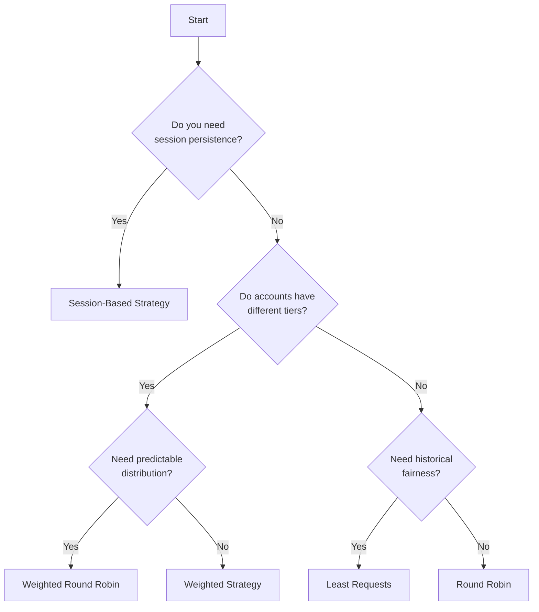

# Load Balancing in Claudeflare

## Table of Contents
1. [Overview](#overview)
2. [Load Balancing Strategies](#load-balancing-strategies)
   - [Round Robin](#round-robin)
   - [Least Requests](#least-requests)
   - [Session-Based](#session-based)
   - [Weighted](#weighted)
   - [Weighted Round Robin](#weighted-round-robin)
3. [Strategy Comparison Table](#strategy-comparison-table)
4. [Decision Matrix](#decision-matrix)
5. [Configuration](#configuration)
6. [Performance Considerations](#performance-considerations)
7. [Custom Strategy Development](#custom-strategy-development)

## Overview

Claudeflare implements a sophisticated load balancing system to distribute requests across multiple Claude OAuth accounts, avoiding rate limits and ensuring high availability. The system supports multiple strategies, each optimized for different use cases and traffic patterns.

### Key Features
- **Account Health Monitoring**: Automatically filters out rate-limited or paused accounts
- **Failover Support**: Returns ordered lists of accounts for automatic failover
- **Tier-Based Weighting**: Supports different account tiers (1x, 5x, 20x)
- **Session Persistence**: Maintains user sessions on specific accounts
- **Real-time Strategy Switching**: Change strategies without restarting the server
- **Async Database Operations**: Non-blocking database writes via AsyncDbWriter
- **Default Strategy**: Session-based strategy is the default (configurable)

## Load Balancing Strategies

### Round Robin

**Description**: Distributes requests evenly across all available accounts in a circular fashion.

**Use Case**: Best for uniform traffic patterns where all accounts should receive equal load.

**Implementation**:
```typescript
export class RoundRobinStrategy implements LoadBalancingStrategy {
    private cursor = 0;

    select(accounts: Account[], _meta: RequestMeta): Account[] {
        const now = Date.now();
        const available = accounts.filter((a) => isAccountAvailable(a, now));

        if (available.length === 0) return [];

        // Ensure cursor is within bounds
        this.cursor = this.cursor % available.length;

        // Create ordered array starting from cursor position
        const ordered = [
            ...available.slice(this.cursor),
            ...available.slice(0, this.cursor),
        ];

        // Move cursor for next request
        this.cursor = (this.cursor + 1) % available.length;

        return ordered;
    }
}
```

**Pseudocode Algorithm**:
```
1. Filter available accounts (not rate-limited or paused)
2. Start from cursor position
3. Create ordered list: [cursor...end, start...cursor-1]
4. Increment cursor for next request
5. Return ordered list for failover
```

**Pros**:
- Simple and predictable
- Ensures even distribution
- No account starvation
- Stateless between restarts

**Cons**:
- Doesn't consider account capacity (tiers)
- May not be optimal for varying request patterns
- No consideration for current load

**When to Use**:
- When all accounts have the same tier/capacity
- For predictable, uniform traffic
- When simplicity is preferred

### Least Requests

**Description**: Routes requests to the account with the fewest total requests.

**Use Case**: Ideal for balancing historical usage across accounts.

**Implementation**:
```typescript
export class LeastRequestsStrategy implements LoadBalancingStrategy {
    select(accounts: Account[], _meta: RequestMeta): Account[] {
        const now = Date.now();
        const available = accounts.filter((a) => isAccountAvailable(a, now));

        if (available.length === 0) return [];

        // Sort by request count (ascending)
        return available.sort((a, b) => a.request_count - b.request_count);
    }
}
```

**Pseudocode Algorithm**:
```
1. Filter available accounts
2. Sort by request_count ascending
3. Return sorted list (least used first)
```

**Pros**:
- Naturally balances usage over time
- Helps new accounts catch up
- Simple implementation
- Good for long-running deployments

**Cons**:
- Historical bias (old accounts always preferred)
- Doesn't consider account tiers
- May concentrate load on newest accounts

**When to Use**:
- When balancing total usage is important
- For accounts added at different times
- When historical fairness matters

### Session-Based

**Description**: Maintains user sessions on specific accounts for a configurable duration (default 5 hours).

**Use Case**: Perfect for applications requiring session persistence or when switching accounts mid-conversation is problematic.

**Implementation**:
```typescript
export class SessionStrategy implements LoadBalancingStrategy {
    private sessionDurationMs: number;
    private store: StrategyStore | null = null;
    private log = new Logger("SessionStrategy");

    constructor(sessionDurationMs: number = 5 * 60 * 60 * 1000) {
        this.sessionDurationMs = sessionDurationMs;
    }

    initialize(store: StrategyStore): void {
        this.store = store;
    }

    private resetSessionIfExpired(account: Account): void {
        const now = Date.now();

        if (
            !account.session_start ||
            now - account.session_start >= this.sessionDurationMs
        ) {
            // Reset session
            if (this.store) {
                const wasExpired = account.session_start !== null;
                this.log.info(
                    wasExpired
                        ? `Session expired for account ${account.name}, starting new session`
                        : `Starting new session for account ${account.name}`,
                );
                this.store.resetAccountSession(account.id, now);

                // Update the account object to reflect changes
                account.session_start = now;
                account.session_request_count = 0;
            }
        }
    }

    select(accounts: Account[], _meta: RequestMeta): Account[] {
        const now = Date.now();

        // Find account with active session
        let activeAccount: Account | null = null;
        let mostRecentSessionStart = 0;

        for (const account of accounts) {
            if (
                account.session_start &&
                now - account.session_start < this.sessionDurationMs &&
                account.session_start > mostRecentSessionStart
            ) {
                activeAccount = account;
                mostRecentSessionStart = account.session_start;
            }
        }

        // If active account is available, use it
        if (activeAccount && isAccountAvailable(activeAccount, now)) {
            // Reset session if expired (shouldn't happen but just in case)
            this.resetSessionIfExpired(activeAccount);
            this.log.info(
                `Continuing session for account ${activeAccount.name} (${activeAccount.session_request_count} requests in session)`,
            );
            // Return active account first, then others as fallback
            const others = accounts.filter(
                (a) => a.id !== activeAccount.id && isAccountAvailable(a, now),
            );
            return [activeAccount, ...others];
        }

        // Start new session with first available account
        const available = accounts.filter((a) => isAccountAvailable(a, now));
        if (available.length === 0) return [];

        const chosenAccount = available[0];
        this.resetSessionIfExpired(chosenAccount);

        const others = available.filter((a) => a.id !== chosenAccount.id);
        return [chosenAccount, ...others];
    }
}
```

**Pseudocode Algorithm**:
```
1. Check for active session within duration window
2. If active session exists and account is available:
   - Return active account first
   - Include other accounts for failover
3. If no active session or account unavailable:
   - Select first available account
   - Start new session
   - Return selected account with failover options
```

**Pros**:
- Maintains conversation context
- Reduces account switching
- Configurable session duration
- Automatic session expiry

**Cons**:
- Can lead to uneven distribution
- One account may handle entire session
- Complexity in session management
- Requires StrategyStore initialization for session persistence

**When to Use**:
- For conversational AI applications
- When context persistence is critical
- For long-running interactions
- When account switching causes issues

**Important Notes**:
- The strategy logs session lifecycle events for debugging
- Sessions are automatically reset after expiration
- If the StrategyStore is not initialized, sessions won't persist across restarts
- The strategy maintains session_request_count for monitoring

### Weighted

**Description**: Distributes load based on account tiers, considering capacity differences.

**Use Case**: Optimal when accounts have different rate limits or capacities (1x, 5x, 20x tiers).

**Implementation**:
```typescript
export class WeightedStrategy implements LoadBalancingStrategy {
    select(accounts: Account[], _meta: RequestMeta): Account[] {
        const now = Date.now();
        const available = accounts.filter((a) => isAccountAvailable(a, now));

        if (available.length === 0) return [];

        // Calculate weighted request count
        const accountsWithWeight = available.map((account) => ({
            account,
            weightedCount: account.request_count / (account.account_tier || 1),
        }));

        // Sort by weighted request count (ascending)
        accountsWithWeight.sort((a, b) => a.weightedCount - b.weightedCount);

        return accountsWithWeight.map((item) => item.account);
    }
}
```

**Pseudocode Algorithm**:
```
1. Filter available accounts
2. Calculate weighted count: request_count / tier
3. Sort by weighted count ascending
4. Return sorted list
```

**Pros**:
- Respects account capacity differences
- Fair distribution based on tier
- Higher tier accounts handle more load
- Simple tier-based calculation

**Cons**:
- Requires accurate tier configuration
- Still based on historical counts
- May not reflect real-time capacity

**When to Use**:
- With mixed account tiers (1x, 5x, 20x)
- When accounts have different rate limits
- For cost optimization (use higher tiers efficiently)

### Weighted Round Robin

**Description**: Combines round-robin distribution with tier-based weighting.

**Use Case**: Best for predictable distribution that respects account capacity.

**Implementation**:
```typescript
export class WeightedRoundRobinStrategy implements LoadBalancingStrategy {
    private currentIndex = 0;

    select(accounts: Account[], _meta: RequestMeta): Account[] {
        const now = Date.now();
        const available = accounts.filter((a) => isAccountAvailable(a, now));

        if (available.length === 0) return [];

        // Build weighted list (accounts appear multiple times based on tier)
        const weightedList: Account[] = [];
        for (const account of available) {
            const tier = account.account_tier || 1;
            for (let i = 0; i < tier; i++) {
                weightedList.push(account);
            }
        }

        // Create ordered array from current index
        const ordered = [
            ...weightedList.slice(this.currentIndex),
            ...weightedList.slice(0, this.currentIndex),
        ];

        this.currentIndex = (this.currentIndex + 1) % weightedList.length;

        // Remove duplicates while preserving order
        const seen = new Set<string>();
        const result: Account[] = [];
        for (const account of ordered) {
            if (!seen.has(account.id)) {
                seen.add(account.id);
                result.push(account);
            }
        }

        return result;
    }
}
```

**Pseudocode Algorithm**:
```
1. Filter available accounts
2. Create weighted list (tier 5 account appears 5 times)
3. Apply round-robin on weighted list
4. Remove duplicates preserving order
5. Return ordered unique accounts
```

**Pros**:
- Predictable distribution pattern
- Respects account tiers
- Combines fairness with capacity
- No starvation of low-tier accounts

**Cons**:
- More complex implementation
- Larger memory footprint for weighted list
- Pattern can be less intuitive

**When to Use**:
- With mixed tiers and predictable traffic
- When both fairness and capacity matter
- For balanced tier utilization

## Strategy Comparison Table

| Strategy | Distribution | Tier-Aware | Session Support | Complexity | Best For |
|----------|--------------|------------|-----------------|------------|----------|
| Round Robin | Even | No | No | Low | Uniform traffic, same-tier accounts |
| Least Requests | Historical | No | No | Low | Long-term fairness, usage balancing |
| Session-Based | Concentrated | No | Yes | Medium | Conversational AI, context persistence |
| Weighted | Proportional | Yes | No | Low | Mixed tiers, capacity-based distribution |
| Weighted Round Robin | Proportional + Cyclic | Yes | No | Medium | Mixed tiers with predictable patterns |

## Decision Matrix



### Decision Criteria

1. **Session Persistence Required?**
   - Yes → Use Session-Based Strategy (Note: Initialize with StrategyStore for persistence)
   - No → Continue to next criterion

2. **Different Account Tiers?**
   - Yes → Consider Weighted or Weighted Round Robin
   - No → Consider Round Robin or Least Requests

3. **Need Predictable Distribution?**
   - Yes → Use Round Robin or Weighted Round Robin
   - No → Use Least Requests or Weighted

4. **Historical Fairness Important?**
   - Yes → Use Least Requests
   - No → Use Round Robin

## Configuration

### Environment Variables

```bash
# Set default strategy (defaults to 'session' if not specified)
LB_STRATEGY=session

# Configure session duration (milliseconds)
SESSION_DURATION_MS=18000000  # 5 hours

# Server port
PORT=8080
```

**Note**: The default strategy is defined as `DEFAULT_STRATEGY = StrategyName.Session` in the core package.

### Configuration File

Create `~/.claudeflare/config.json`:

```json
{
    "lb_strategy": "weighted-round-robin",
    "session_duration_ms": 18000000,
    "port": 8080
}
```

### Runtime Configuration

Strategies can be changed at runtime via the API:

```bash
# Update strategy
curl -X PUT http://localhost:8080/api/config/strategy \
  -H "Content-Type: application/json" \
  -d '{"strategy": "weighted"}'

# Get current configuration
curl http://localhost:8080/api/config
```

### Strategy Names

Use these exact names in configuration:
- `round-robin`
- `least-requests`
- `session`
- `weighted`
- `weighted-round-robin`

## Performance Considerations

### Memory Usage

| Strategy | Memory Complexity | Notes |
|----------|------------------|-------|
| Round Robin | O(1) | Single cursor variable |
| Least Requests | O(n log n) | Sorting overhead |
| Session-Based | O(1) | Session data in database |
| Weighted | O(n log n) | Sorting overhead |
| Weighted Round Robin | O(n × tier) | Weighted list generation |

### Computational Complexity

| Strategy | Time Complexity | Operations |
|----------|----------------|------------|
| Round Robin | O(n) | Filter + slice |
| Least Requests | O(n log n) | Filter + sort |
| Session-Based | O(n) | Linear search + filter |
| Weighted | O(n log n) | Map + sort |
| Weighted Round Robin | O(n × tier) | Build weighted list |

### Recommendations

1. **High Traffic**: Use Round Robin or Weighted Round Robin for predictable O(n) performance
2. **Many Accounts**: Avoid Weighted Round Robin with high-tier accounts (memory usage)
3. **Frequent Updates**: Session-Based with database writes may add latency
4. **Real-time Requirements**: Avoid sorting-based strategies (Least Requests, Weighted)

## Custom Strategy Development

### Interface Implementation

All strategies must implement the `LoadBalancingStrategy` interface:

```typescript
export interface LoadBalancingStrategy {
    /**
     * Return a filtered & ordered list of candidate accounts.
     * First account in the list should be tried first.
     */
    select(accounts: Account[], meta: RequestMeta): Account[];

    /**
     * Optional initialization for dependency injection
     */
    initialize?(store: StrategyStore): void;
}
```

### Example: Random Strategy

Here's how to implement a custom random selection strategy:

```typescript
import type { Account, LoadBalancingStrategy, RequestMeta } from "@claudeflare/core";
import { isAccountAvailable } from "@claudeflare/core";
// isAccountAvailable checks if account is not paused and not rate-limited

export class RandomStrategy implements LoadBalancingStrategy {
    select(accounts: Account[], _meta: RequestMeta): Account[] {
        const now = Date.now();
        const available = accounts.filter((a) => isAccountAvailable(a, now));
        
        if (available.length === 0) return [];
        
        // Fisher-Yates shuffle
        const shuffled = [...available];
        for (let i = shuffled.length - 1; i > 0; i--) {
            const j = Math.floor(Math.random() * (i + 1));
            [shuffled[i], shuffled[j]] = [shuffled[j], shuffled[i]];
        }
        
        return shuffled;
    }
}
```

### Example: Least Rate Limited Strategy

A strategy that prioritizes accounts furthest from rate limits:

```typescript
export class LeastRateLimitedStrategy implements LoadBalancingStrategy {
    select(accounts: Account[], _meta: RequestMeta): Account[] {
        const now = Date.now();
        const available = accounts.filter((a) => isAccountAvailable(a, now));
        
        if (available.length === 0) return [];
        
        // Sort by remaining capacity (rate_limit_remaining)
        return available.sort((a, b) => {
            const aRemaining = a.rate_limit_remaining ?? Infinity;
            const bRemaining = b.rate_limit_remaining ?? Infinity;
            return bRemaining - aRemaining; // Descending order
        });
    }
}
```

### Integration Steps

1. **Create Strategy Class**: Implement in `packages/load-balancer/src/strategies/`
2. **Export Strategy**: Add to `packages/load-balancer/src/strategies/index.ts`
3. **Register Strategy**: Update `StrategyName` enum in `packages/types/src/strategy.ts`
4. **Wire Strategy**: Add case in `initStrategy()` function in `apps/server/src/server.ts`
5. **Initialize Dependencies**: If your strategy needs database access, implement the `initialize(store: StrategyStore)` method

### Best Practices

1. **Always Filter**: Use `isAccountAvailable()` to exclude unavailable accounts
2. **Return Arrays**: Always return arrays for failover support
3. **Handle Edge Cases**: Empty accounts, all accounts rate-limited
4. **Maintain State Carefully**: Consider persistence needs
5. **Log Decisions**: Use Logger for debugging strategy behavior
6. **Test Thoroughly**: Unit test with various account states
7. **Initialize Store**: If using database operations, implement `initialize(store: StrategyStore)`
8. **Async Operations**: Use AsyncDbWriter for non-blocking database writes when needed

### Advanced Features

Consider implementing:
- **Geo-based routing**: Route based on request origin
- **Latency-based**: Track and route to fastest accounts
- **Cost-optimized**: Minimize usage of expensive tiers
- **Time-based**: Different strategies for peak/off-peak
- **Adaptive**: Adjust strategy based on success rates

## Monitoring and Debugging

### Rate Limiting Behavior

When an account is rate-limited:
1. The `rate_limited_until` timestamp is set on the account
2. `isAccountAvailable()` returns false for that account
3. The account is excluded from all strategy selections
4. Once the timestamp passes, the account automatically becomes available again

### Logging

All strategies use the `@claudeflare/logger` package for debugging:
- **Session Strategy**: Logs session starts, expirations, and continuations
- **All Strategies**: Can log selection decisions with appropriate log levels

### Account States

Accounts can be in several states:
- **Available**: Not paused and not rate-limited
- **Paused**: Manually disabled (paused = true)
- **Rate Limited**: Temporarily unavailable (rate_limited_until > now)
- **In Session**: Has active session_start timestamp (Session strategy only)

## Recent Updates

### Async Database Writer
The system now includes an `AsyncDbWriter` component that handles non-blocking database operations. This is particularly useful for strategies that need to update account statistics or session information without blocking request processing.

### Streaming Response Support
The proxy layer has been enhanced with streaming response capture capabilities for analytics, though this doesn't directly impact load balancing strategy selection.

## Conclusion

Claudeflare's load balancing system provides flexible strategies for different use cases. Choose the strategy that best fits your traffic patterns, account configuration, and application requirements. The modular design allows easy extension with custom strategies as needs evolve.

For more information, see:
- [API Documentation](/docs/api.md)
- [Configuration Guide](/docs/configuration.md)
- [Account Management](/docs/accounts.md)