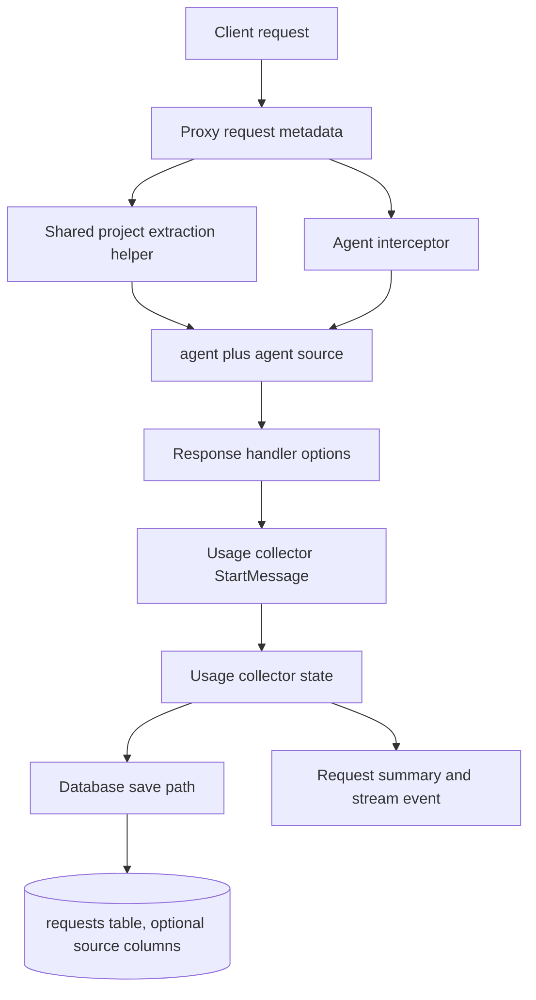

# Attribution Source Tags - Plan

## Goal Capsule

| Field | Value |
|---|---|
| Objective | Add first-class source tags for existing `project` and `agent_used` attribution so better-ccflare can distinguish explicit caller labels from heuristic extraction without storing prompts or secrets. |
| Active scope | First upstream OSS PR: shared project extraction helper, project source tags, agent source tags, runtime propagation, and optional persistence of only the two source columns. |
| Authority order | Product Contract requirements, repo `CLAUDE.md`, existing proxy/database patterns, then implementation judgment. |
| Stop conditions | Stop if implementing this requires broad caller/job/campaign lineage, dashboard redesign, budget policy, or prompt-body persistence. Those are follow-up work. |
| Execution profile | Test-first for new helper/source behavior, then implementation, then targeted Bun tests plus repo lint/typecheck/format checks. |
| Tail ownership | The implementer updates this plan only if scope changes; execution progress is tracked in git and the PR, not in this document. |

---

## Product Contract

### Summary

This plan implements the first upstreamable attribution improvement for better-ccflare: source tags for the existing `project` and `agent_used` fields.
It keeps current behavior compatible while making provenance explicit, so future cost spikes can tell whether labels came from headers, workspace-path heuristics, prompt headings, or agent prompt detection.

Product Contract preservation: Product Contract unchanged in intent, narrowed for execution to PR 1; broader caller/job/campaign, dashboard, budgets, failover grouping, and producer instrumentation remain deferred follow-up work.

### Problem Frame

better-ccflare records useful request data, including `project`, `agent_used`, model, account, token fields, cost, status, and failover attempts.
During the recent `Harness` and `gpt-5.5` spend investigation, those fields identified the cost bucket but not the label provenance.
A value such as `project=Harness` could have come from an explicit header, a workspace path, or a prompt heading.

Today, answering that provenance question requires database archaeology and source inspection.
The first fix should be maintainer-friendly and small: keep existing attribution values, add source labels, and centralize duplicated extraction logic.
It must not store request bodies, prompt text, tool inputs, auth headers, cookies, raw trace IDs, or private harness-specific metadata.

### Requirements

**Source tagging**

- R1. Every persisted or emitted `project` value produced by the proxy flow must carry a low-cardinality source label: `header_project`, `path_project`, `heading_project`, or `none`.
- R2. Every persisted or emitted `agent_used` value produced by the agent interceptor flow must carry a low-cardinality source label: `header_agent`, `prompt_agent`, or `none`. For PR 1, registry-assisted matches intentionally share `prompt_agent` because they still originate from prompt or known-agent prompt detection rather than an explicit caller header.
- R3. Source labels must describe provenance only, never raw header names, prompt excerpts, request bodies, full paths, or tool input content. Each label describes the winning source for the final persisted or emitted value, not every source consulted during extraction.

**Compatibility and behavior preservation**

- R4. Existing callers that send only `x-project` or `x-anthropic-agent-id` must continue to work unchanged.
- R5. Existing project extraction precedence must remain compatible: explicit project header, workspace path inference, eligible markdown heading, then no project.
- R6. Existing agent attribution precedence must remain compatible: explicit agent header, prompt or registry detection, then no agent.
- R7. The proxy and usage collector must not maintain divergent copies of project extraction rules after this change.

**Privacy and safety**

- R8. The implementation must not store prompt bodies, request bodies, tool arguments, authorization headers, cookies, API keys, bearer-like strings, high-entropy tokens, raw IP forwarding headers, or raw trace IDs as attribution metadata.
- R9. Header-derived project and agent values must keep existing sanitization and length caps unless a compatible tightening is required by tests.
- R10. Path-derived project inference must persist only a sanitized project slug, not the source path.
- R10a. Heading-derived project inference must only emit or persist values that pass a strict low-risk project-slug validator; headings containing secret-like strings, URLs, emails, long random tokens, or customer/incident-shaped labels must return no project instead of being stored or emitted.

**Upstream PR shape**

- R11. The first PR must stay small enough for upstream review by focusing on source tags and shared extraction, not the whole attribution platform.
- R12. If persistence is included, only `project_attribution_source` and `agent_attribution_source` may be added to request storage in this PR.
- R13. SQLite and PostgreSQL schema paths must stay in sync if any request columns are added.

### Acceptance Examples

- AE1. Given a request with `x-better-ccflare-project: eval-suite`, when better-ccflare records the request, then `project` is `eval-suite` and `project_attribution_source` is `header_project`.
- AE2. Given a request with only the existing `x-project: eval-suite` header, when better-ccflare records the request, then existing project behavior still works and the source is `header_project`.
- AE3. Given a request with no project header but a workspace or repo path under a recognized root, when better-ccflare infers the project, then only the sanitized repo slug is stored and the source is `path_project`.
- AE4. Given a request with no project header or recognized workspace path but a first eligible non-Claude markdown heading that passes the low-risk project-slug validator, when better-ccflare infers the project, then the source is `heading_project`.
- AE5. Given a request with `x-better-ccflare-agent-id` or `x-anthropic-agent-id`, when the agent interceptor runs, then the agent value comes from the header and the source is `header_agent`.
- AE6. Given a request with no explicit agent header but a known agent prompt match, when the agent interceptor detects it, then the source is `prompt_agent`.
- AE7. Given fake `authorization`, `cookie`, `x-api-key`, or bearer-like values in request headers, when attribution metadata is saved or emitted, then none of those values appear in request rows, payload metadata, logs, errors, or analytics responses.

### Scope Boundaries

#### Active in PR 1

- Shared project extraction helper used by both the proxy and usage collector paths.
- Project source labels for header, path, heading, and none.
- Agent source labels for explicit header, prompt or registry detection, and none.
- Backward-compatible namespaced headers as preferred aliases where practical.
- Runtime propagation through request metadata, worker start messages, usage collector state, summaries, and existing early-failure records.
- A pre-U5 persistence checkpoint: include only the two source columns in PR 1 if maintainers accept minimal schema expansion and the diff remains small after U2-U4; otherwise skip U5 and ship runtime-only source propagation with persistence as a required follow-up PR.

#### Deferred to Follow-Up Work

- `caller`, `job_id`, `campaign_id`, repo slug, worktree slug, session hash, transcript hash, workflow id, subagent id, or parent-agent lineage fields.
- Request attempt grouping, failover attempt numbering, and failover waterfall diagnostics.
- Requested-model versus resolved-model split and transport/provider route classification.
- Server-side attribution filters, analytics filters, dashboard columns, dashboard widgets, and unattributed spend ratios.
- Budget enforcement, per-caller limits, per-job ceilings, campaign budgets, and high-context approval policy.
- pi-evals, pi-lens, private harness, Claude Code wrapper, Codex host, cron, or CI producer instrumentation.
- Historical backfill from prompt bodies, request payloads, or encrypted payload JSON.

### Sources

- Current brainstorm artifact in `docs/plans/2026-07-08-001-feature-attribution-source-tags-plan.md`.
- Repo instructions in `CLAUDE.md`, especially migration parity, test-first work, generated-file exclusions, and testing restrictions.
- Planning research over `packages/proxy/src/proxy.ts`, `packages/proxy/src/usage-collector.ts`, `packages/proxy/src/handlers/agent-interceptor.ts`, `packages/proxy/src/response-handler.ts`, `packages/proxy/src/worker-messages.ts`, `packages/database/src/migrations.ts`, `packages/database/src/migrations-pg.ts`, `packages/database/src/repositories/request.repository.ts`, `packages/database/src/database-operations.ts`, `packages/types/src/request.ts`, and `packages/http-api/src/handlers/requests.ts`.

---

## Planning Contract

### Key Technical Decisions

- KTD1. Keep PR 1 focused on provenance for existing labels. This makes the change upstreamable and prevents the attribution roadmap from becoming a dashboard, budgeting, or private harness PR.
- KTD2. Represent source as application-validated string labels rather than raw source details. The labels are enough for diagnostics and avoid storing prompt excerpts, full paths, or header values beyond existing sanitized `project` and `agent_used`.
- KTD3. Centralize project extraction in a proxy-local helper that returns both value and source. The current duplicate rules in `proxy.ts` and `usage-collector.ts` can drift, and source tagging would make that drift harder to reason about.
- KTD4. Prefer namespaced better-ccflare headers while preserving existing aliases. `x-better-ccflare-project` and `x-better-ccflare-agent-id` are clearer for upstream docs, while `x-project` and `x-anthropic-agent-id` keep existing clients compatible.
- KTD5. Treat path and heading extraction as inference. Source labels should say that inference happened, but stored values remain sanitized project slugs and never include the raw path or heading context.
- KTD6. Persist source columns only after an explicit pre-U5 checkpoint. Proceed into persistence when maintainers accept two nullable columns in PR 1 and the U2-U4 diff remains small; otherwise skip U5, keep PR 1 runtime-only, and treat persistence as the mandatory follow-up needed for historical spend investigations.
- KTD7. Keep attribution values and source labels atomic on repository conflicts. If an existing `project` or `agent_used` value is preserved, preserve its matching source. If the value is replaced by a more authoritative value, replace the source in the same operation. Allow source upgrades from `none` to non-none, or from inferred to header source, only when the persisted attribution value remains identical or is replaced together with the source.

### High-Level Technical Design



The data flow has one rule: source labels are created at the extraction boundary and then carried forward, not rediscovered at persistence time.
Project extraction is created by the shared helper.
Agent source is created by the interceptor.
The usage collector treats source fields as a tri-state contract: an explicit source label is authoritative for the matching value, an explicit `none` is authoritative absence, and an absent field means legacy or direct input where fallback extraction may run. Normal proxy flow must not recompute when `StartMessage` carries either a concrete source or authoritative `none`; direct and legacy paths may use the shared helper fallback when enough request context exists.

### Assumptions

- The first upstream PR may include two nullable database columns only after the pre-U5 checkpoint accepts the schema scope; otherwise persistence is split into the mandatory follow-up PR.
- The existing authenticated request summary API is the right exposure point if source fields are persisted.
- Dashboard display is not required for PR 1; downstream consumers can ignore new optional response fields.
- PR 1 should preserve existing path inference behavior while tagging its source. New recognition for `SITES`, worktree directories, or checkout caches belongs in follow-up work unless implementation confirms those roots are already supported today, in which case tests should frame them as compatibility coverage.

### Implementation Constraints

- Do not read or store request body text for attribution beyond the existing parsed context already used by project extraction.
- Do not touch generated files: `packages/proxy/src/inline-worker.ts`, `packages/database/src/inline-vacuum-worker.ts`, or `packages/database/src/inline-integrity-check-worker.ts`.
- If `packages/database/src/migrations.ts` changes, mirror the schema and migration in `packages/database/src/migrations-pg.ts`.
- Use `git add <specific-files>` if committing, not `git add .`.
- Do not curl the Anthropic endpoint or test through the `claude` account.

---

## Implementation Units

### U1. Lock active PR scope in the plan

- **Goal:** Keep the artifact executable for the first upstream PR rather than the entire attribution roadmap.
- **Requirements:** R11, R12, R13.
- **Dependencies:** None.
- **Files:** `docs/plans/2026-07-08-001-feature-attribution-source-tags-plan.md`.
- **Approach:** Preserve the original goals and non-goals, but separate active PR 1 work from deferred attribution platform work.
- **Patterns to follow:** Unified plan sections in this file and repo-relative path rules.
- **Test scenarios:** Test expectation: none, this is a planning-only unit with no runtime behavior.
- **Verification:** The plan does not instruct an implementer to build caller/job/campaign fields, dashboard filters, budgets, or producer instrumentation in PR 1.

### U2. Create shared project attribution extraction

- **Goal:** Replace duplicated project extraction logic with one helper that returns a sanitized project and `project_attribution_source`.
- **Requirements:** R1, R3, R4, R5, R7, R9, R10, AE1, AE2, AE3, AE4.
- **Dependencies:** U1.
- **Files:** `packages/proxy/src/proxy.ts`, `packages/proxy/src/usage-collector.ts`, a new or existing helper under `packages/proxy/src`, and a focused helper test file under `packages/proxy/src` or `packages/proxy/src/__tests__`.
- **Approach:** Move project sanitization and extraction precedence into a proxy-local helper that accepts headers and request context, then returns `project` plus `projectAttributionSource`.
- **Execution note:** Start with helper tests for header precedence, path inference, heading fallback, and no-match behavior before replacing the duplicated callers.
- **Helper contract:** Support both the normal proxy path's parsed JSON input and the usage collector's `StartMessage` input. Either expose a decode-and-extract wrapper for base64 `requestBody` or move the base64 decode plus system prompt extraction into the shared module so the collector does not keep divergent fallback rules.
- **Patterns to follow:** Existing `sanitizeProjectName` behavior, existing header/path/H1 precedence, and usage-collector fallback behavior when `requestBody` is absent.
- **Test scenarios:**
  - Given `x-better-ccflare-project` and `x-project`, the namespaced header wins and the source is `header_project`.
  - Given only `x-project`, the project is still extracted and the source is `header_project`.
  - Given control characters or an overlong project header, sanitization and length caps match the existing behavior.
  - Given a recognized `/home` or `/Users` workspace path, the helper infers a sanitized repo slug and the source is `path_project`.
  - Given an already-supported workspace or repo path, the helper infers only the sanitized repo slug and never stores the full path.
  - Given a proposed new `SITES`, worktree, or checkout-cache root, the helper treats it as follow-up scope unless implementation proves the root is already supported today.
  - Given no header or recognized path and a first eligible non-Claude H1 that passes the low-risk project-slug validator, the helper returns that heading with source `heading_project`.
  - Given no valid header, path, or heading, the helper returns no project and source `none`.
  - Given a heading containing bearer/API-key-like strings, URLs, emails, long random tokens, or customer/incident-shaped labels, the helper returns no project and does not persist or emit the heading-derived value.
  - Given only `StartMessage.requestBody` is available in the usage collector fallback path, path and heading extraction still use the shared helper contract and return the same source labels as the proxy path.
- **Verification:** `proxy.ts` and `usage-collector.ts` both call the shared helper, and their old project extraction rules no longer diverge.

### U3. Add agent source tagging at the interceptor boundary

- **Goal:** Make explicit-header agent attribution distinguishable from prompt or registry-based detection.
- **Requirements:** R2, R3, R4, R6, R8, R9, AE5, AE6, AE7.
- **Dependencies:** U1.
- **Files:** `packages/proxy/src/handlers/agent-interceptor.ts`, `packages/proxy/src/handlers/__tests__/agent-interceptor.header.test.ts`, `packages/proxy/src/handlers/__tests__/agent-interceptor.security.test.ts`.
- **Approach:** Extend the interceptor result so it carries `agentUsed` plus `agentAttributionSource`, preserving explicit header precedence and existing prompt matching behavior.
- **Execution note:** Add failing tests for source labels before changing interceptor return plumbing.
- **Source invariant:** For PR 1, `prompt_agent` covers known-agent prompt and registry-assisted prompt detection. Do not add a separate registry source label unless a later PR explicitly expands the low-cardinality enum.
- **Patterns to follow:** Current `x-anthropic-agent-id` trim and length cap behavior, existing prompt extraction from system and CLAUDE.md contexts, and model preference substitution behavior.
- **Test scenarios:**
  - Given `x-better-ccflare-agent-id`, the interceptor returns the header value and source `header_agent`.
  - Given only `x-anthropic-agent-id`, existing behavior still works and source is `header_agent`.
  - Given both preferred and legacy headers, precedence is deterministic and documented by the test.
  - Given a known prompt or registry-assisted prompt match and no explicit header, the interceptor returns the detected agent and source `prompt_agent`.
  - Given no header and no prompt or registry-assisted match, the interceptor returns no agent and source `none`.
  - Given whitespace-padded or overlong header values, sanitization remains compatible with current behavior.
  - Given fake auth, cookie, API key, bearer-like, or traversal-shaped prompt content, no secret-bearing value is emitted as agent metadata.
- **Verification:** Existing agent header and security tests still pass, and new tests prove source labels without changing model preference behavior.

### U4. Thread source tags through proxy runtime flow

- **Goal:** Carry project and agent source labels from extraction into worker messages, collector state, summaries, and existing failure paths.
- **Requirements:** R1, R2, R3, R5, R6, R7, AE1, AE2, AE5, AE6.
- **Dependencies:** U2, U3.
- **Files:** `packages/proxy/src/proxy.ts`, `packages/proxy/src/response-handler.ts`, `packages/proxy/src/worker-messages.ts`, `packages/proxy/src/usage-collector.ts`, `packages/proxy/src/handlers/proxy-operations.ts`, `packages/proxy/src/__tests__/response-handler-worker-protocol.test.ts`.
- **Approach:** Add optional source fields to the existing request metadata, `StartMessage`, and real-time request event paths, then store them on usage collector state and include them in summary objects where `project` and `agentUsed` already flow.
- **Runtime contract:** Treat source fields as tri-state. A concrete source is authoritative for the matching value, explicit `none` means the value is absent or truly unattributed, and field absence means legacy/direct input where the shared helper fallback may run if request context is available.
- **Exposure contract:** Source fields may appear only on the same authenticated request-summary surfaces that already expose `project` and `agent_used`. Do not include them on errors, logs, public health/status endpoints, unauthenticated responses, or unrelated analytics payloads.
- **Patterns to follow:** Current `project` and `agentUsed` propagation through `forwardToClient`, `StartMessage`, request event start payloads, `handleStart`, `_handleEndInternal`, and pool-exhausted synthetic messages.
- **Test scenarios:**
  - Given a non-streaming request with project and agent sources, the StartMessage includes both existing values and both source labels.
  - Given a streaming request with project and agent sources, the StartMessage includes both existing values and both source labels.
  - Given a request event start payload includes `agentUsed`, it also includes `agentAttributionSource`; if project is emitted through this path later, it carries `projectAttributionSource` as well.
  - Given a pool-exhausted or early-failure path that already records `project` or `agentUsed`, the matching source labels are preserved; `none` is used only when the corresponding attribution value is absent or truly unattributed.
  - Given a consumer that ignores unknown StartMessage fields, existing worker protocol behavior remains backward compatible.
  - Given `requestBody` is absent in the usage collector, `StartMessage.project` and `StartMessage.projectAttributionSource` remain authoritative for normal proxy flow.
  - Given a legacy or direct usage collector message omits source fields, fallback extraction runs only through the shared helper when enough request context exists; otherwise the source remains explicitly unattributed.
  - Given error responses, logs, public health/status endpoints, unauthenticated responses, or unrelated analytics payloads are emitted, they do not include raw headers, paths, prompt text, or attribution source fields outside the intended authenticated request-summary surface.
- **Verification:** Source labels are not recomputed after extraction in normal flow, and request summaries expose them consistently when available.

### U5. Persist source columns if accepted in PR 1

- **Goal:** Save `project_attribution_source` and `agent_attribution_source` beside existing request attribution fields with SQLite and PostgreSQL parity.
- **Requirements:** R1, R2, R3, R8, R12, R13, AE1, AE2, AE5, AE6, AE7.
- **Dependencies:** U4.
- **Pre-U5 checkpoint:** Start U5 only if maintainers accept two nullable source columns in PR 1 and the U2-U4 diff remains small enough for upstream review. If not, skip U5 entirely, leave schema/repository/API response changes for a required follow-up PR, and update the DoD for PR 1 to require runtime-only source propagation.
- **Files:** `packages/database/src/migrations.ts`, `packages/database/src/migrations-pg.ts`, `packages/database/src/database-operations.ts`, `packages/database/src/repositories/request.repository.ts`, `packages/types/src/request.ts`, `packages/http-api/src/handlers/requests.ts`, `packages/proxy/src/handlers/proxy-operations.ts`, `packages/database/src/migrations.test.ts`, and a request repository test under `packages/database/src/repositories/__tests__` if one exists or is added.
- **Approach:** Add nullable text columns to fresh schemas and guarded migrations, extend request save types and SQL, map source fields into shared request response types and `/api/requests` summaries, and update direct `dbOps.saveRequest` failure or failover call sites so persisted attribution values keep matching source labels.
- **Execution note:** Implement schema tests before repository plumbing so SQLite and PostgreSQL parity is not missed.
- **Patterns to follow:** Existing `project` and `agent_used` columns, existing `RequestData` to `RequestRepository.save` flow, direct `dbOps.saveRequest` calls in `packages/proxy/src/handlers/proxy-operations.ts`, `RequestRow` and `toRequestResponse` mappers, and migration parity rules in `CLAUDE.md`.
- **Test scenarios:**
  - Given a fresh SQLite database, the `requests` table includes both source columns.
  - Given an old SQLite database, migration adds both nullable source columns without disrupting existing rows.
  - Given PostgreSQL schema creation, both source columns exist in the fresh `requests` schema.
  - Given PostgreSQL migrations, both source columns are present in the `columnsToAdd` upgrade list.
  - Given a saved request with source labels, the repository persists and returns both labels.
  - Given an UPSERT for an existing request, attribution values and source fields follow the atomic conflict policy from KTD7, including mismatched old/new value-source pairs, `none` to non-none upgrades, and inferred to header-source upgrades when allowed.
  - Given direct failure or failover paths call `dbOps.saveRequest` from `proxy-operations.ts`, `requestMeta` carries `projectAttributionSource` and `agentAttributionSource` and those fields are passed into saved rows with their matching values.
  - Given `/api/requests` returns summaries, source fields are mapped when present and omitted or null when absent.
  - Given fake secret-bearing headers, no secret values appear in source columns, payload metadata, logs, errors, or analytics responses.
  - Given errors, logs, public endpoints, unauthenticated responses, or unrelated analytics payloads are produced, source fields appear only on the intended authenticated request-summary surface.
- **Verification:** Persistence is optional to the first PR, but if included it is complete across schemas, save path, shared types, and request summary API.

### U6. Keep the broader attribution roadmap deferred

- **Goal:** Preserve roadmap context without making PR 1 too broad for upstream review.
- **Requirements:** R11, R12.
- **Dependencies:** U1.
- **Files:** `docs/plans/2026-07-08-001-feature-attribution-source-tags-plan.md`.
- **Approach:** Keep caller/job/campaign, diagnostics, filters, dashboard, budget, failover, and producer-instrumentation ideas in Scope Boundaries and Appendix instead of active units.
- **Test scenarios:** Test expectation: none, this is a planning-only unit with no runtime behavior.
- **Verification:** The active unit list contains no implementation work for deferred roadmap items.

---

## Verification Contract

| Gate | Applies to | Expected proof |
|---|---|---|
| Project helper tests | U2 | Header precedence, sanitization, path inference, heading fallback, and no-match source labels are covered. |
| Agent interceptor tests | U3 | Header and prompt source labels are covered without regressing model preference substitution or security tests. |
| Worker protocol tests | U4 | Streaming and non-streaming StartMessage payloads carry optional source labels while existing consumers remain compatible. |
| Database migration tests | U5, only if persistence is included | SQLite fresh and migrated schemas include both columns, and PostgreSQL schema plus migration list are updated. |
| Repository/API tests | U5, only if persistence is included | Save, UPSERT, shared type mapping, and `/api/requests` summary mapping preserve source labels. |
| Full repo tests | All implementation units | `bun test` passes. |
| Repo checks | All implementation units | `bun run lint && bun run typecheck && bun run format` passes, followed by checking the resulting diff. |

If implementation touches dashboard code through shared types, also run the dashboard package typecheck or build using the package scripts in `packages/dashboard-web/package.json`.
Do not test with the Anthropic endpoint or the `claude` account.

---

## Definition of Done

- Project extraction is centralized and both existing project extraction callers use it.
- `project_attribution_source` can distinguish header, path, heading, and none cases.
- `agent_attribution_source` can distinguish explicit header, prompt or registry-assisted detection, and none cases.
- Existing `x-project` and `x-anthropic-agent-id` behavior remains backward compatible.
- Namespaced better-ccflare headers are supported or intentionally deferred with a documented reason.
- Source labels contain only low-cardinality enum-like values, never prompt bodies, request bodies, raw paths, auth headers, cookies, API keys, or trace IDs.
- Heading-derived project values pass the low-risk project-slug validator before they are emitted or persisted.
- Runtime propagation keeps source labels with their matching `project` and `agent_used` values through worker start messages and usage collector state.
- If persistence passes the pre-U5 checkpoint, SQLite and PostgreSQL schemas, migrations, repository save logic, direct failure/failover save paths, shared types, and `/api/requests` summaries all include the two source columns; otherwise PR 1 explicitly ships runtime-only source propagation and persistence remains a required follow-up.
- Broader attribution fields, path-root expansion, and dashboards remain deferred follow-up work, not partially implemented in PR 1.
- Targeted tests, `bun test`, and `bun run lint && bun run typecheck && bun run format` pass or any failures are diagnosed and fixed.
- The final diff excludes generated inline worker files and contains no abandoned exploratory code.

---

## Appendix

### Deferred attribution roadmap

The broader attribution design remains valuable after PR 1 proves source tagging.
Future PRs can add sanitized caller lineage fields such as `caller`, `job_id`, `campaign_id`, request attempt groups, requested and resolved model fields, transport classification, server-side filters, dashboard surfaces, budget alerts, and producer-side header emission.
Those features should be split into separate upstreamable units after the source-tag spine lands.

### Diagnostic queries for later work

These query shapes are not part of PR 1 unless the corresponding fields exist.
They document why the deferred fields matter.

```sql
SELECT caller, job_id, campaign_id, model, COUNT(*) AS requests, SUM(total_tokens) AS total_tokens, ROUND(SUM(cost_usd), 2) AS cost_usd
FROM requests
WHERE timestamp >= ?
GROUP BY caller, job_id, campaign_id, model
ORDER BY cost_usd DESC
LIMIT 50;
```

```sql
SELECT project, project_attribution_source, COUNT(*) AS requests, SUM(total_tokens) AS total_tokens, ROUND(SUM(cost_usd), 2) AS cost_usd
FROM requests
WHERE timestamp >= ?
GROUP BY project, project_attribution_source
ORDER BY cost_usd DESC;
```

```sql
SELECT caller, model, SUM(input_tokens) AS input_tokens, SUM(cache_read_input_tokens) AS cache_read_input_tokens, SUM(cache_creation_input_tokens) AS cache_creation_input_tokens, SUM(output_tokens) AS output_tokens
FROM requests
WHERE timestamp >= ?
GROUP BY caller, model;
```
