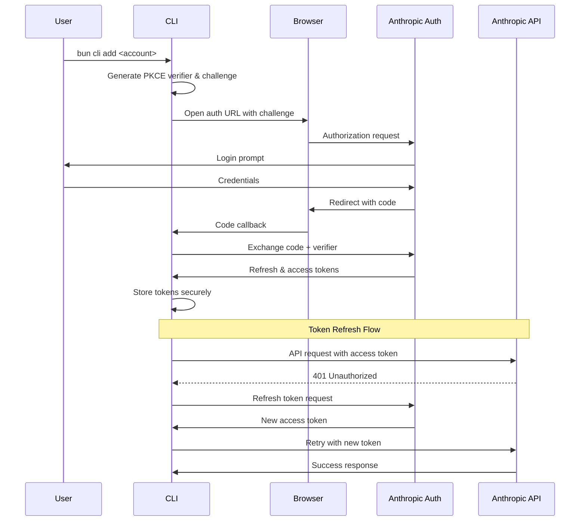

# Providers System Documentation

## Quick Reference

### Currently Supported Providers
- **Anthropic** - Single provider with two modes:
  - **console mode**: Standard Claude API (console.anthropic.com)
  - **max mode**: Claude Code (claude.ai)
- **Z.ai** - Claude proxy service with API key authentication:
  - Lite, Pro, and Max plans with higher rate limits than direct Claude API
  - Uses API key authentication (no OAuth support)

### Key Points
- All API requests route to `https://api.anthropic.com`
- OAuth is the preferred authentication method with PKCE security
- Recent updates include enhanced streaming response capture for analytics
- Provider system is extensible for future providers (OpenAI, Gemini, etc.)
- Default OAuth client ID: `9d1c250a-e61b-44d9-88ed-5944d1962f5e` (configurable via environment or config file)

## Table of Contents
- [Overview](#overview)
- [Provider Registry Pattern](#provider-registry-pattern)
- [OAuth Authentication Flow](#oauth-authentication-flow)
- [AnthropicProvider Implementation](#anthropicprovider-implementation)
- [Provider Interface](#provider-interface)
- [Account Tier System](#account-tier-system)
- [Rate Limit Handling](#rate-limit-handling)
- [Token Storage and Security](#token-storage-and-security)
- [Adding New Providers](#adding-new-providers)

## Overview

The ccflare providers system is a modular architecture designed to support multiple AI service providers through a unified interface. Currently, it implements support for Anthropic's services through a single provider that can operate in two modes:

### Supported Providers

1. **Anthropic Provider** - Provides access to:
   - **Claude API** (console mode) - Standard API access via console.anthropic.com
   - **Claude Code** (max mode) - Enhanced access via claude.ai

2. **Z.ai Provider** - Provides access to:
   - **Z.ai API** - Claude proxy service with enhanced rate limits
   - Uses API key authentication instead of OAuth
   - Supports Lite, Pro, and Max plans with ~3× the usage quota of equivalent Claude plans

The providers system handles:
- OAuth authentication flows with PKCE security (Anthropic)
- API key authentication (Z.ai)
- Token lifecycle management (refresh, expiration)
- Provider-specific request routing and header management
- Rate limit detection and handling
- Usage tracking and tier detection
- Response processing and transformation
- Streaming response capture for analytics

## Provider Registry Pattern

The provider registry implements a singleton pattern to manage all available providers in the system. This centralized approach ensures consistent provider access and automatic OAuth capability detection.

### Registry Architecture

```typescript
class ProviderRegistry {
  private providers = new Map<string, Provider>();
  private oauthProviders = new Map<string, OAuthProvider>();
  
  registerProvider(provider: Provider): void
  getProvider(name: string): Provider | undefined
  getOAuthProvider(name: string): OAuthProvider | undefined
  listProviders(): string[]
  listOAuthProviders(): string[]
  unregisterProvider(name: string): boolean  // Useful for testing
  clear(): void  // Clear all providers (useful for testing)
}
```

### Auto-Registration

Providers are automatically registered when the package is imported:

```typescript
// In packages/providers/src/index.ts
import { registry } from "./registry";
import { AnthropicProvider } from "./providers/anthropic/provider";

registry.registerProvider(new AnthropicProvider());
```

### OAuth Detection

The registry automatically detects OAuth-capable providers through duck typing:

```typescript
if ("supportsOAuth" in provider && provider.supportsOAuth()) {
  const oauthProvider = provider.getOAuthProvider();
  this.oauthProviders.set(provider.name, oauthProvider);
}
```

## OAuth Authentication Flow

The OAuth implementation follows the OAuth 2.0 specification with PKCE (Proof Key for Code Exchange) for enhanced security.

### PKCE Flow Sequence



### PKCE Implementation

The PKCE implementation generates cryptographically secure challenges:

```typescript
export async function generatePKCE(): Promise<PKCEChallenge> {
  // Generate 32-byte random verifier
  const verifierBytes = new Uint8Array(32);
  crypto.getRandomValues(verifierBytes);
  const verifier = base64urlEncode(verifierBytes);
  
  // Create SHA-256 challenge
  const data = new TextEncoder().encode(verifier);
  const hashBuffer = await crypto.subtle.digest("SHA-256", data);
  const challenge = base64urlEncode(new Uint8Array(hashBuffer));
  
  return { verifier, challenge };
}
```

### OAuth Configuration

The Anthropic provider supports two OAuth modes with different authorization endpoints:

```typescript
getOAuthConfig(mode: "console" | "max" = "console"): OAuthConfig {
  const baseUrl = mode === "console" 
    ? "https://console.anthropic.com"  // Standard Claude API
    : "https://claude.ai";              // Claude Code
    
  return {
    authorizeUrl: `${baseUrl}/oauth/authorize`,
    tokenUrl: "https://console.anthropic.com/v1/oauth/token", // Always uses console endpoint
    clientId: "", // Provided by configuration
    scopes: ["org:create_api_key", "user:profile", "user:inference"],
    redirectUri: "https://console.anthropic.com/oauth/code/callback",
    mode,
  };
}
```

**Mode Differences:**
- **console mode**: Uses the standard Claude API via console.anthropic.com
- **max mode**: Uses Claude Code via claude.ai for enhanced capabilities
- Both modes use the same API endpoint (api.anthropic.com) for actual requests

**Client ID Configuration:**
The OAuth client ID can be configured in multiple ways (in order of precedence):
1. Config file: `client_id` field
2. Environment variable: `CLIENT_ID`
3. Default value: `9d1c250a-e61b-44d9-88ed-5944d1962f5e`

## AnthropicProvider Implementation

The AnthropicProvider extends the BaseProvider class and implements Anthropic-specific functionality.

## ZaiProvider Implementation

The ZaiProvider extends the BaseProvider class and implements Z.ai-specific functionality.

### Key Features

1. **API Key Authentication**: Uses `x-api-key` header instead of OAuth
2. **No Tier Detection**: Returns null from `extractTierInfo()` - tiers must be set manually
3. **Usage Extraction**: Parses token usage from both streaming and non-streaming responses (similar to Anthropic)
4. **Request Routing**: Routes all requests to `https://api.z.ai/api/anthropic`
5. **Compatible Response Format**: Z.ai responses follow the same format as Anthropic's API

### Z.ai Request Routing

The Z.ai provider routes all requests to the Z.ai API endpoint:

```typescript
buildUrl(path: string, query: string): string {
  return `https://api.z.ai/api/anthropic${path}${query}`;
}
```

### Z.ai Authentication

Z.ai uses API key authentication via the `x-api-key` header:

```typescript
prepareHeaders(headers: Headers, accessToken?: string, apiKey?: string): Headers {
  const newHeaders = new Headers(headers);

  // z.ai expects the API key in x-api-key header
  if (accessToken) {
    newHeaders.set("x-api-key", accessToken);
  } else if (apiKey) {
    newHeaders.set("x-api-key", apiKey);
  }

  return newHeaders;
}
```

The API key is stored in the `refresh_token` field of the account record for consistency with the authentication system.

## Anthropic Request Routing

The Anthropic provider handles all request paths and routes them to the standard Anthropic API endpoint:

```typescript
canHandle(_path: string): boolean {
  // Handle all paths for now since this is Anthropic-specific
  return true;
}

buildUrl(path: string, query: string): string {
  return `https://api.anthropic.com${path}${query}`;
}
```

**Important**: Both console and max modes use the same API endpoint. The mode only affects:
- OAuth authorization flow (which frontend to use)
- Account tier capabilities
- Rate limits based on subscription type

### Key Features

1. **Token Refresh**: Handles OAuth token refresh automatically with detailed error logging
2. **Rate Limit Detection**: Distinguishes between hard limits and soft warnings
3. **Usage Extraction**: Parses token usage from both streaming and non-streaming responses
   - For streaming: Captures initial usage from `message_start` event (capped at 64KB)
   - For non-streaming: Extracts complete usage from JSON response
   - Includes cache token breakdown (cache read, cache creation)
4. **Tier Detection**: Automatically detects account tier based on rate limit tokens
5. **Header Management**: 
   - Removes compression headers (`accept-encoding`, `content-encoding`)
   - Sanitizes proxy headers using `sanitizeProxyHeaders` utility
   - Adds Bearer token authentication
6. **Streaming Response Capture**: Captures initial streaming responses for analytics
7. **Cost Tracking**: Extracts cost information from `anthropic-billing-cost` header

### Rate Limit Status Types

```typescript
// Hard limits that block account usage
const HARD_LIMIT_STATUSES = new Set([
  "rate_limited",
  "blocked", 
  "queueing_hard",
  "payment_required"
]);

// Soft warnings that don't block usage
const SOFT_WARNING_STATUSES = new Set([
  "allowed_warning",
  "queueing_soft"
]);
```

### Usage Information Extraction

The provider extracts detailed usage information from responses:

```typescript
interface UsageInfo {
  model?: string;
  promptTokens?: number;
  completionTokens?: number;
  totalTokens?: number;
  costUsd?: number;
  inputTokens?: number;
  cacheReadInputTokens?: number;
  cacheCreationInputTokens?: number;
  outputTokens?: number;
}
```

## Provider Interface

All providers must implement the core Provider interface:

```typescript
export interface Provider {
  name: string;
  
  // Request routing
  canHandle(path: string): boolean;
  buildUrl(path: string, query: string): string;
  
  // Authentication
  refreshToken(account: Account, clientId: string): Promise<TokenRefreshResult>;
  prepareHeaders(headers: Headers, accessToken?: string): Headers;
  
  // Rate limiting
  parseRateLimit(response: Response): RateLimitInfo;
  
  // Response processing
  processResponse(response: Response, account: Account | null): Promise<Response>;
  
  // Optional features
  extractTierInfo?(response: Response): Promise<number | null>;
  extractUsageInfo?(response: Response): Promise<UsageInfo | null>;
  isStreamingResponse?(response: Response): boolean;
}
```

### BaseProvider Class

The BaseProvider abstract class provides default implementations for common functionality:

- **Header preparation**: Adds Bearer token (if provided) and removes host header
- **Rate limit parsing**: Checks unified headers first, then falls back to 429 status with retry-after header
- **Response processing**: Default pass-through implementation
- **Streaming detection**: Checks for `text/event-stream` or `stream` in content-type header
- **Tier extraction**: Default returns null (no tier info)
- **Usage extraction**: Default returns null (no usage info)

## Account Tier System

ccflare supports three account tiers based on Anthropic's subscription levels:

| Tier | Value | Rate Limit | Description |
|------|-------|------------|-------------|
| Free | 1 | 40,000 tokens/min | Free tier accounts |
| Pro | 5 | 200,000 tokens/min | Individual pro subscriptions |
| Team | 20 | 800,000+ tokens/min | Team/enterprise accounts |

### Z.ai Tier Mapping

Z.ai plans map to ccflare tiers as follows:

| Z.ai Plan | ccflare Tier | Usage Limit | Description |
|-----------|--------------|-------------|-------------|
| Lite | 1 | ~120 prompts/5hrs | ~3× Claude Pro usage quota |
| Pro | 5 | ~600 prompts/5hrs | ~3× Claude Max (5×) usage quota |
| Max | 20 | ~2400 prompts/5hrs | ~3× Claude Max (20×) usage quota |

**Important**: Z.ai does not provide automatic tier detection. You must manually specify the tier when adding z.ai accounts:

```bash
ccflare --add-account my-zai-account --tier 1  # For Lite plan
ccflare --add-account my-zai-account --tier 5  # For Pro plan
ccflare --add-account my-zai-account --tier 20 # For Max plan
```

### Automatic Tier Detection (Anthropic Only)

The system automatically detects account tiers from Anthropic API responses:

```typescript
async extractTierInfo(response: Response): Promise<number | null> {
  const json = await response.clone().json();
  if (json.usage?.rate_limit_tokens) {
    const rateLimit = json.usage.rate_limit_tokens;
    if (rateLimit >= 800000) return 20;  // Team tier
    if (rateLimit >= 200000) return 5;   // Pro tier
    return 1;  // Free tier
  }
  return null;
}
```

### Tier-Based Load Balancing

Higher tier accounts receive proportionally more requests:
- Free accounts: 1x weight
- Pro accounts: 5x weight  
- Team accounts: 20x weight

## Rate Limit Handling

The provider system implements sophisticated rate limit detection and handling.

### Unified Rate Limit Headers

Anthropic uses unified headers for rate limit information:

```typescript
interface RateLimitInfo {
  isRateLimited: boolean;
  resetTime?: number;
  statusHeader?: string;
  remaining?: number;
}
```

### Rate Limit Detection

```typescript
parseRateLimit(response: Response): RateLimitInfo {
  const statusHeader = response.headers.get("anthropic-ratelimit-unified-status");
  const resetHeader = response.headers.get("anthropic-ratelimit-unified-reset");
  const remainingHeader = response.headers.get("anthropic-ratelimit-unified-remaining");
  
  // Only hard limits block the account
  const isRateLimited = HARD_LIMIT_STATUSES.has(statusHeader) || 
                       response.status === 429;
  
  return {
    isRateLimited,
    resetTime: resetHeader ? Number(resetHeader) * 1000 : undefined,
    statusHeader: statusHeader || undefined,
    remaining: remainingHeader ? Number(remainingHeader) : undefined
  };
}
```

### Account Blocking

When rate limited, accounts are temporarily blocked:
- `rate_limited_until`: Timestamp when the account becomes available
- `rate_limit_status`: Current limit status (e.g., "rate_limited", "allowed_warning")
- `rate_limit_reset`: Time when the rate limit resets
- `rate_limit_remaining`: Remaining requests in current window

## Token Storage and Security

### Security Considerations

1. **Token Encryption**: Access and refresh tokens should be encrypted at rest
2. **Secure Storage**: Use environment-specific secure storage (e.g., OS keychain)
3. **Token Rotation**: Regularly refresh access tokens before expiration
4. **Minimal Exposure**: Never log or expose tokens in error messages

### Authentication Methods

The system supports two authentication methods:

1. **OAuth Authentication** (Recommended)
   - Used for both console and max modes
   - Provides automatic token refresh
   - Better security with short-lived access tokens
   - Supports PKCE for enhanced security

2. **API Key Authentication** (Legacy)
   - Direct API key usage stored in `account.api_key`
   - No automatic refresh capability
   - Simpler but less secure
   - Maintained for backward compatibility

### Token Lifecycle

```typescript
interface Account {
  // OAuth tokens
  refresh_token: string;      // Long-lived refresh token
  access_token: string | null; // Short-lived access token
  expires_at: number | null;   // Token expiration timestamp
  
  // API key (alternative auth)
  api_key: string | null;      // Direct API key authentication
}
```

**Note**: The current implementation prioritizes OAuth authentication for Anthropic. Z.ai uses API key authentication exclusively as it does not support OAuth.

### Token Refresh Strategy

1. **Proactive Refresh**: Refresh tokens 5 minutes before expiration
2. **Reactive Refresh**: Refresh on 401 responses
3. **Retry Logic**: Implement exponential backoff for refresh failures
4. **Concurrent Request Handling**: Prevent multiple simultaneous refreshes

## Adding New Providers

To add a new provider, follow these steps:

### 1. Create Provider Structure

```
packages/providers/src/providers/newprovider/
├── index.ts       # Exports
├── provider.ts    # Main provider implementation
└── oauth.ts       # OAuth implementation (if supported)
```

### 2. Implement the Provider Interface

```typescript
import { BaseProvider } from "../../base";
import type { Account, TokenRefreshResult } from "../../types";

export class NewProvider extends BaseProvider {
  name = "newprovider";
  
  async refreshToken(account: Account, clientId: string): Promise<TokenRefreshResult> {
    // Implement token refresh logic
  }
  
  buildUrl(path: string, query: string): string {
    return `https://api.newprovider.com${path}${query}`;
  }
  
  // Override other methods as needed
}
```

### 3. Implement OAuth Support (Optional)

```typescript
export class NewProviderOAuth implements OAuthProvider {
  getOAuthConfig(mode?: string): OAuthConfig {
    return {
      authorizeUrl: "https://newprovider.com/oauth/authorize",
      tokenUrl: "https://newprovider.com/oauth/token",
      clientId: "",
      scopes: ["read", "write"],
      redirectUri: "http://localhost:8080/callback"
    };
  }
  
  async exchangeCode(code: string, verifier: string, config: OAuthConfig): Promise<TokenResult> {
    // Implement code exchange
  }
  
  generateAuthUrl(config: OAuthConfig, pkce: PKCEChallenge): string {
    // Build authorization URL
  }
}
```

### 4. Register the Provider

```typescript
// In packages/providers/src/index.ts
import { NewProvider } from "./providers/newprovider/provider";
registry.registerProvider(new NewProvider());
```

### 5. Update Types and Configuration

1. Add provider-specific configuration options
2. Update documentation
3. Add provider-specific tests
4. Update CLI commands to support the new provider

### Provider Checklist

- [ ] Implement all required Provider interface methods
- [ ] Handle provider-specific headers and authentication
- [ ] Implement rate limit detection for the provider's format
- [ ] Add usage tracking if supported by the provider
- [ ] Implement OAuth flow if the provider supports it
- [ ] Add comprehensive error handling
- [ ] Write unit and integration tests
- [ ] Document provider-specific features and limitations
- [ ] Update load balancer logic if needed

## Best Practices

1. **Error Handling**: Always provide meaningful error messages
2. **Logging**: Use structured logging for debugging
3. **Testing**: Test both success and failure scenarios
4. **Documentation**: Keep provider documentation up to date
5. **Security**: Never expose sensitive tokens or credentials
6. **Performance**: Cache provider configurations when possible
7. **Compatibility**: Maintain backward compatibility when updating

## Recent Updates

- **Streaming Response Capture**: Added initial capture of streaming responses for analytics (commit 55446bf)
  - Captures up to 64KB of streaming data to extract usage information
  - Extracts model and token usage from `message_start` event
  - Prevents hanging by properly canceling stream readers
- **Enhanced Analytics**: Improved usage tracking and cost estimation for both streaming and non-streaming responses
  - Includes cache token breakdown (cache read vs cache creation)
  - Extracts billing cost from response headers
- **Header Sanitization**: Added `sanitizeProxyHeaders` utility for proper proxy header handling (commit f0f179e)

## Future Enhancements

1. **Multi-Provider Support**: Add support for OpenAI, Google Gemini, and other AI providers
2. **Provider Health Checks**: Monitor provider availability and performance
3. **Dynamic Provider Loading**: Load providers from external packages
4. **Provider Metrics**: Track success rates, latency, and costs per provider
5. **Fallback Strategies**: Automatic fallback to alternative providers on failure
6. **Provider-Specific Features**: Expose unique capabilities of each provider (e.g., vision, tools, etc.)
7. **Path-Based Routing**: Route specific API paths to different providers based on capabilities