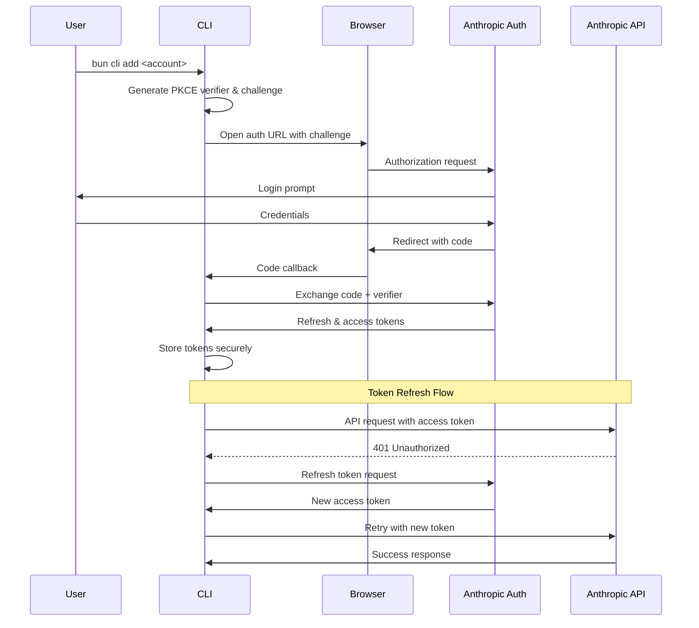

# Providers System Documentation

## Quick Reference

### Currently Supported Providers
- **Anthropic** - Single provider with two modes:
  - **console mode**: Standard Claude API (console.anthropic.com)
  - **max mode**: Claude Code (claude.ai)
- **Vertex AI** - Google Cloud's Claude on Vertex AI:
  - Uses Google Cloud authentication (gcloud or service accounts)
  - Supports all Claude models via Vertex AI
  - No API key required - uses Google Cloud credentials
  - Automatic token refresh
- **NanoGPT** - High-performance GPT provider with competitive pricing:
  - Dynamic pricing fetch with 24-hour cache
  - Supports GLM-4.5, GLM-4.5-Air, GLM-4.6, and GLM-4.6-Air models
  - API key authentication only
- **Minimax** - Chinese AI provider with Anthropic-compatible API:
  - Supports MiniMax-M2 and other models
  - API key authentication
  - Automatic format conversion
- **Z.ai** - Claude proxy service with API key authentication:
  - Lite, Pro, and Max plans with higher rate limits than direct Claude API
  - Uses API key authentication (no OAuth support)
- **DeepSeek** - Native Anthropic-compatible API via `api.deepseek.com`:
  - Default model: `deepseek-v4-flash`
  - Uses API key authentication (`x-api-key` header, no OAuth support)
  - Built on the same `BaseAnthropicCompatibleProvider` base as Minimax
- **Anthropic-Compatible** - Generic provider for Anthropic-compatible APIs:
  - Supports custom endpoints
  - API key authentication only
- **OpenAI-Compatible** - Generic provider for any OpenAI-compatible API:
  - Supports custom endpoints (OpenRouter, Together AI, local models, etc.)
  - API key authentication only
  - Automatic format conversion between Anthropic and OpenAI APIs
- **Ollama** - Local Ollama provider (v0.14.0+):
  - Uses Ollama's Anthropic-compatible `/v1/messages` API
  - Default endpoint: `http://localhost:11434`
  - Supports custom endpoints (local/LAN/self-hosted)
  - No real API key required
- **Ollama Cloud** - Hosted Ollama at ollama.com:
  - Uses Ollama Cloud's `/api/chat` endpoint
  - Model mapping required (e.g., `claude-sonnet-4-6` → `deepseek-v4-flash:cloud`)
  - Bearer token authentication via API key
  - Converts Anthropic-format requests to Ollama native `/api/chat` format
  - Converts NDJSON streaming responses back to Anthropic SSE
- **xAI** - Grok models via `api.x.ai`, built on the OpenAI-compatible base:
  - OAuth authentication (device-style refresh-token flow against `auth.x.ai`), not just API keys
  - All Claude model families (opus/sonnet/haiku/fable) map to `grok-4.3` by default, editable via the provider model defaults override (`CCFLARE_MODEL_DEFAULTS_PROVIDERS`, see `docs/configuration.md`)
  - Optional opt-in cache-native conversation affinity (`CCFLARE_XAI_CACHE_NATIVE`) — see `docs/configuration.md` for the env var
- **Codex** - OpenAI's ChatGPT/Codex Responses API, a bespoke `BaseProvider` (not OpenAI-chat-compatible):
  - OAuth authentication against `auth.openai.com`, rotating refresh tokens
  - Converts Anthropic `/v1/messages` requests to the Responses API's `input`/`function_call` shape and back, including a synthetic `count_tokens` endpoint (Codex has none natively)
  - Default model map is derived live per-account from `chatgpt.com/backend-api/codex/models` rather than compiled, so it never guesses a model the account's plan can't call — see `docs/configuration.md`
- **Qwen** - Alibaba's Qwen/DashScope coder model via device-code OAuth, built on the OpenAI-compatible base:
  - All Claude model families map to `coder-model`
  - Rewrites the Claude Code system prompt to a Qwen Code identity and strips Claude-specific instructions before forwarding
  - Sends a fixed set of Stainless-SDK and DashScope headers so `portal.qwen.ai` treats requests as coming from the official client

### Key Points
- Anthropic requests route to `https://api.anthropic.com`
- OpenAI-compatible requests route to custom endpoints (default: `https://api.openai.com`)
- xAI and Qwen build on the OpenAI-compatible base but support OAuth (unlike generic OpenAI-compatible accounts, which are API-key only)
- Codex talks to OpenAI's Responses API, a different shape from OpenAI's Chat Completions API used by the other OpenAI-compatible providers
- OAuth is available for Anthropic, Vertex AI (Google Cloud credentials), xAI, Codex, and Qwen; all other providers are API-key only
- API key authentication for Z.ai, OpenAI-compatible, NanoGPT, Minimax, DeepSeek, and Ollama Cloud providers
- Ollama Cloud requires model mapping to translate Claude model names to Ollama models
- Provider system supports format conversion between different API standards
- Default OAuth client ID: `9d1c250a-e61b-44d9-88ed-5944d1962f5e` (configurable via environment or config file) — this applies to the Anthropic provider; other OAuth providers (xAI, Codex, Qwen) use their own fixed client IDs

## Table of Contents
- [Overview](#overview)
- [Provider Registry Pattern](#provider-registry-pattern)
- [OAuth Authentication Flow](#oauth-authentication-flow)
- [AnthropicProvider Implementation](#anthropicprovider-implementation)
- [ZaiProvider Implementation](#zaiprovider-implementation)
- [VertexAIProvider Implementation](#vertexaiprovider-implementation)
- [OpenAI-Compatible Provider Implementation](#openai-compatible-provider-implementation)
- [XaiProvider Implementation](#xaiprovider-implementation)
- [CodexProvider Implementation](#codexprovider-implementation)
- [QwenProvider Implementation](#qwenprovider-implementation)
- [Provider Interface](#provider-interface)
- [Account Priority System](#account-priority-system)
- [Rate Limit Handling](#rate-limit-handling)
- [Token Storage and Security](#token-storage-and-security)
- [Adding New Providers](#adding-new-providers)

## Overview

The better-ccflare providers system is a modular architecture designed to support multiple AI service providers through a unified interface. Currently, it implements support for Anthropic's services through a single provider that can operate in two modes:

### Supported Providers

1. **Anthropic Provider** - Provides access to:
   - **Claude API** (console mode) - Standard API access via console.anthropic.com
   - **Claude Code** (max mode) - Enhanced access via claude.ai
   - OAuth authentication with PKCE security
   - Token health monitoring with automatic refresh (30-minute buffer)

2. **Vertex AI Provider** - Provides access to:
   - **Claude on Vertex AI** - Google Cloud's managed Claude API
   - Uses Google Cloud authentication (no API keys needed)
   - Supports all Claude models (Sonnet, Opus, Haiku)
   - Automatic token refresh (1-hour tokens)
   - Global and regional endpoints
   - Requires gcloud CLI or service account credentials

3. **NanoGPT Provider** - Provides access to:
   - **NanoGPT API** - High-performance GPT models with competitive pricing
   - Supports GLM-4.5, GLM-4.5-Air, GLM-4.6, and GLM-4.6-Air models
   - Dynamic pricing fetch with 24-hour cache from nano-gpt.com API
   - API key authentication
   - Full Anthropic-compatible API format

4. **Minimax Provider** - Provides access to:
   - **Minimax API** - Chinese AI provider with Anthropic-compatible API
   - Supports MiniMax-M2 and other models
   - API key authentication
   - Automatic format conversion

5. **DeepSeek Provider** - Provides access to:
   - **DeepSeek API** - Native Anthropic-compatible API via `api.deepseek.com`
   - Default model: `deepseek-v4-flash`
   - API key authentication (`x-api-key` header, no OAuth support)
   - Same `BaseAnthropicCompatibleProvider` pattern as Minimax

6. **Z.ai Provider** - Provides access to:
   - **Z.ai API** - Claude proxy service with enhanced rate limits
   - Uses API key authentication instead of OAuth
   - Supports Lite, Pro, and Max plans with ~3× the usage quota of equivalent Claude plans

7. **Anthropic-Compatible Provider** - Provides access to:
   - **Any Anthropic-compatible API** - Custom endpoints, self-hosted models, etc.
   - Uses API key authentication
   - Supports custom endpoints for maximum flexibility

8. **OpenAI-Compatible Provider** - Provides access to:
   - **Any OpenAI-compatible API** - OpenRouter, Together AI, local models, etc.
   - Uses API key authentication
   - Automatic format conversion between Anthropic and OpenAI API formats
   - Supports custom endpoints for maximum flexibility

9. **Ollama Provider** - Provides access to:
   - **Ollama Anthropic API (v0.14.0+)** - Native `/v1/messages` compatibility
   - Default endpoint: `http://localhost:11434`
   - Optional custom endpoint for remote/self-hosted Ollama
   - No real API key required for authentication

10. **Ollama Cloud Provider** - Provides access to:
    - **Ollama Cloud hosted API** at ollama.com
    - Converts Anthropic-format requests to Ollama native `/api/chat` format
    - NDJSON streaming responses converted back to Anthropic SSE
    - Bearer token authentication via API key
    - Model mapping required (configured via `model_mappings` on account)

11. **xAI Provider** - Provides access to:
    - **Grok models** via `api.x.ai`, built on top of the OpenAI-Compatible provider
    - OAuth authentication (refresh-token grant against `auth.x.ai`)
    - Default model map (opus/sonnet/haiku/fable → `grok-4.3`) editable via the provider model defaults override
    - Optional opt-in cache-native conversation affinity for xAI's own prompt cache (see [XaiProvider Implementation](#xaiprovider-implementation))

12. **Codex Provider** - Provides access to:
    - **OpenAI's ChatGPT/Codex Responses API** (`chatgpt.com/backend-api/codex/responses`)
    - OAuth authentication against `auth.openai.com` with rotating refresh tokens
    - Full bidirectional format conversion between Anthropic `/v1/messages` and OpenAI's Responses API shape (not the Chat Completions shape the other OpenAI-compatible providers use)
    - Default model map derived live from the account's own model listing rather than compiled in

13. **Qwen Provider** - Provides access to:
    - **Alibaba's Qwen/DashScope coder model**, built on top of the OpenAI-Compatible provider
    - Device-code OAuth flow against `chat.qwen.ai`
    - Rewrites the Claude Code system prompt into a Qwen Code identity before forwarding
    - All Claude model families map to a single `coder-model`

Other providers registered in `packages/providers/src/index.ts` but not covered in depth here (Alibaba Coding Plan, AWS Bedrock, Kilo, OpenRouter) are thin wrappers around the `AnthropicCompatibleProvider`/`OpenAICompatibleProvider`/`BaseProvider` bases described below, following the same patterns as Z.ai, Minimax, and OpenAI-Compatible respectively.

The providers system handles:
- OAuth authentication flows with PKCE security (Anthropic, and refresh-token/device-code variants for xAI, Codex, Qwen)
- Google Cloud authentication (Vertex AI)
- API key authentication (Z.ai, OpenAI-Compatible, NanoGPT, Minimax, DeepSeek, Ollama Cloud)
- Token lifecycle management (refresh, expiration)
- Provider-specific request routing and header management
- Rate limit detection and handling
- Usage tracking
- Response processing and transformation
- Streaming response capture for analytics
- Format conversion between different API standards (Anthropic ↔ OpenAI, Anthropic ↔ OpenAI Responses API)

## Provider Registry Pattern

The provider registry implements a singleton pattern to manage all available providers in the system. This centralized approach ensures consistent provider access and automatic OAuth capability detection.

### Registry Architecture

```typescript
class ProviderRegistry {
  private providers = new Map<string, Provider>();
  private oauthProviders = new Map<string, OAuthProvider>();
  
  registerProvider(provider: Provider): void
  getProvider(name: string): Provider | undefined
  getOAuthProvider(name: string): OAuthProvider | undefined
  listProviders(): string[]
  listOAuthProviders(): string[]
  unregisterProvider(name: string): boolean  // Useful for testing
  clear(): void  // Clear all providers (useful for testing)
}
```

### Auto-Registration

Providers are automatically registered when the package is imported. `packages/providers/src/index.ts` registers every provider (18 as of this writing: Alibaba Coding Plan, Anthropic, Codex, Bedrock, Kilo, OpenRouter, Qwen, Minimax, DeepSeek, NanoGPT, Z.ai, Vertex AI, xAI, OpenAI-Compatible, Ollama, Ollama Cloud, Anthropic-Compatible, Meta) in one place:

```typescript
// In packages/providers/src/index.ts
import { registry } from "./registry";
import { AnthropicProvider } from "./providers/anthropic/index";
import { XaiProvider } from "./providers/xai/index";

registry.registerProvider(new AnthropicProvider());
registry.registerProvider(new XaiProvider());
// ...and the rest of the registered providers
```

### OAuth Detection

The registry automatically detects OAuth-capable providers through duck typing:

```typescript
if ("supportsOAuth" in provider && provider.supportsOAuth()) {
  const oauthProvider = provider.getOAuthProvider();
  this.oauthProviders.set(provider.name, oauthProvider);
}
```

## OAuth Authentication Flow

The OAuth implementation follows the OAuth 2.0 specification with PKCE (Proof Key for Code Exchange) for enhanced security.

### PKCE Flow Sequence


```mermaid
sequenceDiagram
    participant User
    participant CLI
    participant Browser
    participant AuthServer as Anthropic Auth
    participant API as Anthropic API
    
    User->>CLI: bun cli add <account>
    CLI->>CLI: Generate PKCE verifier & challenge
    CLI->>Browser: Open auth URL with challenge
    Browser->>AuthServer: Authorization request
    AuthServer->>User: Login prompt
    User->>AuthServer: Credentials
    AuthServer->>Browser: Redirect with code
    Browser->>CLI: Code callback
    CLI->>AuthServer: Exchange code + verifier
    AuthServer->>CLI: Refresh & access tokens
    CLI->>CLI: Store tokens securely
    
    Note over CLI,API: Token Refresh Flow
    CLI->>API: API request with access token
    API-->>CLI: 401 Unauthorized
    CLI->>AuthServer: Refresh token request
    AuthServer->>CLI: New access token
    CLI->>API: Retry with new token
    API->>CLI: Success response
```

### PKCE Implementation

The PKCE implementation generates cryptographically secure challenges:

```typescript
export async function generatePKCE(): Promise<PKCEChallenge> {
  // Generate 32-byte random verifier
  const verifierBytes = new Uint8Array(32);
  crypto.getRandomValues(verifierBytes);
  const verifier = base64urlEncode(verifierBytes);
  
  // Create SHA-256 challenge
  const data = new TextEncoder().encode(verifier);
  const hashBuffer = await crypto.subtle.digest("SHA-256", data);
  const challenge = base64urlEncode(new Uint8Array(hashBuffer));
  
  return { verifier, challenge };
}
```

### OAuth Configuration

The Anthropic provider supports two OAuth modes with different authorization endpoints:

```typescript
getOAuthConfig(mode: "console" | "claude-oauth" = "console"): OAuthConfig {
  const baseUrl = mode === "console"
    ? "https://console.anthropic.com"  // Standard Claude API
    : "https://claude.ai";              // Claude Code
    
  return {
    authorizeUrl: `${baseUrl}/oauth/authorize`,
    tokenUrl: "https://console.anthropic.com/v1/oauth/token", // Always uses console endpoint
    clientId: "", // Provided by configuration
    scopes: ["org:create_api_key", "user:profile", "user:inference"],
    redirectUri: "https://console.anthropic.com/oauth/code/callback",
    mode,
  };
}
```

**Mode Differences:**
- **console mode**: Uses the standard Claude API via console.anthropic.com
- **max mode**: Uses Claude Code via claude.ai for enhanced capabilities
- Both modes use the same API endpoint (api.anthropic.com) for actual requests

**Client ID Configuration:**
The OAuth client ID can be configured in multiple ways (in order of precedence):
1. Config file: `client_id` field
2. Environment variable: `CLIENT_ID`
3. Default value: `9d1c250a-e61b-44d9-88ed-5944d1962f5e`

## AnthropicProvider Implementation

The AnthropicProvider extends the BaseProvider class and implements Anthropic-specific functionality.

## ZaiProvider Implementation

The ZaiProvider extends the BaseProvider class and implements Z.ai-specific functionality.

### Key Features

1. **API Key Authentication**: Uses `x-api-key` header instead of OAuth
2. **No Tier Information**: Returns null from `extractTierInfo()` - no tier information is used
3. **Usage Extraction**: Parses token usage from both streaming and non-streaming responses (similar to Anthropic)
4. **Request Routing**: Routes all requests to `https://api.z.ai/api/anthropic`
5. **Compatible Response Format**: Z.ai responses follow the same format as Anthropic's API

### Z.ai Request Routing

The Z.ai provider routes all requests to the Z.ai API endpoint:

```typescript
buildUrl(path: string, query: string): string {
  return `https://api.z.ai/api/anthropic${path}${query}`;
}
```

### Z.ai Authentication

Z.ai uses API key authentication via the `x-api-key` header:

```typescript
prepareHeaders(headers: Headers, accessToken?: string, apiKey?: string): Headers {
  const newHeaders = new Headers(headers);

  // z.ai expects the API key in x-api-key header
  if (accessToken) {
    newHeaders.set("x-api-key", accessToken);
  } else if (apiKey) {
    newHeaders.set("x-api-key", apiKey);
  }

  return newHeaders;
}
```

The API key is stored in the `refresh_token` field of the account record for consistency with the authentication system.

## VertexAIProvider Implementation

The VertexAIProvider extends the BaseAnthropicCompatibleProvider class and implements Google Cloud Vertex AI-specific functionality.

### Key Features

1. **Google Cloud Authentication**: Uses `google-auth-library` for automatic credential discovery
2. **No API Keys Required**: Authenticates via gcloud CLI or service account credentials
3. **Automatic Token Refresh**: Access tokens are automatically refreshed (1-hour validity)
4. **Model in URL**: Model name is moved from request body to URL path (Vertex AI requirement)
5. **Global and Regional Endpoints**: Supports both global and regional Vertex AI endpoints
6. **Full Anthropic Compatibility**: Supports all Claude models and features

### Authentication Methods

Vertex AI supports multiple authentication methods (in order of precedence):

1. **`GOOGLE_APPLICATION_CREDENTIALS` environment variable** - Path to service account JSON key
2. **gcloud CLI credentials** - From `gcloud auth application-default login`
3. **Attached service account** - When running on Google Cloud resources

```bash
# Method 1: User credentials via gcloud CLI (recommended for development)
gcloud auth application-default login

# Method 2: Service account (recommended for production)
export GOOGLE_APPLICATION_CREDENTIALS=/path/to/service-account.json

# Method 3: Attached service account (automatic on GCP resources)
# No configuration needed - works automatically on GCE, GKE, Cloud Run, etc.
```

### Setup Instructions

#### Prerequisites

1. **Google Cloud Project** with Vertex AI API enabled
2. **IAM Permissions**: `roles/aiplatform.user` or custom role with:
   - `aiplatform.endpoints.predict`
   - `aiplatform.endpoints.computeTokens` (optional, for token counting)

#### Step 1: Authenticate with Google Cloud

```bash
# For development (user credentials)
gcloud auth application-default login

# For production (service account)
export GOOGLE_APPLICATION_CREDENTIALS=/path/to/service-account.json
```

#### Step 2: Add Vertex AI Account

```bash
# Using environment variables (recommended)
export ANTHROPIC_VERTEX_PROJECT_ID=your-project-id
export CLOUD_ML_REGION=global

bun run cli --add-account vertex-claude --mode vertex-ai --priority 0

# Or enter details interactively
bun run cli --add-account vertex-claude --mode vertex-ai
```

#### Step 3: Test the Account

```bash
# Start the proxy server
bun start

# Test with curl
curl -X POST http://localhost:8080/v1/messages \
  -H "Content-Type: application/json" \
  -H "Authorization: Bearer test" \
  -d '{
    "model": "claude-sonnet-4-5@20250929",
    "max_tokens": 100,
    "messages": [{"role": "user", "content": "Hello!"}]
  }'
```

### Troubleshooting

**Error: "Failed to authenticate with Google Cloud"**
- Run `gcloud auth application-default login` or set `GOOGLE_APPLICATION_CREDENTIALS`
- Ensure your account has `roles/aiplatform.user` permission
- Verify project ID is correct

**Error: "No projectId was given"**
- Set `ANTHROPIC_VERTEX_PROJECT_ID` environment variable
- Or provide project ID when adding the account

**Error: "403 Forbidden"**
- Check IAM permissions: need `aiplatform.endpoints.predict`
- Verify Vertex AI API is enabled in your project
- Ensure you're using the correct project ID

## OpenAI-Compatible Provider Implementation

The `OpenAICompatibleProvider` (registered as `"openai-compatible"`) enables full bidirectional proxying between Anthropic `/v1/messages` and OpenAI `/v1/chat/completions` APIs.

### Core Files
- `packages/providers/src/providers/openai/provider.ts` (~1010 lines) - Main class extending `BaseProvider`
- `packages/providers/src/providers/openai/index.ts` - Exports
- `packages/providers/src/registry.ts` - Auto-registration
- `packages/providers/src/providers/openai/__tests__/provider.test.ts` - 200+ tests
- `packages/types/src/provider-config.ts` - Config: `{ requiresSessionTracking: false, supportsOAuth: false }`

### Architecture
```
Anthropic Client → better-ccflare Proxy → OpenAI Provider (OpenRouter, etc.) → Transformed Response → Client
```
- **Path conversion**: `/v1/messages` → `/v1/chat/completions`
- **Model mapping**: `claude-3-haiku` → `openai/gpt-5-mini` (via `model-mapping.ts`)
- **Body transform**: Anthropic `{system, messages}` → OpenAI `{messages: [{role:"system"}, ...]}`
- **Streaming**: OpenAI SSE → Anthropic SSE via `TransformStream` + state machine
- **Auth**: API keys (stored in `refresh_token`), no OAuth

### Streaming Transformation (Key Innovation)
Uses `TransformStream` with state tracking across chunks:

**State:**
```
{
  buffer: "",
  extractedModel: "unknown",
  promptTokens: 0,
  completionTokens: 0,
  toolCallAccumulators: {},
  hasSentStart: false
}
```

**Flow:**
```
OpenAI: data: {"choices":[{"delta":{"content":"Hello"}}]}
↓ pipeThrough
Anthropic:
event: message_start
event: content_block_delta → {"delta":{"type":"text_delta","text":"Hello"}}
...
data: {"usage":{"prompt_tokens":170,"completion_tokens":2}}
event: message_stop
```

**Recent Fix:** `tee()` for stream cloning + `__analyticsStream` for worker analytics (commits `a0ef749`, `b1fd2b7`)

### Authentication & Security
```typescript
refreshToken(account): { accessToken: apiKey, expiresAt: +1yr }
```
- Sanitizes client `Authorization` if server creds provided
- Case-insensitive header removal

### Error Handling
- `parseRateLimit()`: Always `isRateLimited: false` (handles 429 inline)
- Usage extraction from final chunk

### Tool Calling
Full support: Anthropic `tools` ↔ OpenAI `tools`, streaming args accumulated.

### CLI Testing (OpenRouter free model)
```bash
curl -X POST http://localhost:8081/v1/messages \
  -H "Content-Type: application/json" \
  -H "Authorization: Bearer test" \
  -d '{"model":"z-ai/glm-4.5-air:free","messages":[{"role":"user","content":"test"}],"max_tokens":10}'
```

### Testing Coverage
- Path/header conversion
- Streaming (incl. `tee()` fixes)
- Model mapping
- Tools
- Custom endpoints (OpenRouter JSON)

**Limitations:** Advanced vision/tools may need endpoint-specific tweaks.

## XaiProvider Implementation

The `XaiProvider` (registered as `"xai"`) extends `OpenAICompatibleProvider`, reusing its Anthropic ↔ OpenAI format conversion and streaming transform, and adds xAI-specific auth, routing, and model defaults.

- **Core file**: `packages/providers/src/providers/xai/provider.ts`
- **Cache-native affinity**: `packages/providers/src/providers/xai/cache-native.ts`

### Key Features

1. **OAuth Authentication**: Unlike most OpenAI-compatible accounts (API-key only), xAI supports OAuth via a refresh-token grant against `auth.x.ai/oauth2/token`. `refreshToken()` posts `grant_type=refresh_token` with the account's stored refresh token and a fixed client ID (`XAI_DEFAULT_CLIENT_ID`), and preserves the OAuth server's machine-readable error code (e.g. `invalid_grant`) ahead of the human description so the token manager can detect a dead refresh token and prompt re-auth.
2. **Request Routing**: `buildUrl()` targets `https://api.x.ai/v1` by default (`XAI_DEFAULT_ENDPOINT`), or a validated `account.custom_endpoint`. It converts `/v1/messages` to `/v1/chat/completions` the same way the base OpenAI-compatible provider does.
3. **Default Model Mapping**: All four Claude families (opus, sonnet, haiku, fable) map to `grok-4.3` by default (`XAI_MODEL_MAPPINGS`). This map is registered as a live-editable "provider model default" factory (`registerProviderModelDefaultFactory("xai", ...)`), so it can be overridden globally via the config-driven override layer — gated behind `CCFLARE_MODEL_DEFAULTS_PROVIDERS` (see `docs/configuration.md`). `beforeConvert()` injects the resolved mapping onto the account only when the account has no explicit `model_mappings`.
4. **Streaming Usage Chunk**: `afterConvert()` sets `stream_options.include_usage = true` on streamed requests so xAI returns a final usage chunk, improving token accounting.
5. **Cache-Native Conversation Affinity (opt-in)**: When `CCFLARE_XAI_CACHE_NATIVE=1`, the proxy derives a privacy-safe conversation id from the client's Claude session id (one-way SHA-256 hash, raw session id never leaves the process) and attaches it as the `x-grok-conv-id` header on requests to `api.x.ai`, with sticky account affinity so a conversation keeps landing on the account that owns its upstream cache partition. This is fully documented in `docs/configuration.md` (env var) and `docs/api-http.md` (header/routing behavior); the implementation lives in `packages/providers/src/providers/xai/cache-native.ts` and is wired into `packages/proxy/src/handlers/account-selector.ts` and `packages/proxy/src/proxy.ts`. The feature is a strict no-op (never sends the header, never influences routing) unless explicitly enabled, and only applies when the account targets xAI's official `api.x.ai` host — custom/proxy xAI endpoints are excluded since conv-id partitioning is only meaningful against xAI's own cache.
6. **Context window advertisement**: Grok 4.5 and Grok 4.6 have a 500,000-token xAI window. For official `api.x.ai` accounts, the OpenAI→Anthropic stream transform attaches Codex-shaped `message_delta.context_window` (`context_window_size: 500000`) so Claude Code autocompacts before that hard stop. Custom xAI-compatible endpoints do not inherit this limit, and original `grok-4` is not treated as 500k. Resolution logic lives in `packages/core/src/xai.ts` (`resolveXaiContextWindow`), threaded through `transformStreamingResponse`'s `contextWindowForModel` option via `OpenAICompatibleProvider.resolveStreamContextWindow()`.

## CodexProvider Implementation

The `CodexProvider` (registered as `"codex"`) extends `BaseProvider` directly rather than `OpenAICompatibleProvider` — OpenAI's Responses API (`chatgpt.com/backend-api/codex/responses`) has a materially different request/response shape from the Chat Completions API the other OpenAI-compatible providers target, so Codex implements its own conversion end to end.

- **Core file**: `packages/providers/src/providers/codex/provider.ts`
- **OAuth**: `packages/providers/src/providers/codex/oauth.ts`
- **Live model catalog**: `packages/proxy/src/codex-model-catalog.ts`

### Key Features

1. **OAuth Authentication**: OAuth against `auth.openai.com/oauth/token` with a fixed client ID (`app_EMoamEEZ73f0CkXaXp7hrann`). OpenAI rotates the refresh token on every refresh, so `refreshToken()` always returns the new one. A `refresh_token_reused` error is preserved verbatim in the thrown message so the token manager's re-auth detection fires reliably.
2. **Request Format Conversion**: `transformRequestBody()` converts Anthropic `/v1/messages` request bodies into the Responses API's `input` array of `CodexMessage` / `function_call` / `function_call_output` items — a structurally different shape from Anthropic's `messages` array (tool calls and their results are top-level input items rather than nested content blocks). System/developer roles collapse to `system`, and structured (non-text) tool-result blocks larger than 8,192 characters are replaced with a size marker to avoid bloating context and destroying prompt-cache reuse.
3. **Response Format Conversion**: `processResponse()` converts the Responses API's SSE event stream back into Anthropic-shaped SSE (`transformStreamingResponse`) or, for clients that requested a non-streaming response, buffers and converts it into a single Anthropic JSON message (`transformSseResponseToJson`) — Codex always streams upstream regardless of what the client asked for.
4. **Synthetic `count_tokens` Endpoint**: Codex has no native token-counting endpoint. Requests to `/v1/messages/count_tokens` are intercepted and answered locally with a conservative character-based estimate (`CODEX_SYNTHETIC_COUNT_TOKENS_URL`), rather than being forwarded upstream.
5. **Default Model Mapping Derived Live, Not Compiled**: `mapModel()` resolves each Claude family (opus/sonnet/haiku/fable) through `resolveProviderModelDefault("codex", family, accountId)`. Unlike other providers, Codex's factory default map is largely superseded at runtime: `packages/proxy/src/codex-model-catalog.ts` fetches the account's own model listing from `chatgpt.com/backend-api/codex/models` and derives a per-account family → model map from it (`deriveFamilyDefaults`), because the compiled guess (`gpt-5.3-codex` for opus/sonnet) 400s on ChatGPT-subscription accounts that don't support that model. See `docs/configuration.md` for the full precedence chain and the `CCFLARE_MODEL_DEFAULTS_PROVIDERS` override layer.
6. **Reasoning Effort & Prompt Caching**: Requests carry a `reasoning.effort` resolved via `resolveReasoningEffort()`, and — enabled by default, opt-out via `CCFLARE_CODEX_PROMPT_CACHE_KEY=0` — a derived `prompt_cache_key` (session + instructions + first input item, hashed) attached only when the account resolves to OpenAI's own `chatgpt.com`/`api.openai.com` hosts. See `docs/configuration.md` for both env vars.
7. **Rate Limit Detection**: `parseRateLimit()` reads Codex's `x-codex-primary-reset-at` / `x-codex-secondary-reset-at` (and legacy `x-codex-5h-reset-at` / `x-codex-7d-reset-at`) headers, using the soonest reset time; only HTTP 429 is treated as a hard rate limit.
8. **On-Demand Usage Probe (the dashboard refresh button)**: Codex has no free usage endpoint — `supportsUsageTracking` is `false` and there is no polling, so the card's quota bars normally only update when real traffic happens to carry the `x-codex-*` headers. `POST /api/accounts/:id/refresh-usage` fills that gap by sending one deliberately minimal `/responses` request (a single `.`, `instructions: "ping"`, `stream: true`, `store: false`) and cancelling the body as soon as the headers are read (`packages/providers/src/providers/codex/on-demand-fetch.ts`). Three choices in that request are non-obvious and each fixed a real failure:
   - **The model comes from the account's own listing, not from a constant.** An unknown model name is rejected *before* quota accounting, so a stale name returns a 400 with **no** `x-codex-*` headers at all and the refresh has nothing to report — which is exactly how a hardcoded `gpt-5-codex` broke it on ChatGPT-subscription accounts. `lowestTierCodexModel()` reads the same listing that feeds the family mapping. `CODEX_PING_MODEL` remains only as the blind fallback for an account whose listing has never been readable.
   - **It pings the weakest listed model, not the frontier one.** The headers report the *subscription's* windows, not the model's, so the frontier model buys nothing here and costs the most per ping. `normalize()` sorts by OpenAI's own `priority`, so position is the tier: the last entry is the weakest, and nothing needs maintenance when OpenAI reshuffles the list. A one-model plan still gets that model.
   - **`reasoning.effort` is pinned to `"low"`.** A body-level parameter the model dislikes is rejected *after* accounting, so the usage headers still arrive — the opposite of the model-name case. `"low"` is the cheapest effort every measured model accepts.

   This probe spends quota, and the button's tooltip says so. It fires only on an explicit click; the periodic probe is a separate mechanism with different rules (see `docs/auto-refresh.md`).

## QwenProvider Implementation

The `QwenProvider` (registered as `"qwen"`) extends `OpenAICompatibleProvider`, targeting Alibaba's DashScope-hosted Qwen coder model.

- **Core file**: `packages/providers/src/providers/qwen/provider.ts`
- **Device OAuth flow**: `packages/providers/src/providers/qwen/device-oauth.ts`

### Key Features

1. **Device-Code OAuth Authentication**: Qwen uses an RFC 8628 OAuth 2.0 Device Authorization Grant with PKCE against `chat.qwen.ai` (`initiateDeviceFlow()` / `pollForToken()` / `refreshQwenTokens()` in `device-oauth.ts`) rather than the redirect-based PKCE flow Anthropic uses.
2. **Fixed Header Set**: `prepareHeaders()` builds a clean header set from scratch (not extending the incoming client headers) — DashScope is sensitive to unexpected headers and can 429 on them. It sets Qwen/DashScope-specific headers (`X-DashScope-CacheControl`, `X-DashScope-AuthType: qwen-oauth`, etc.) plus a fixed set of Stainless-SDK headers (`X-Stainless-Lang`, `X-Stainless-Runtime`, etc.) that `portal.qwen.ai` validates to confirm the request looks like it came from the official OpenAI Node SDK.
3. **Default Model Mapping**: All four Claude families map to a single `coder-model` (`QWEN_MODEL_MAPPINGS`), registered as a live-editable provider model default factory the same way as xAI, gated behind `CCFLARE_MODEL_DEFAULTS_PROVIDERS`.
4. **System Prompt Sanitization for Qwen Code Identity**: `afterConvert()` rewrites the converted system message: it swaps the Claude Code identity line for a Qwen Code one, replaces `CLAUDE.md` references with `QWEN.md`, redirects the feedback/help lines to Qwen Code's own commands, and drops lines that reference Claude-specific model names or CLI availability (`sanitizeForQwen()`). It also strips Anthropic billing-header text blocks and enables `vl_high_resolution_images` for vision support.
5. **Rate Limits Handled Upstream**: `parseRateLimit()` always reports `isRateLimited: false` — Qwen enforces its own quota via inline 403 responses rather than the OpenAI-style rate-limit headers other providers parse.
6. **Streaming Tool-Call Buffering**: Per this repo's Qwen conventions (mirrored from the `qwen-code` reference implementation), DashScope sends incremental (not cumulative) tool-call argument chunks; the shared OpenAI-compatible streaming transform buffers these and emits complete JSON at stream end rather than assuming cumulative deltas.

## Format Conversion Details

**Request Conversion (Anthropic → OpenAI):**
```typescript
// Anthropic format
{
  "model": "claude-3-sonnet-20240229",
  "max_tokens": 1000,
  "messages": [{"role": "user", "content": "Hello"}],
  "system": "You are helpful"
}

// OpenAI format
{
  "model": "gpt-4",
  "max_tokens": 1000,
  "messages": [
    {"role": "system", "content": "You are helpful"},
    {"role": "user", "content": "Hello"}
  ]
}
```

**Response Conversion (OpenAI → Anthropic):**
```typescript
// OpenAI format
{
  "id": "chatcmpl-123",
  "choices": [{
    "message": {"role": "assistant", "content": "Hello!"},
    "finish_reason": "stop"
  }],
  "usage": {"prompt_tokens": 10, "completion_tokens": 5}
}

// Anthropic format
{
  "id": "msg_123",
  "type": "message",
  "role": "assistant",
  "content": [{"type": "text", "text": "Hello!"}],
  "stop_reason": "end_turn",
  "usage": {
    "input_tokens": 10,
    "output_tokens": 5
  }
}
```

### Model Mapping

The OpenAI-Compatible provider automatically maps Anthropic model names to provider-specific models using wildcard matching:

**Default Mappings:**
- **Opus models** (containing "opus"): `openai/gpt-5`
- **Sonnet models** (containing "sonnet"): `openai/gpt-5`
- **Haiku models** (containing "haiku"): `openai/gpt-5-mini`

**Example Mappings:**
- `claude-3-opus-20240229` → `openai/gpt-5`
- `claude-3-5-sonnet-20241022` → `openai/gpt-5`
- `claude-3-5-haiku-20241022` → `openai/gpt-5-mini`

**Custom Mappings:**
You can override default mappings using environment variables:

```bash
export OPENAI_COMPATIBLE_MODEL_MAPPINGS='{
  "opus": "google/gemini-2.0-pro-exp-02-05:free",
  "sonnet": "meta-llama/llama-3.1-70b-instruct:free",
  "haiku": "meta-llama/llama-3.1-8b-instruct:free"
}'
```

### Usage Examples

**OpenRouter:**
```bash
better-ccflare --add-account openrouter-account \
  --provider openai-compatible \
  --api-key sk-or-v1-... \
  --endpoint https://openrouter.ai/api/v1 \
  --priority 10  # Lower priority = higher preference
```

**Together AI:**
```bash
better-ccflare --add-account together-account \
  --provider openai-compatible \
  --api-key ... \
  --endpoint https://api.together.xyz/v1 \
  --priority 20  # Higher number = lower preference
```

**Local Models (Ollama/LM Studio):**
```bash
better-ccflare --add-account local-models \
  --provider openai-compatible \
  --api-key dummy-key \
  --endpoint http://localhost:11434/v1 \
  --priority 99  # Use as last resort
```

**Custom Model Mappings via JSON Configuration:**
```bash
# Store custom mappings in custom_endpoint as JSON
better-ccflare --add-account custom-provider \
  --provider openai-compatible \
  --api-key sk-... \
  --endpoint '{"modelMappings": {"opus": "gpt-4-turbo", "haiku": "gpt-3.5-turbo"}}'
```

### Rate Limit Handling

The provider detects rate limits from OpenAI-compatible headers:
- `x-ratelimit-reset-requests`: Reset time for requests
- `x-ratelimit-remaining-requests`: Remaining requests
- `x-ratelimit-limit-requests`: Request limit
- `retry-after`: Fallback retry timing

### Priority Configuration

OpenAI-compatible providers use the priority system for load balancing:

- Load balancing is controlled by the **priority** field
- Priority determines the order in which accounts are attempted (lower numbers = higher priority)
- The priority field is used for all account types (Anthropic, OpenAI-compatible, etc.)
- The priority question is included for all providers in both CLI and web UI

**Important**: Use the **priority** field to control request routing order (lower priority = higher preference).

### Limitations

1. **No OAuth Support**: Only API key authentication is supported
2. **Format Conversion**: May not support all advanced features (tools, vision, etc.)
3. **Streaming**: Basic streaming support with text content only

## Anthropic Request Routing

The Anthropic provider handles all request paths and routes them to the standard Anthropic API endpoint:

```typescript
canHandle(_path: string): boolean {
  // Handle all paths for now since this is Anthropic-specific
  return true;
}

buildUrl(path: string, query: string): string {
  return `https://api.anthropic.com${path}${query}`;
}
```

**Important**: Both console and max modes use the same API endpoint. The mode only affects:
- OAuth authorization flow (which frontend to use)
- Account priority configuration
- Rate limits based on subscription type

### Key Features

1. **Token Refresh**: Handles OAuth token refresh automatically with detailed error logging
2. **Rate Limit Detection**: Distinguishes between hard limits and soft warnings
3. **Usage Extraction**: Parses token usage from both streaming and non-streaming responses
   - For streaming: Captures initial usage from `message_start` event (capped at 64KB)
   - For non-streaming: Extracts complete usage from JSON response
   - Includes cache token breakdown (cache read, cache creation)
4. **Rate Limit Status**: Automatically detects rate limit status from response headers
5. **Header Management**: 
   - Removes compression headers (`accept-encoding`, `content-encoding`)
   - Sanitizes proxy headers using `sanitizeProxyHeaders` utility
   - Adds Bearer token authentication
6. **Streaming Response Capture**: Captures initial streaming responses for analytics
7. **Cost Tracking**: Extracts cost information from `anthropic-billing-cost` header

### Rate Limit Status Types

```typescript
// Hard limits that block account usage
const HARD_LIMIT_STATUSES = new Set([
  "rate_limited",
  "blocked", 
  "queueing_hard",
  "payment_required"
]);

// Soft warnings that don't block usage
const SOFT_WARNING_STATUSES = new Set([
  "allowed_warning",
  "queueing_soft"
]);
```

### Usage Information Extraction

The provider extracts detailed usage information from responses:

```typescript
interface UsageInfo {
  model?: string;
  promptTokens?: number;
  completionTokens?: number;
  totalTokens?: number;
  costUsd?: number;
  inputTokens?: number;
  cacheReadInputTokens?: number;
  cacheCreationInputTokens?: number;
  outputTokens?: number;
}
```

## Provider Interface

All providers must implement the core Provider interface:

```typescript
export interface Provider {
  name: string;
  
  // Request routing
  canHandle(path: string): boolean;
  buildUrl(path: string, query: string): string;
  
  // Authentication
  refreshToken(account: Account, clientId: string): Promise<TokenRefreshResult>;
  prepareHeaders(headers: Headers, accessToken?: string): Headers;
  
  // Rate limiting
  parseRateLimit(response: Response): RateLimitInfo;
  
  // Response processing
  processResponse(response: Response, account: Account | null): Promise<Response>;
  
  // Optional features
  extractTierInfo?(response: Response): Promise<number | null>;
  extractUsageInfo?(response: Response): Promise<UsageInfo | null>;
  isStreamingResponse?(response: Response): boolean;
}
```

### BaseProvider Class

The BaseProvider abstract class provides default implementations for common functionality:

- **Header preparation**: Adds Bearer token (if provided) and removes host header
- **Rate limit parsing**: Checks unified headers first, then falls back to 429 status with retry-after header
- **Response processing**: Default pass-through implementation
- **Streaming detection**: Checks for `text/event-stream` or `stream` in content-type header
- **Usage extraction**: Default returns null (no usage info)

## Account Priority System

better-ccflare uses an account priority system to control request routing order:

| Priority | Value | Description |
|----------|-------|-------------|
| Highest | 0 | Accounts with priority 0 are tried first |
| High | 1-25 | Higher priority accounts (lower numbers) are tried first |
| Medium | 50 | Default priority level |
| Low | 75-99 | Lower priority accounts (higher numbers) are tried later |
| Lowest | 100 | Accounts with priority 100 are tried last |

### Priority Configuration

Accounts are selected based on their priority value (lower numbers = higher priority). The priority system works with the session-based load balancing strategy:

```bash
better-ccflare --add-account primary-account --mode max --priority 0
better-ccflare --add-account secondary-account --mode max --priority 10
better-ccflare --add-account backup-account --mode max --priority 50
```

### Priority-Based Load Balancing

Accounts are ordered by priority (ascending) for load balancing:
- Lower priority numbers (0-25) are selected first
- Higher priority numbers (75-100) are used as fallbacks
- Priority only affects the order in which accounts are attempted
- The session-based strategy maintains sticky sessions with individual accounts

## Rate Limit Handling

The provider system implements sophisticated rate limit detection and handling.

### Unified Rate Limit Headers

Anthropic uses unified headers for rate limit information:

```typescript
interface RateLimitInfo {
  isRateLimited: boolean;
  resetTime?: number;
  statusHeader?: string;
  remaining?: number;
}
```

### Rate Limit Detection

```typescript
parseRateLimit(response: Response): RateLimitInfo {
  const statusHeader = response.headers.get("anthropic-ratelimit-unified-status");
  const resetHeader = response.headers.get("anthropic-ratelimit-unified-reset");
  const remainingHeader = response.headers.get("anthropic-ratelimit-unified-remaining");
  
  // Only hard limits block the account
  const isRateLimited = HARD_LIMIT_STATUSES.has(statusHeader) || 
                       response.status === 429;
  
  return {
    isRateLimited,
    resetTime: resetHeader ? Number(resetHeader) * 1000 : undefined,
    statusHeader: statusHeader || undefined,
    remaining: remainingHeader ? Number(remainingHeader) : undefined
  };
}
```

### Account Blocking

When rate limited, accounts are temporarily blocked:
- `rate_limited_until`: Timestamp when the account becomes available
- `rate_limit_status`: Current limit status (e.g., "rate_limited", "allowed_warning")
- `rate_limit_reset`: Time when the rate limit resets
- `rate_limit_remaining`: Remaining requests in current window

## Token Storage and Security

### Security Considerations

1. **Token Encryption**: Access and refresh tokens should be encrypted at rest
2. **Secure Storage**: Use environment-specific secure storage (e.g., OS keychain)
3. **Token Rotation**: Regularly refresh access tokens before expiration
4. **Minimal Exposure**: Never log or expose tokens in error messages

### Authentication Methods

The system supports two authentication methods:

1. **OAuth Authentication** (Recommended)
   - Used for both console and max modes
   - Provides automatic token refresh
   - Better security with short-lived access tokens
   - Supports PKCE for enhanced security

2. **API Key Authentication** (Legacy)
   - Direct API key usage stored in `account.api_key`
   - No automatic refresh capability
   - Simpler but less secure
   - Maintained for backward compatibility

### Token Lifecycle

```typescript
interface Account {
  // OAuth tokens
  refresh_token: string;      // Long-lived refresh token
  access_token: string | null; // Short-lived access token
  expires_at: number | null;   // Token expiration timestamp
  
  // API key (alternative auth)
  api_key: string | null;      // Direct API key authentication
}
```

**Note**: OAuth is available for Anthropic, Vertex AI, xAI, Codex, and Qwen. Z.ai, OpenAI-Compatible, NanoGPT, Minimax, DeepSeek, and Ollama Cloud use API key authentication exclusively as they do not support OAuth.

### Token Refresh Strategy

1. **Proactive Refresh**: Refresh tokens 5 minutes before expiration
2. **Reactive Refresh**: Refresh on 401 responses
3. **Retry Logic**: Implement exponential backoff for refresh failures
4. **Concurrent Request Handling**: Prevent multiple simultaneous refreshes

## Adding New Providers

To add a new provider, follow these steps:

### 1. Create Provider Structure

```
packages/providers/src/providers/newprovider/
├── index.ts       # Exports
├── provider.ts    # Main provider implementation
└── oauth.ts       # OAuth implementation (if supported)
```

### 2. Implement the Provider Interface

```typescript
import { BaseProvider } from "../../base";
import type { Account, TokenRefreshResult } from "../../types";

export class NewProvider extends BaseProvider {
  name = "newprovider";
  
  async refreshToken(account: Account, clientId: string): Promise<TokenRefreshResult> {
    // Implement token refresh logic
  }
  
  buildUrl(path: string, query: string): string {
    return `https://api.newprovider.com${path}${query}`;
  }
  
  // Override other methods as needed
}
```

### 3. Implement OAuth Support (Optional)

```typescript
export class NewProviderOAuth implements OAuthProvider {
  getOAuthConfig(mode?: string): OAuthConfig {
    return {
      authorizeUrl: "https://newprovider.com/oauth/authorize",
      tokenUrl: "https://newprovider.com/oauth/token",
      clientId: "",
      scopes: ["read", "write"],
      redirectUri: "http://localhost:8080/callback"
    };
  }
  
  async exchangeCode(code: string, verifier: string, config: OAuthConfig): Promise<TokenResult> {
    // Implement code exchange
  }
  
  generateAuthUrl(config: OAuthConfig, pkce: PKCEChallenge): string {
    // Build authorization URL
  }
}
```

### 4. Register the Provider

```typescript
// In packages/providers/src/index.ts
import { NewProvider } from "./providers/newprovider/index";
registry.registerProvider(new NewProvider());
```

### 5. Update Types and Configuration

1. Add provider-specific configuration options
2. Update documentation
3. Add provider-specific tests
4. Update CLI commands to support the new provider

### Provider Checklist

- [ ] Implement all required Provider interface methods
- [ ] Handle provider-specific headers and authentication
- [ ] Implement rate limit detection for the provider's format
- [ ] Add usage tracking if supported by the provider
- [ ] Implement OAuth flow if the provider supports it
- [ ] Add comprehensive error handling
- [ ] Write unit and integration tests
- [ ] Document provider-specific features and limitations
- [ ] Update load balancer logic if needed

## Best Practices

1. **Error Handling**: Always provide meaningful error messages
2. **Logging**: Use structured logging for debugging
3. **Testing**: Test both success and failure scenarios
4. **Documentation**: Keep provider documentation up to date
5. **Security**: Never expose sensitive tokens or credentials
6. **Performance**: Cache provider configurations when possible
7. **Compatibility**: Maintain backward compatibility when updating

## Recent Updates

This section intentionally does not track individual commits — provider code changes frequently and a commit-hash changelog goes stale fast. For actual recent history, run:

```bash
git log --oneline -30 -- packages/providers/
```

At a high level, the provider set has grown well beyond the original Anthropic/Vertex/Z.ai/OpenAI-Compatible lineup: xAI, Codex (OpenAI's ChatGPT/Codex Responses API), Qwen, Alibaba Coding Plan, AWS Bedrock, Kilo, and OpenRouter are all now registered (`packages/providers/src/index.ts`). Several providers (xAI, Codex, Qwen) also gained OAuth support and a live-editable default-model-mapping override layer (`CCFLARE_MODEL_DEFAULTS_PROVIDERS`, see `docs/configuration.md`), and Codex's default model map is now derived from the account's own live model listing rather than compiled in.

## Future Enhancements

1. **Provider Health Checks**: Monitor provider availability and performance
2. **Dynamic Provider Loading**: Load providers from external packages
3. **Provider Metrics**: Track success rates, latency, and costs per provider
4. **Fallback Strategies**: Automatic fallback to alternative providers on failure
5. **Provider-Specific Features**: Expose unique capabilities of each provider (e.g., vision, tools, etc.)
6. **Path-Based Routing**: Route specific API paths to different providers based on capabilities