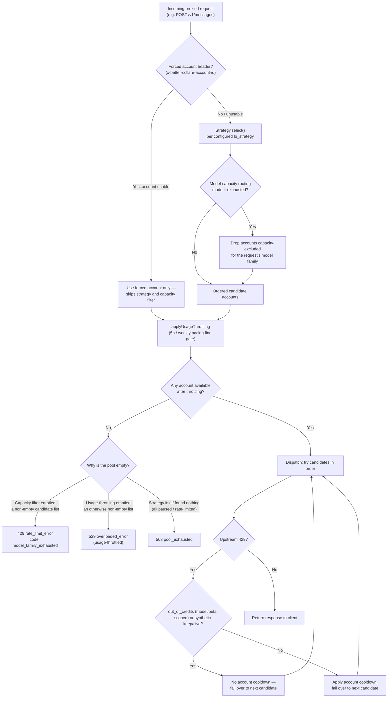
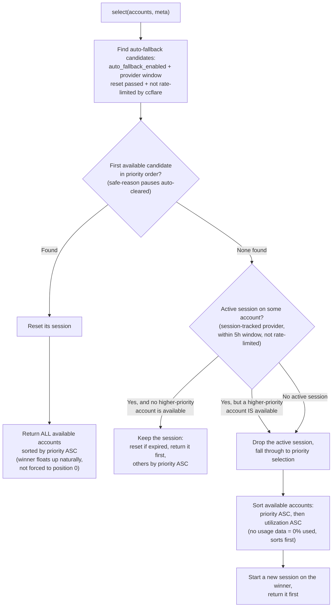
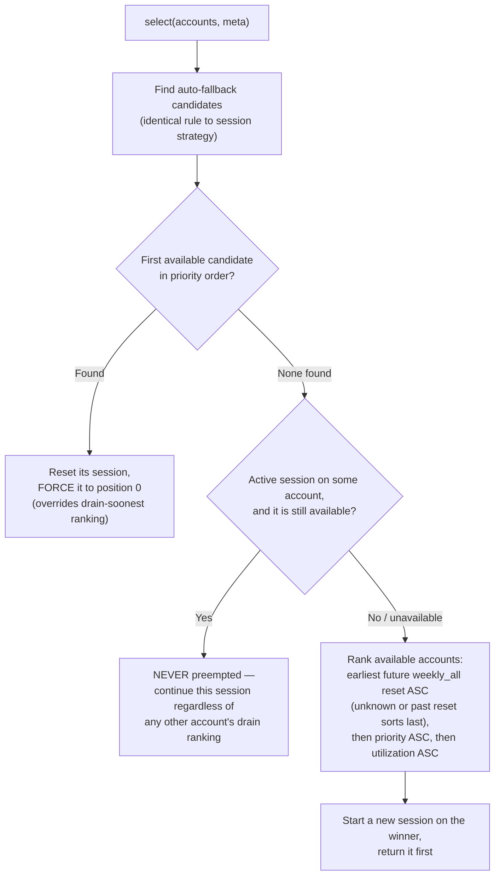
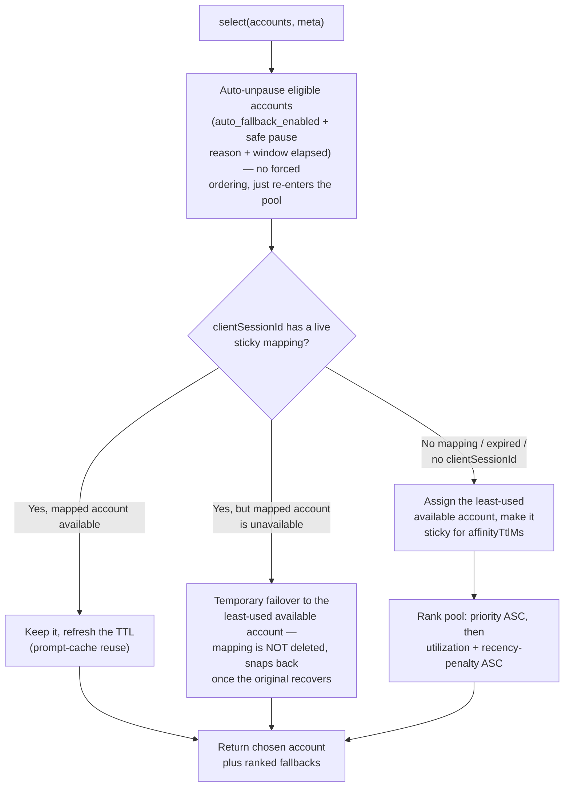
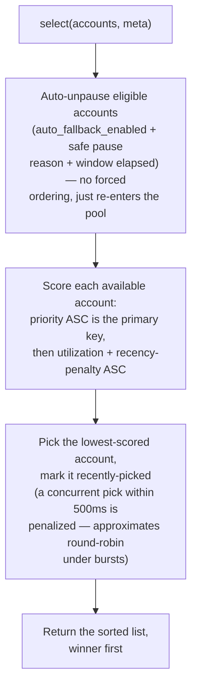
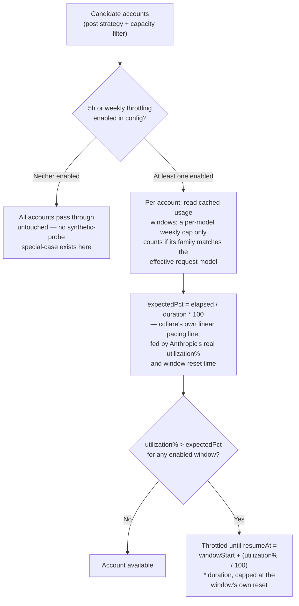
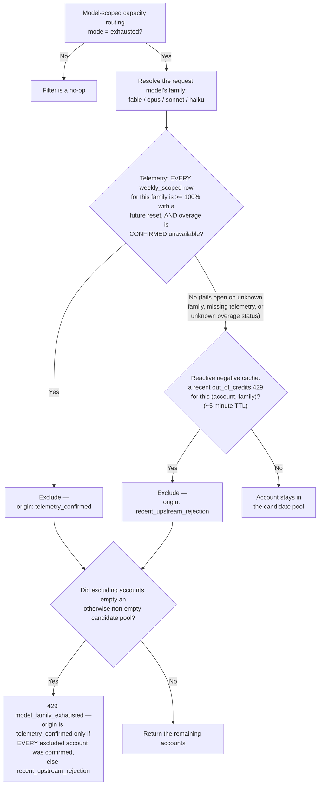
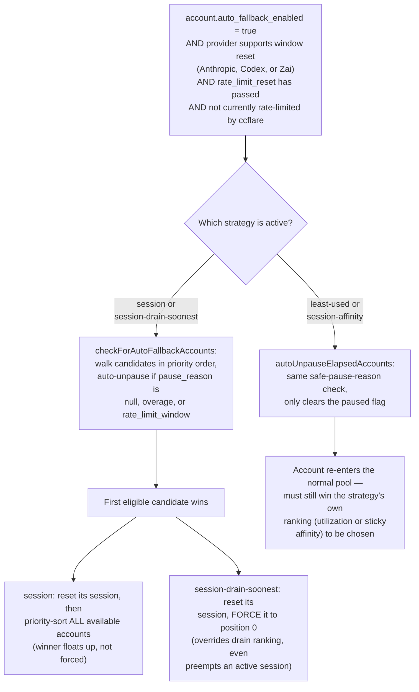

# Account Routing Architecture

This document explains how better-ccflare picks an account for each proxied request: the master pipeline, the four load-balancing strategies, usage-throttling, model-scoped capacity routing, and auto-fallback. It is a technical reference for understanding *why* a given request landed on a given account — for user-facing setup guides see [Load Balancing](./load-balancing.md), [Auto-Fallback Configuration](./auto-fallback.md), [Combos](./combos.md), and [Configuration](./configuration.md).

## Table of Contents

1. [Overview: Three Orthogonal Axes](#overview-three-orthogonal-axes)
2. [Master Pipeline](#master-pipeline)
3. [The Four Load-Balancing Strategies](#the-four-load-balancing-strategies)
   - [session](#session-sessionstrategy)
   - [session-drain-soonest](#session-drain-soonest-sessiondrainsoonestrategy)
   - [session-affinity](#session-affinity-sessionaffinitystrategy)
   - [least-used](#least-used-leastusedstrategy)
4. [Usage Throttling](#usage-throttling)
5. [Model-Capacity Routing](#model-capacity-routing)
6. [Auto-Fallback](#auto-fallback)

## Overview: Three Orthogonal Axes

Account routing is controlled by three independent settings that can each be changed at runtime without restarting the server: the **load-balancing strategy** (`lb_strategy` — which of the four strategies below picks the candidate order), **usage-throttling** (`usage_throttling_five_hour_enabled` / `usage_throttling_weekly_enabled` — an optional pacing gate applied after strategy selection), and **model-scoped capacity routing** (`model_scoped_capacity_routing` — `off` or `exhausted`, an optional per-model-family exclusion filter). Any runtime "combination" you observe (e.g. `least-used` with weekly throttling and capacity routing both on) is not a special combined mode — it is simply the master pipeline below with the configured strategy plugged into the `Strategy.select` step, and the two optional gates turned on or off. Understanding the pipeline once is enough to reason about every valid combination of the three settings.

## Master Pipeline

Every proxied request first checks for the `x-better-ccflare-account-id` force-route header (used both for manual force-routing and by internal auto-refresh/keepalive probes), then runs the configured strategy's `select()`, then an optional model-capacity filter, then an optional usage-throttling gate. If the candidate pool is empty afterwards, the response depends on *why* it emptied — the capacity filter and usage-throttling empty the pool for mutually exclusive reasons on a given request (the capacity filter runs first and, if it excludes everyone, usage-throttling never sees any accounts to throttle), so the code checks them in a fixed priority order: a capacity exclusion is reported first (as a structured 429), a throttling exclusion second (as a 529), and a strategy-level "nothing available at all" last (as a generic 503). When a [Combo](./combos.md) is active for the request's model family, an additional per-slot routing layer runs between the forced-header check and `Strategy.select`; it is omitted from the diagram below for clarity (see `packages/proxy/src/handlers/account-selector.ts`).

*Source: `packages/proxy/src/proxy.ts` (`handleProxy`, `applyUsageThrottling`), `packages/proxy/src/handlers/account-selector.ts` (`selectAccountsForRequest`).*

## The Four Load-Balancing Strategies

`lb_strategy` selects one of four implementations (`packages/load-balancer/src/strategies/`), all constructed in `apps/server/src/server.ts`. All four return an ordered list of candidate accounts; the first entry is tried first, the rest are failover order.

### session (SessionStrategy)

The default strategy pins a client to one account for the configured session duration (5h by default) so prompt caches stay warm, and only rotates to a new account once that session expires, the account becomes unavailable, or a higher-priority account frees up. Unlike the drain-soonest variant below, an active session *can* be preempted — but only by a strictly higher-priority account, never by a same-or-lower-priority one. Auto-fallback candidates are checked first on every call; if one becomes eligible, its session is reset but it is not force-ranked to the top — it is simply included in a fresh priority-sorted list, avoiding a priority inversion if an even-higher-priority account is already available.

*Source: `packages/load-balancer/src/strategies/index.ts` (`SessionStrategy.select`, `checkForAutoFallbackAccounts`).*

### session-drain-soonest (SessionDrainSoonestStrategy)

This strategy shares session-affinity and auto-fallback semantics with `session`, but replaces the static-priority tiebreak with a "use it or lose it" ranking: at every fresh selection it prefers whichever account's `weekly_all` usage window resets *soonest*, so unused weekly capacity is drained before it is replaced by a fresh, unrelated allowance. The one deliberate exception is its whole purpose — an active session is **never** preempted by drain ranking, only by auto-fallback reactivation, which is force-ranked to position 0 (unlike `session`, which never forces a position).

*Source: `packages/load-balancer/src/strategies/session-drain-soonest.ts`.*

### session-affinity (SessionAffinityStrategy)

A hybrid of `session` and `least-used`, keyed on the *client's* session id (the request body's `metadata.user_id`) rather than a single account-level session: the first request from a new client is routed to the least-loaded account, and that client→account mapping then stays sticky for `affinityTtlMs`. This spreads many concurrent client-sessions across the whole pool (instead of `session`'s single account taking all traffic until it rate-limits), while each individual client still keeps its prompt-cache locality. Auto-fallback here only auto-*unpauses* eligible accounts so they re-enter the pool — it never forces a pick, unlike `session`/`session-drain-soonest`.

*Source: `packages/load-balancer/src/strategies/session-affinity.ts`.*

### least-used (LeastUsedStrategy)

The simplest strategy: no session stickiness at all, every request independently picks the account with the lowest effective utilization (upstream utilization plus a short recency penalty so concurrent bursts spread across the pool instead of piling onto the same "emptiest" account). It trades prompt-cache reuse for better burst tolerance — a spike of N concurrent requests is spread across all healthy accounts rather than funneled into one, reducing the chance of several accounts hitting per-account rate limits at once. Like `session-affinity`, its auto-fallback handling only auto-unpauses eligible accounts; it never forces a pick.

*Source: `packages/load-balancer/src/strategies/least-used.ts`.*

## Usage Throttling

Independent of which strategy picked the candidate order, usage-throttling (`usage_throttling_five_hour_enabled` / `usage_throttling_weekly_enabled`) can hold an account back even though it isn't rate-limited yet. For each enabled window class, ccflare computes its own linear **pacing line** — the percentage of the window's duration that has elapsed — and compares it against Anthropic's real reported utilization: if the account is "ahead of pace" it is throttled until the point where reported usage and the pacing line would realign. A per-model weekly cap only counts against the request's own model family for normal requests — but combo-routed requests assign their per-slot model later in the pipeline, so `applyUsageThrottling` passes no request model for them and model-scoped weekly windows are skipped entirely (only the flat, non-scoped windows and the reactive `out_of_credits` cache still apply). There is no special exemption for internal auto-refresh/keepalive probes — they are throttled by the same gate as any other request (they are only exempted from request-history logging, not from this gate).

*Source: `packages/proxy/src/handlers/usage-throttling.ts` (`getUsageThrottleStatus`), `packages/proxy/src/proxy.ts` (`applyUsageThrottling`).*

## Model-Capacity Routing

When `model_scoped_capacity_routing` is set to `exhausted`, accounts whose weekly per-model-family cap (e.g. a Fable/Opus/Sonnet-specific quota) is provably exhausted are excluded from routing for requests of that family — in both normal and combo-slot routing. Exclusion has two independent signals: a **telemetry-confirmed** one (the account's own usage payload shows every relevant weekly-scoped row at ≥100% with a future reset, and pay-as-you-go overage is confirmed unavailable) and a **reactive** one (a recently observed `out_of_credits` 429 sidelines the account for that family for a short, fixed TTL to bridge the telemetry poll interval). The filter fails open on any ambiguity — an unknown model family, missing/dropped telemetry rows, or an unresolved overage signal never causes an exclusion — because a false exclusion removes a working account while a false pass only costs one extra 429 round-trip. Only when excluding accounts empties an otherwise non-empty candidate pool does the request get the structured `model_family_exhausted` response instead of falling through to the generic pool-exhausted path.

*Source: `packages/proxy/src/handlers/model-capacity.ts` (`isAccountExhaustedForModel`, `markFamilyExhausted`), `packages/proxy/src/handlers/account-selector.ts` (`isAccountCapacityExcluded`), `packages/proxy/src/handlers/proxy-operations.ts` (the `out_of_credits` 429 handler that feeds the reactive cache — distinct from the unrelated `all_models_exhausted_429` per-account cooldown reason used when an account's own configured model-fallback list is exhausted).*

## Auto-Fallback

The same per-account `auto_fallback_enabled` flag drives two different mechanisms depending on which strategy is active, both gated on the same eligibility rule: the account's provider must support window-reset detection (Anthropic, Codex, or Zai), its `rate_limit_reset` must have passed, and it must not currently be rate-limited by ccflare itself. `session` and `session-drain-soonest` run a dedicated `checkForAutoFallbackAccounts` pass that walks eligible candidates in priority order, auto-unpauses one with a safe pause reason (`null`, `overage`, or `rate_limit_window` — never `manual` or `failure_threshold`), and either lets it float up in a fresh priority sort (`session`) or forces it to the very front, even preempting an active session (`session-drain-soonest`). `least-used` and `session-affinity` instead only auto-*unpause* eligible accounts via the shared `wouldAutoUnpause` predicate — the account re-enters the normal pool but must still win that strategy's own ranking (utilization score or sticky affinity) to actually be chosen; neither strategy force-picks it.

*Source: `packages/load-balancer/src/strategies/peek-availability.ts` (`wouldAutoUnpause`, shared by `least-used` and `session-affinity`), `packages/load-balancer/src/strategies/index.ts` and `session-drain-soonest.ts` (`checkForAutoFallbackAccounts`, the forced-position variant).*
